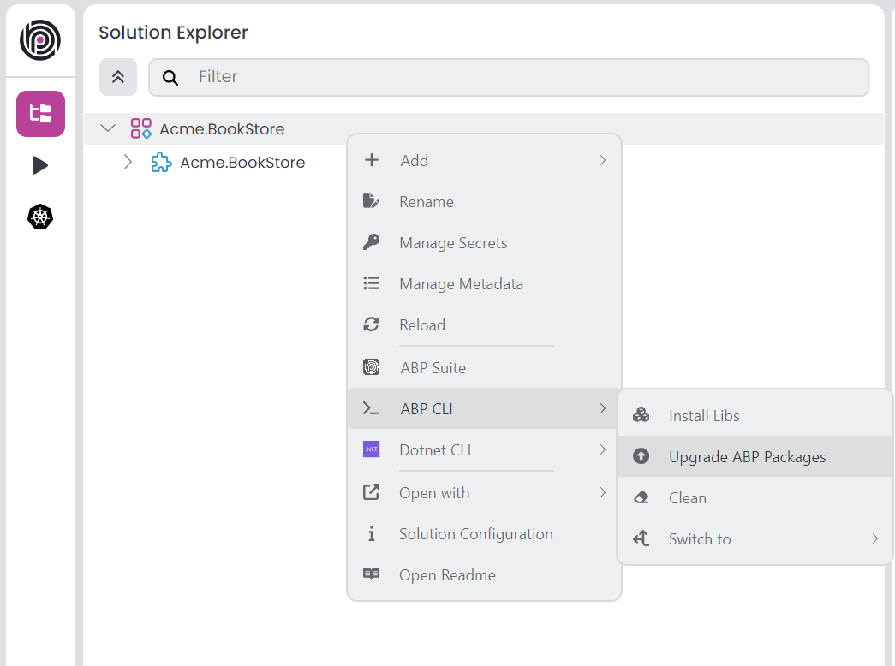

# ABP.IO Platform 9.3 Final Has Been Released!

We are glad to announce that [ABP](https://abp.io/) 9.3 stable version has been released today. 

## What's New With Version 9.3?

All the new features were explained in detail in the [9.3 RC Announcement Post](https://abp.io/community/announcements/announcing-abp-9-3-release-candidate-4dqgiryf), so there is no need to review them again. You can check it out for more details. 

## Getting Started with 9.3

### Creating New Solutions

You can check the [Get Started page](https://abp.io/get-started) to see how to get started with ABP. You can either download [ABP Studio](https://abp.io/get-started#abp-studio-tab) (**recommended**, if you prefer a user-friendly GUI application - desktop application) or use the [ABP CLI](https://abp.io/docs/latest/cli) to create new solutions.

### How to Upgrade an Existing Solution

You can upgrade your existing solutions with either ABP Studio or ABP CLI. In the following sections, both approaches are explained:

### Upgrading via ABP Studio

If you are already using the ABP Studio, you can upgrade it to the latest version. ABP Studio periodically checks for updates in the background, and when a new version of ABP Studio is available, you will be notified through a modal. Then, you can update it by confirming the opened modal. See [the documentation](https://abp.io/docs/latest/studio/installation#upgrading) for more info.

After upgrading the ABP Studio, then you can open your solution in the application, and simply click the **Upgrade ABP Packages** action button to instantly upgrade your solution:



### Upgrading via ABP CLI

Alternatively, you can upgrade your existing solution via ABP CLI. First, you need to install the ABP CLI or upgrade it to the latest version.

If you haven't installed it yet, you can run the following command:

```bash
dotnet tool install -g Volo.Abp.Studio.Cli
```

Or to update the existing CLI, you can run the following command:

```bash
dotnet tool update -g Volo.Abp.Studio.Cli
```

After installing/updating the ABP CLI, you can use the [`update` command](https://abp.io/docs/latest/CLI#update) to update all the ABP related NuGet and NPM packages in your solution as follows:

```bash
abp update
```

You can run this command in the root folder of your solution to update all ABP related packages.

## Migration Guides

There are a few breaking changes in this version that may affect your application. Please read the migration guide carefully, if you are upgrading from v9.2: [ABP Version 9.3 Migration Guide](https://abp.io/docs/9.3/release-info/migration-guides/abp-9-3)

## Community News

### New ABP Community Articles

As always, exciting articles have been contributed by the ABP community. I will highlight some of them here:

* [Fahri Gedik](https://abp.io/community/members/fahrigedik) has published 2 new articles:
    * [A Modern Approach to Angular Dependency Injection using inject function](https://abp.io/community/articles/a-modern-approach-to-angular-dependency-injection-using-8np4o1ap)
    * [Angular Application Builder: Transitioning from Webpack to Esbuild](https://abp.io/community/articles/angular-application-builder-transitioning-from-webpack-to-3yzhzfl0)
* [Benjamin Fadina](https://abp.io/community/members/benjaminsqlserver@gmail.com) has published several videos on various topics such as **Blazor Web Assembly Using ABP.IO**, **CQRS Implementation with MediatR in ABP** and more. You can see all his videos [here](https://abp.io/community/members/benjaminsqlserver@gmail.com).
* [Mansur Besleney](https://abp.io/community/members/mansur.besleney) has published [How to Build Persistent Background Jobs with ABP Framework and Quartz](https://abp.io/community/articles/how-to-build-persistent-background-jobs-with-abp-framework-n9aloh93)
* [Halil Ibrahim Kalkan](https://x.com/hibrahimkalkan) has published [Multitenancy with Separate Databases in .NET and ABP](https://abp.io/community/articles/multitenancy-with-separate-databases-in-dotnet-and-abp-51nvl4u9)
* [Alex Maiereanu](https://abp.io/community/members/alex.maiereanu@3sstudio.com) has published [ABP-Hangfire-AzurePostgreSQL](https://abp.io/community/articles/abphangfireazurepostgresql-s1jnf3yg)
* [Jack Fistelmann](https://abp.io/community/members/jfistelmann) has published [ABP and maildev](https://abp.io/community/articles/abp-and-maildev-gy13cr1p)
* [Harsh Gupta](https://abp.io/community/members/harshgupta) has published [How to Add a Module in the ABP.io Application?](https://abp.io/community/articles/how-to-add-a-module-in-the-abp.io-application-sdeajkn6)
* [Tarık Özdemir](https://abp.io/community/members/mtozdemir) has published [AI-First Architecture for .NET Projects: A Modern Blueprint Inspired by McKinsey](https://abp.io/community/articles/AI-First%20Architecture%20for%20.NET%20Projects%3A%20A%20Modern%20Blueprint-h2wgcoq3)
* [Liming Ma](https://github.com/maliming) has published [Using Hangfire Dashboard in ABP API Website](https://abp.io/community/articles/using-hangfire-dashboard-in-abp-api-website--r32ox497)

Thanks to the ABP Community for all the content they have published. You can also [post your ABP related (text or video) content](https://abp.io/community/posts/create) to the ABP Community.

## About the Next Version

The next feature version will be 10.0. You can follow the [release planning here](https://github.com/abpframework/abp/milestones). Please [submit an issue](https://github.com/abpframework/abp/issues/new) if you have any problems with this version.
