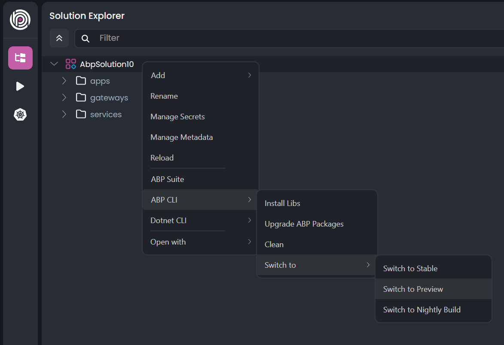
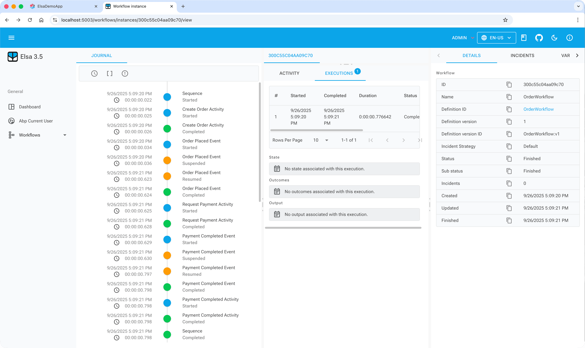
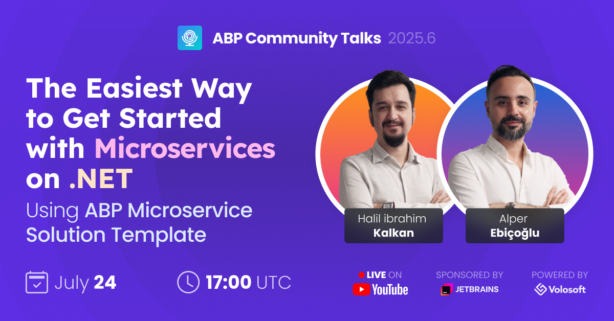
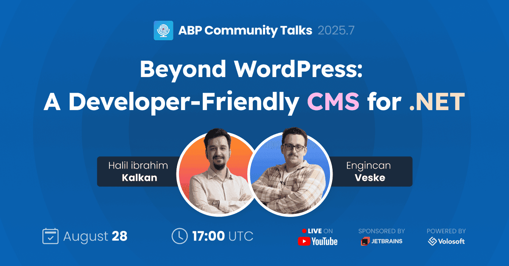

# ABP Platform 10.0 RC Has Been Released

We are happy to release [ABP](https://abp.io) version **10.0 RC** (Release Candidate). This blog post introduces the new features and important changes in this new version.

Try this version and provide feedback for a more stable version of ABP v10.0! Thanks to you in advance.

## Get Started with the 10.0 RC

You can check the [Get Started page](https://abp.io/get-started) to see how to get started with ABP. You can either download [ABP Studio](https://abp.io/get-started#abp-studio-tab) (**recommended**, if you prefer a user-friendly GUI application - desktop application) or use the [ABP CLI](https://abp.io/docs/latest/cli).

By default, ABP Studio uses stable versions to create solutions. Therefore, if you want to create a solution with a preview version, first you need to create a solution and then switch your solution to the preview version from the ABP Studio UI:



## Migration Guide

There are a few breaking changes in this version that may affect your application. Please read the migration guide carefully, if you are upgrading from v10.0 or earlier: [ABP Version 10.0 Migration Guide](https://abp.io/docs/10.0/release-info/migration-guides/abp-10-0).

## What's New with ABP v10.0?

In this section, I will introduce some major features released in this version.
Here is a brief list of titles explained in the next sections:

* Upgraded to .NET 10.0
* Update to Blazorise 1.8.2
* New Module: **Workflow (Elsa)**
* New Object Mapper: **Mapperly**
* Localization: Nested object support in JSON files
* Support EF Core Shared Entity Types on Repositories 
* Add failure retry policy to InboxProcessor
* Migrate to New Esbuild-based Angular Builder
* Angular SSR support

### Upgraded to .NET 10.0

We've upgraded ABP to .NET 10.0, so you need to move your solutions to .NET 10.0 if you want to use ABP 10.0. 

> Since the stable version of .NET 10 hasn't been released yet, we upgraded ABP to .NET v10.0-rc.1. Stable NET 10 is scheduled to launch as a Long-Term Support (LTS) release during .NET Conf 2025, which takes place November 11?13, 2025. We'll update the ABP Platform to the .NET 10 as soon as possible official .NET 10 release is completed.

### Upgraded to Blazorise v1.8.2

Upgraded the [Blazorise](https://blazorise.com/) library to v1.8.2 for Blazor UI. If you are upgrading your project to v10.0 RC, please ensure that all the Blazorise-related packages are using v1.8.2 in your application. Otherwise, you might get errors due to incompatible versions.

> See [#23717](https://github.com/abpframework/abp/issues/23717) for the updated NuGet packages.


### New Module: **Workflow (Elsa)**

ABP now ships a Workflow module that integrates [Elsa Workflows] to build visual, long-running, event-driven workflows in your ABP solutions (monolith or microservices). It provides seamless integration with ABP authentication/authorization, distributed event bus, persistence, background processing and includes support for hybrid UIs via Elsa Studio. For a hands-on reference showcasing an end-to-end order/payment workflow across services, see the sample: [Elsa Workflows - Sample Workflow Demo](https://abp.io/docs/10.0/samples/elsa-workflows-demo). For capabilities, installation and configuration details (activities, storage, hosting, dashboard), see the module docs: [Workflow (Elsa) module](https://abp.io/docs/10.0/modules/elsa-pro).



### New Object Mapper: **Mapperly**

ABP modules now use Mapperly as the default object-to-object mapper. Mapperly is a compile-time, source generator–based mapper that removes runtime reflection and offers better performance with simpler maintenance. For background and implementation details, see the planning issue and the PR: [Switch to another object mapping library](https://github.com/abpframework/abp/issues/23243) and [Use Mapperly to replace AutoMapper in all modules](https://github.com/abpframework/abp/pull/23277).

The `Volo.Abp.AutoMapper` package remains available for backward compatibility. You can keep using AutoMapper in your solutions, but you are responsible for obtaining and managing its license if needed. For upgrade guidance and practical steps, follow the migration guide: [AutoMapper to Mapperly](https://github.com/abpframework/abp/blob/dev/docs/en/release-info/migration-guides/AutoMapper-To-Mapperly.md).


### Localization: Nested object support in JSON files

ABP now supports nested objects (and arrays) in JSON localization files, allowing you to organize translations hierarchically and access them using the double underscore (`__`) separator. This improves maintainability for larger resource files and aligns lookups with familiar key paths. See the PR for details: [feat(l8n): add support for nested objects in localization files](https://github.com/abpframework/abp/pull/23701).

Declaration (nested objects):
```json
{
  "culture": "en",
  "texts": {
    "MyNestedTranslation": {
      "SomeKey": "Some nested value",
      "SomeOtherKey": "Some other nested value"
    }
  }
}
```

Usage:
```csharp
L["MyNestedTranslation__SomeKey"];
L["MyNestedTranslation__SomeOtherKey"];
```

Declaration (arrays):
```json
{
  "culture": "en",
  "texts": {
    "Menu": {
      "Items": ["Home", "About", "Contact"]
    }
  }
}
```

Usage:
```csharp
L["Menu__Items__0"]; // Home
L["Menu__Items__2"]; // Contact
```

### Support EF Core Shared Entity Types on Repositories

ABP repositories now support EF Core **shared-type entity** types by allowing a custom entity name to be set on a repository before performing operations. Internally, this uses EF Core's `DbContext.Set<T>(string name)` to target the correct `DbSet`/table for the same CLR type, enabling scenarios like per-tenant tables, archives, or partitioning, and you can switch the target at runtime. See the PR: [Support EF Core Shared Entity Types on Repositories](https://github.com/abpframework/abp/pull/23588) and the EF Core documentation on [shared-type entity types](https://learn.microsoft.com/en-us/ef/core/modeling/entity-types?tabs=data-annotations#shared-type-entity-types).

Example:
```csharp
// Set the shared entity name so repository operations target that table
var repo = serviceProvider.GetRequiredService<IRepository<MyEntity, Guid>>();
repo.SetCustomEntityName("MyEntity_TenantA");
var list = await repo.GetListAsync();

// Switch to another shared name later on the same instance
repo.SetCustomEntityName("MyEntity_Archive");
await repo.InsertAsync(new MyEntity { /* ... */ });
```

### Add failure retry policy to InboxProcessor

`InboxProcessor` now supports configurable failure handling strategies per event: **Retry** (default; reprocess in the next cycle), **RetryLater** (skip the failing event and retry it later with exponential backoff; the backoff factor and maximum retries are configurable), and **Discard** (drop the failing event). This prevents a single failing handler from blocking subsequent events and improves resiliency. Note: this is a breaking change because `IncomingEvent` entity properties were updated. See the PR for details: [Add failure retry policy to InboxProcessor](https://github.com/abpframework/abp/pull/23563).

### Migrate to New Esbuild-based Angular Builder

We've migrated ABP Angular templates and packages to Angular's new esbuild-based build system (introduced in Angular 17+ and fully supported in Angular 20) to deliver faster builds, modern ESM support, built-in SSR/prerender capabilities, and a better development experience. This change is non-breaking for existing apps. See the tracking issue and PR: [Angular - Migrate to New Esbuild-based Angular Builder](https://github.com/abpframework/abp/issues/23242), [feat: Update Angular templates to Angular 20 new build system](https://github.com/abpframework/abp/pull/23363).

Key updates in templates/config:
- Builder switched from `@angular-devkit/build-angular:browser` to `@angular-devkit/build-angular:application`.
- `main` option replaced by `browser`; `polyfills` moved to array form.
- TypeScript updated to `es2020` with `esModuleInterop: true`; module target `esnext`.

More Angular updates:
- Unit tests have been updated for the new builder and configuration: [#23460](https://github.com/abpframework/abp/pull/23460).

Warnings:
- Constructor injections migrated to Angular's `inject()` function. If you extend a class and previously called `super(...)` with injected params, remove those parameters. See: [Angular inject() migration](https://angular.dev/reference/migrations/inject-function).
- `provideLogo` and `withEnvironmentOptions` have moved from LeptonX packages to `@abp/ng.theme-shared`.
- If you use the new application builder and have `tsconfig.json` path mappings that point into `node_modules`, remove those mappings and prefer symlinks instead. See a symlink reference: [Creating symbolic links](https://hostman.com/tutorials/creating-symbolic-links-in-linux/).

### Angular SSR support

ABP Angular templates now support Server-Side Rendering (SSR) with the Angular Application Builder, enabling hybrid rendering (SSR + CSR) for improved first paint, SEO and perceived performance. This includes SSR-safe platform checks (no direct `window`/`location`/`localStorage`), OIDC auth compatibility via cookie-backed storage, and `TransferState` to prevent duplicate HTTP GETs during hydration. For implementation highlights and usage (including how to run the SSR dev server and the `transferStateInterceptor`), see the issue and PR: [Angular SSR](https://github.com/abpframework/abp/issues/23055), [Hybrid Rendering & Application Builder](https://github.com/abpframework/abp/pull/23416).

See Angular's official guide for details on hybrid rendering (prerender + SSR + CSR): [Angular SSR](https://angular.dev/guide/ssr) and on the builder migration: [Angular build system migration](https://angular.dev/tools/cli/build-system-migration).


## Community News

### Announcing ABP Studio 1.0 General Availability ?


We are thrilled to announce that ABP Studio has reached version 1.0 and is now generally available! This marks a significant milestone for our integrated development environment designed specifically for ABP developers. The stable release brings several powerful features including:

* Enhanced Solution Runner with health monitoring capabilities
* Theme style selection during project creation (Basic, LeptonX Lite, and LeptonX Themes)
* New "Container" application type for better Docker container management
* Improved handling of multiple DbContexts for migration operations

> For a detailed overview of these features and to learn more about what's coming next, check out our [announcement post](https://abp.io/community/articles/announcing-abp-studio-1-0-general-availability-82yw62bt).

### Recent Events

We recently hosted two sessions of ABP Community Talks:

#### Community Talks 2025.06: Microservices with ABP Template
The Easiest Way to Get Started with Microservices on .NET Using ABP Microservice Solution Template: a deep dive into ABP’s microservice template, showing how ABP Studio streamlines creating, running, and scaling distributed systems. See the event page: [Community Talks: Microservices with ABP Template](https://abp.io/community/events/community-talks/the-easiest-way-to-get-started-with-microservices-on-.net-using-abp-microservice-solution-template-fd2comfn).



#### Community Talks 2025.07: Developer-Friendly CMS for .NET
Beyond WordPress: A Developer-Friendly CMS for .NET: an overview of building custom web apps with ABP CMS Kit, integrating content management with your application code. Learn more: [Community Talks: Developer-Friendly CMS for .NET](https://abp.io/community/events/community-talks/beyond-wordpress-a-developerfriendly-cms-for-.net-mubtips6).



### Weekly Webinar: Discover ABP Platform

We’ve launched a regular weekly webinar covering the ABP Platform end-to-end—framework, tools, and best practices—with live Q&A and demos. Register here and join an upcoming session: [Discover ABP Platform](https://abp.io/webinars/discover-abp-platform).


### New ABP Community Articles

- [Alper Ebiçoğlu](https://abp.io/community/members/alper):
  - [High-Performance .NET Libraries You Didn’t Know You Needed](https://abp.io/community/articles/high-performance-net-libraries-you-did-not-know-nu5t88sz)
  - [.NET 10: What You Need to Know (LTS Release, Coming November 2025)](https://abp.io/community/articles/net-10-preview-features-breaking-changes-enhancements-xennnnky)
  - [Best Free Alternatives to AutoMapper in .NET — Why We Moved to Mapperly](https://abp.io/community/articles/best-free-alternatives-to-automapper-in-net-l9f5ii8s)
- [Liming Ma](https://abp.io/community/members/maliming):
  - [Keep Track of Your Users in an ASP.NET Core Application](https://abp.io/community/articles/keep-track-of-your-users-in-an-asp.net-core-application-jlt1fxvb)
  - [App Services vs Domain Services](https://abp.io/community/articles/app-services-vs-domain-services-4dvau41u)
  - [Using Hangfire Dashboard in ABP API Website](https://abp.io/community/articles/using-hangfire-dashboard-in-abp-api-website--r32ox497)
- [Fahri Gedik](https://abp.io/community/members/fahrigedik):
  - [Backward‑Compatible REST APIs in .NET Microservices](https://abp.io/community/articles/backward-compatible-rest-apis-dotnet-microservices-9rzlb4q6)
  - [Best Practices for Designing Backward‑Compatible REST APIs in a Microservice Solution for .NET Developers](https://abp.io/community/articles/best-practices-for-designing-backward‑compatible-rest-apis-in-a-microservice-solution-for-.net-developers-t1m4kzfa)
  - [Stepbystep AWS Secrets Manager Integration in ABP](https://abp.io/community/articles/stepbystep-aws-secrets-manager-integration-in-abp-3dcblyix)
- [Engincan Veske](https://abp.io/community/members/engincanv):
  - [Building a Permission-Based Authorization System for ASP.NET Core](https://abp.io/community/articles/building-a-permission-based-authorization-system-for-asp-net-owyszy0b)
  - [Where and How to Store Your Blob Objects in .NET](https://abp.io/community/articles/where-and-how-to-store-your-blob-objects-in-dotnet-r2r1vjjd)
- [Salih Özkara](https://abp.io/community/members/salih):
  - [Truly Layering a .NET Application Based on DDD Principles](https://abp.io/community/articles/truly-layering-a-net-application-based-on-ddd-principles-428jhn3a)
- [Kori Francis](https://abp.io/community/members/kfrancis@clinicalsupportsystems.com):
  - [ABP Postmark Email Integration, Templated Emails](https://abp.io/community/articles/abp-postmark-email-integration-templated-emails-gvgc6pfj)
  - [Universal Redis Configuration in ABP Aspire Deployment](https://abp.io/community/articles/universal-redis-configuration-abp-aspire-deployment-qp90c7u4)
- [Sajankumar Vijayan](https://abp.io/community/members/connect):
  - [Multi-tenant SaaS apps, Cloudflare DNS](https://abp.io/community/articles/multi-tenant%20SaaS%20apps,%20Cloudflare%20DNs-dar977al)
- [Selman Koc](https://abp.io/community/members/selmankoc):
  - [Azure DevOps, CI/CD pipelines, Azure DevOps best practices](https://abp.io/community/articles/Azure%20DevOps,%20CI%2FCD%20pipelines,%20Azure%20DevOps%20best%20practices,-wiguy1ew)
- [Sümeyye Kurtuluş](https://abp.io/community/members/sumeyye.kurtulus):
  - [ABP Now Supports Angular Standalone Applications](https://abp.io/community/articles/abp-now-supports-angular-standalone-applications-zzi2rr2z)
  - [Supercharge your Angular app: A developer's guide to unlock](https://abp.io/community/articles/supercharge-your-angular-app-a-developers-guide-to-unlock-0dmu7tkr)
- [Mansur Besleney](https://abp.io/community/members/mansur.besleney):
  - [Demystified Aggregates in DDD & .NET: From Theory to Practice](https://abp.io/community/articles/demystified-aggregates-in-ddd-and-dotnet-2becl93q)
  - [How to Build Persistent Background Jobs with ABP Framework and Quartz](https://abp.io/community/articles/how-to-build-persistent-background-jobs-with-abp-framework-n9aloh93)
  - [Angular Application Builder: Transitioning from Webpack to Esbuild](https://abp.io/community/articles/angular-application-builder-transitioning-from-webpack-to-3yzhzfl0)
- [Muhammet Ali Özkaya](https://abp.io/community/members/m.aliozkaya):
  - [Implementing Unit of Work with ASP.NET Core](https://abp.io/community/articles/implementing-unit-of-work-with-asp.net-core-lv4v2tyf)
- [Enis Necipoğlu](https://abp.io/community/members/enisn):
  - [Integration Services Explained: What They Are & When to Use](https://abp.io/community/articles/integration-services-explained-what-they-are-when-to-use-lienmsy8)
- [Berkan Şaşmaz](https://abp.io/community/members/berkansasmaz):
  - [How to Dynamically Set the Connection String in EF Core](https://abp.io/community/articles/how-to-dynamically-set-the-connection-string-in-ef-core-30k87fpj)
- [Emre Kara](https://abp.io/community/members/emre.kara):
  - [A Developer's Guide to Distributed Event Buses in .NET](https://abp.io/community/articles/a-developers-guide-to-distributed-event-buses-in-.net-oehl23kb)
- [Oğuzhan Ağır](https://abp.io/community/members/oguzhan.agir):
  - [In-Memory Background Job Queue in ASP.NET Core](https://abp.io/community/articles/in-memory-background-job-queue-aspnet-core-pai2zmtr)
- [Alperen Samurlu](https://abp.io/community/members/alperen.samurlu):
  - [How Can We Apply the DRY Principle in a Better Way?](https://abp.io/community/articles/how-can-we-apply-the-dry-principle-in-a-better-way-pmc4eao2)
- [Ahmet Çelik](https://abp.io/community/members/ahmet.celik):
  - [Best Practices Guide for REST API Design](https://abp.io/community/articles/best-practices-guide-for-rest-api-design-oexc1euj)
- [Elanur Oğuz](https://abp.io/community/members/s.elanuroguz):
  - [Web Design Basics for Graphic Designers Who Don't Code](https://abp.io/community/articles/web-design-basics-for-graphic-designers-who-dont-code-0c2jgt2v)
- [Seda Şen](https://abp.io/community/members/seda.sen):
  - [Color Psychology in Web Design](https://abp.io/community/articles/color-psychology-in-web-design-z383jph8)
- [Halime Karayay](https://abp.io/community/members/halimekarayay):
  - [10 Modern HTML CSS Techniques Every Designer Should Know](https://abp.io/community/articles/10-modern-html-css-techniques-every-designer-should-know-zxnwilf4)
- [Anto Subash](https://abp.io/community/members/antosubash):
  - [ABP React CMS Module: Building Dynamic Pages with Puck](https://abp.io/community/articles/abp-react-cms-module-building-dynamic-pages-with-puck-auxvrwgf)
- [Yağmur Çelik](https://abp.io/community/members/yagmur.celik):
  - [Integration Testing Best Practices for Building a Robust API](https://abp.io/community/articles/integration-testing-best-practices-for-building-a-robust-udcwef71)
- [Suhaib Mousa](https://abp.io/community/members/suhaib-mousa):
  - [Visual Studio 2026 - What's New and Why I'm Excited About It](https://abp.io/community/articles/visual-studio-2026-e4s5hed7)
- [Alex Maiereanu](https://abp.io/community/members/alex.maiereanu@3sstudio.com):
  - [ABP-Hangfire-AzurePostgreSQL](https://abp.io/community/articles/abphangfireazurepostgresql-s1jnf3yg)
- [Jack Fistelmann](https://abp.io/community/members/jfistelmann):
  - [ABP and maildev](https://abp.io/community/articles/abp-and-maildev-gy13cr1p)
- Tarık Özdemir:
  - [AI-First Architecture for .NET Projects: A Modern Blueprint](https://abp.io/community/articles/AI-First%20Architecture%20for%20.NET%20Projects%3A%20A%20Modern%20Blueprint-h2wgcoq3)
- [Prabhjot Singh](https://abp.io/community/members/prabhjot):
  - [Switching from Project References to Package References](https://abp.io/community/articles/switching-from-project-references-to-package-references-ql16qwx0)
- [Yunus Emre Kalkan](https://abp.io/community/members/yekalkan):
  - [New in ABP Studio: Docker Container Management](https://abp.io/community/articles/abp-studio-docker-container-management-ex7r27y8)
- [Burak Demir](https://abp.io/community/members/burakdemir):
  - [Solving MongoDB GUID Issues After an ABP Framework Upgrade](https://abp.io/community/articles/solving-mongodb-guid-issues-after-an-abp-framework-upgrade-tv8waw1n)

See the latest pages for links and more articles: [Latest Articles — Page 1](https://abp.io/community/articles?CurrentPage=1&tab=Latest), [Page 2](https://abp.io/community/articles?CurrentPage=2&tab=Latest), [Page 3](https://abp.io/community/articles?CurrentPage=3&tab=Latest).

Thanks to the ABP Community for all the content they have published. You can also [post your ABP-related (text or video) content](https://abp.io/community/posts/create) to the ABP Community.

## Conclusion

This version comes with some new features and a lot of enhancements to the existing features. You can see the [Road Map](https://abp.io/docs/10.0/release-info/road-map) documentation to learn about the release schedule and planned features for the next releases. Please try ABP v10.0 RC and provide feedback to help us release a more stable version.

Thanks for being a part of this community!