# Announcing .NET Aspire Integration for ABP Microservice Template

We are excited to announce the integration of **.NET Aspire** into the ABP microservice solution. This integration brings a unified development experience for building, running, debugging, and deploying distributed applications. With Aspire, you can now orchestrate your entire microservice ecosystem with a single command, eliminating complex configurations and making local development effortless.

## What is .NET Aspire?

[Aspire](https://aspire.dev/get-started/what-is-aspire/) is a cloud-ready stack designed to streamline the development of distributed applications. It provides:

- **Orchestration**: A code-first approach to defining and running distributed applications, managing dependencies, and launch order.
- **Integrations**: Pre-built components for common services (databases, caches, message brokers) with automatic configuration.
- **Tooling**: A developer dashboard for real-time monitoring of logs, traces, metrics, and resource health.
- **Service Discovery**: Automatic service-to-service communication without hardcoded endpoints.
- **Observability**: Built-in OpenTelemetry support for distributed tracing, metrics, and structured logging.

## How Does It Work with ABP?

When you enable .NET Aspire in an ABP microservice solution, you get a fully integrated development experience where:

- All microservices, gateways, and applications are orchestrated through a single entry point (AppHost).
- Infrastructure containers (databases, Redis, RabbitMQ, Elasticsearch, etc.) are managed as code.
- OpenTelemetry, health checks, and service discovery are automatically configured for all projects via the shared ServiceDefaults project.

## Enabling Aspire in Your Solution

When creating a new microservice solution via ABP Studio:

1. In the solution creation wizard, look for the **".NET Aspire Integration"** step.
2. Toggle the option to **enable .NET Aspire**.
3. Complete the wizard—Aspire projects will be generated along with your solution.

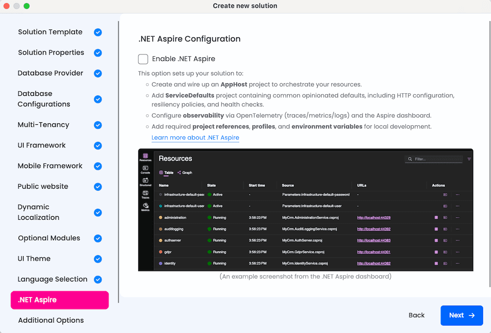

## Solution Structure Changes

When Aspire is enabled, two additional projects are added to your solution:

### AppHost (Orchestrator)

[`AppHost`](https://aspire.dev/get-started/app-host/) is the .NET Aspire orchestrator project that declares all resources (services, databases, containers, applications) and their dependencies in C# code. It provides:

- **Centralized orchestration**: Start your entire microservice ecosystem with a single command.
- **Code-first infrastructure**: Databases, Redis, RabbitMQ, Elasticsearch, and observability tools are defined programmatically.
- **Dependency management**: Services start in the correct order using `WaitFor()` declarations.
- **Automatic configuration**: Connection strings, endpoints, and environment variables are injected automatically.

### ServiceDefaults

[`ServiceDefaults`](https://aspire.dev/fundamentals/service-defaults/) is a shared library that provides common cloud-native configuration for all projects in the solution. Every service uses the same observability, health check, and resilience patterns.

| Feature | Description |
|---------|-------------|
| OpenTelemetry | Tracing, metrics, and structured logging with automatic instrumentation |
| Health Checks | `/health` and `/alive` endpoints for Kubernetes-style probes |
| Service Discovery | Automatic resolution of service endpoints |
| HTTP Resilience | Retry policies, timeouts, and circuit breakers for HTTP clients |

## Running the Solution with Aspire

Running your microservice solution has never been easier:

1. Open **Solution Runner** in ABP Studio.
2. Select the **Aspire** profile.
3. Run `AppHost`.

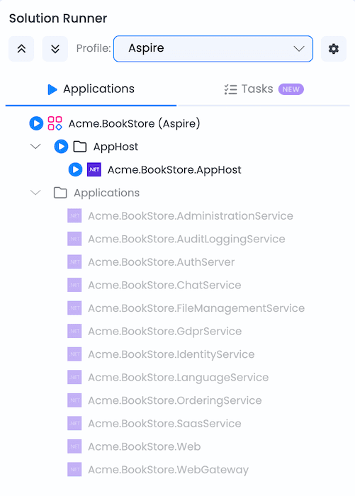

AppHost automatically:

- Starts all infrastructure containers (database, Redis, RabbitMQ, Elasticsearch, etc.).
- Launches all microservices, gateways, and applications in dependency order.
- Injects connection strings and environment variables.
- Opens the Aspire Dashboard for monitoring.

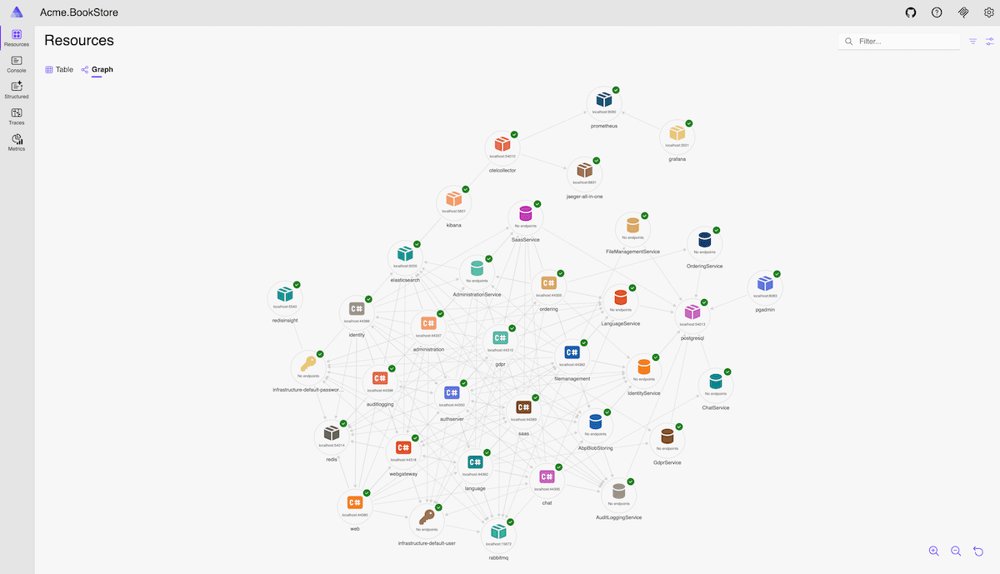

## Aspire Dashboard

The Aspire Dashboard provides real-time tracking of your application's state. It enables you to monitor logs, traces, metrics, and environment configurations in an intuitive UI.

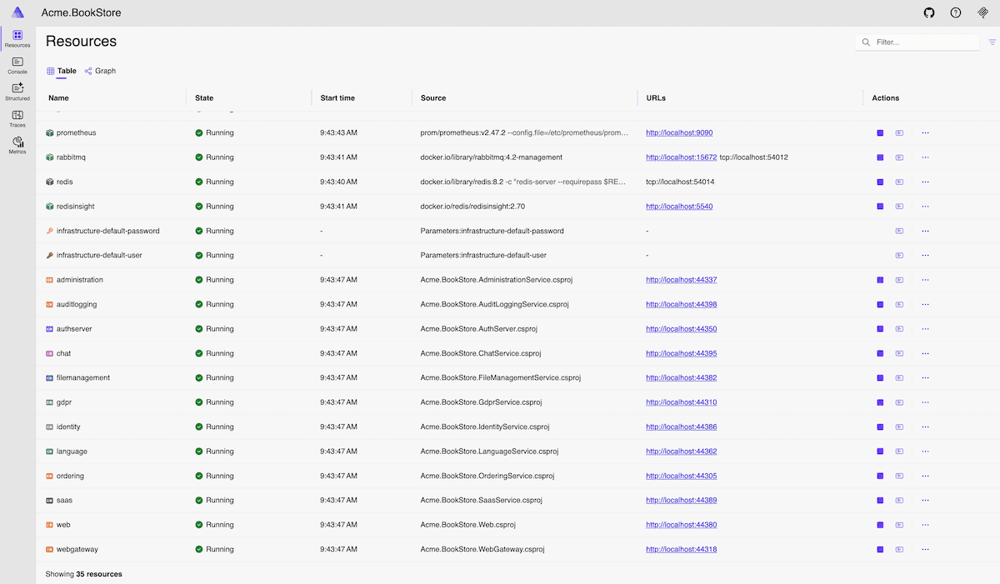

### Key Dashboard Features

#### Console Logs

Display console logs from all resources in real-time. Filter by resource and log level to quickly find relevant information during development and debugging.

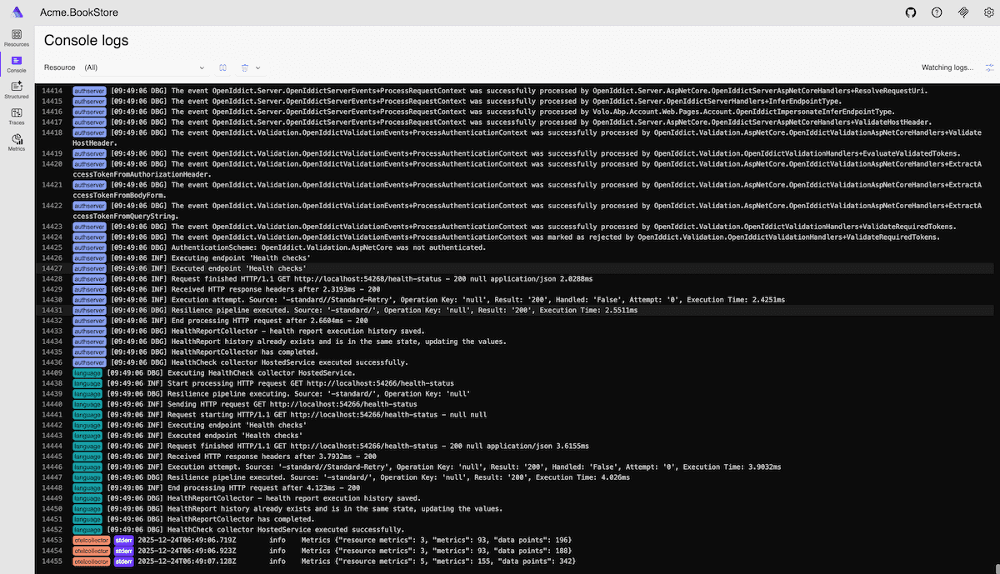

#### Structured Logs

View structured logs from all resources with advanced filtering capabilities. Search and filter logs by resource, log level, timestamp, and custom properties.

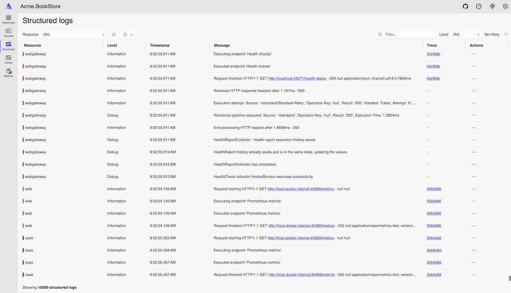

#### Distributed Traces

Explore distributed traces across your microservices to understand request flows and identify performance bottlenecks.

#### Metrics

Monitor real-time metrics including HTTP requests, response times, garbage collection, memory usage, and custom metrics.

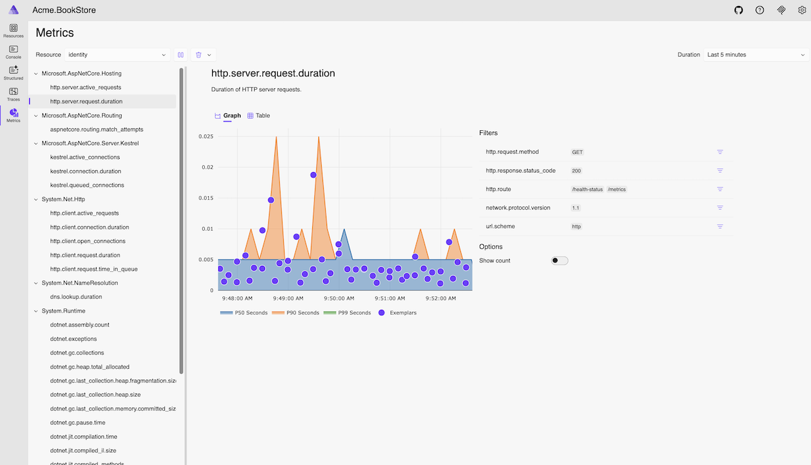

## Pre-Configured Observability Tools

AppHost comes with pre-configured observability and management tools:

### Grafana

Visualization and analytics platform for monitoring metrics with interactive dashboards.

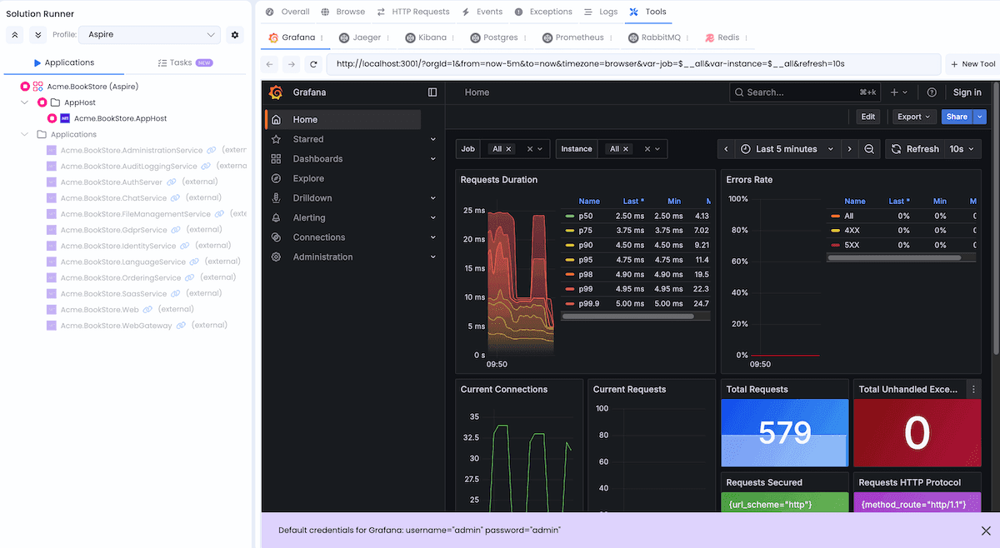

### Jaeger

Distributed tracing system to monitor and troubleshoot problems across microservices.

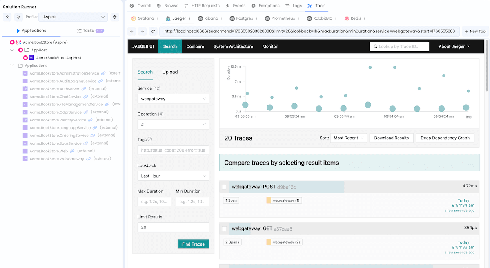

### Kibana

Visualization tool for Elasticsearch data with search and data visualization capabilities for logs.

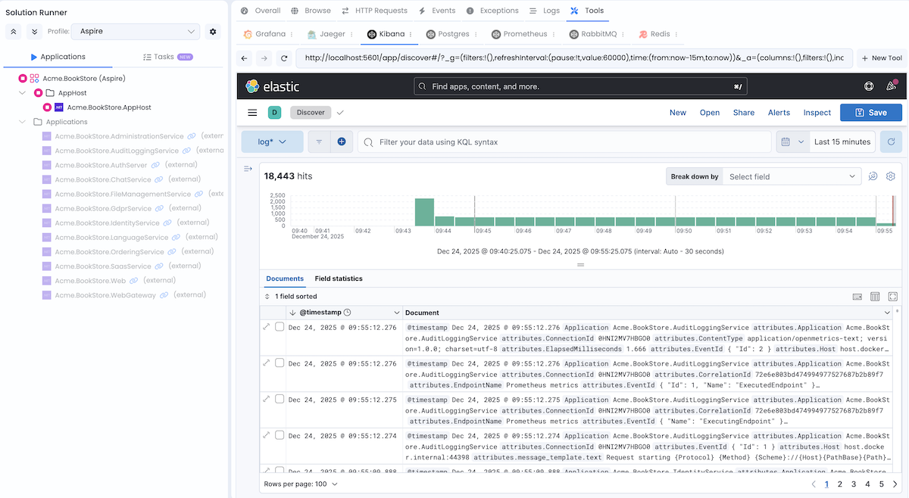

### Prometheus

Monitoring and alerting toolkit that collects and stores metrics as time series data.

### RabbitMQ Management

Web-based interface for managing and monitoring the RabbitMQ message broker.

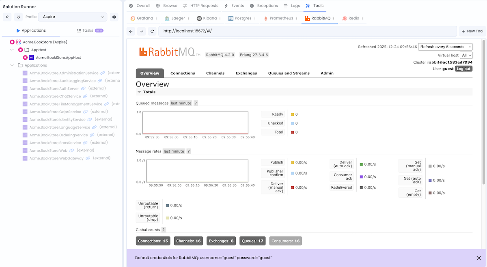

### Redis Insight

Visual tool for Redis that allows you to browse data, run commands, and monitor performance.

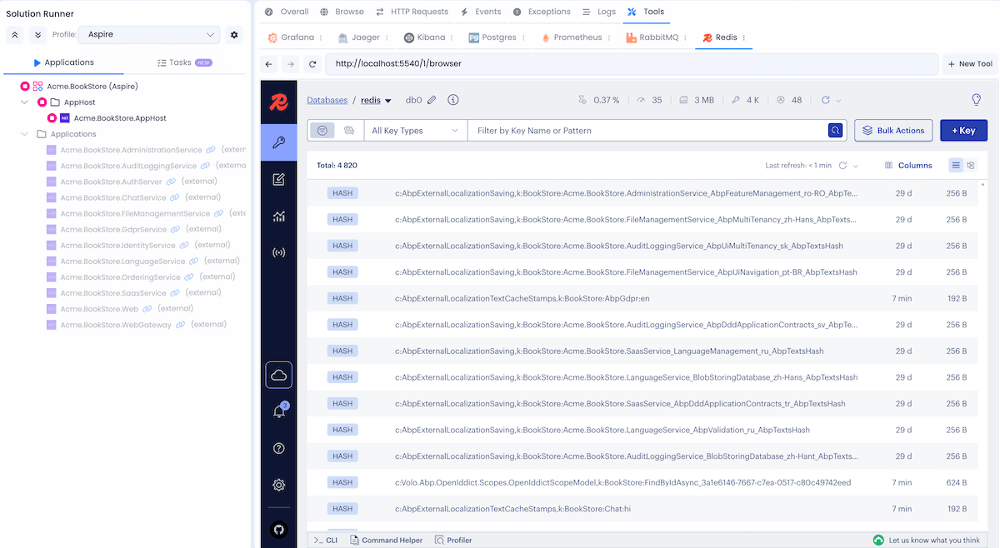

### Database Admin Tools

The database management admin tool varies by database type:

| Database | Tool |
|----------|------|
| SQL Server | DBeaver CloudBeaver |
| MySQL | phpMyAdmin |
| PostgreSQL | pgAdmin |
| MongoDB | Mongo Express |

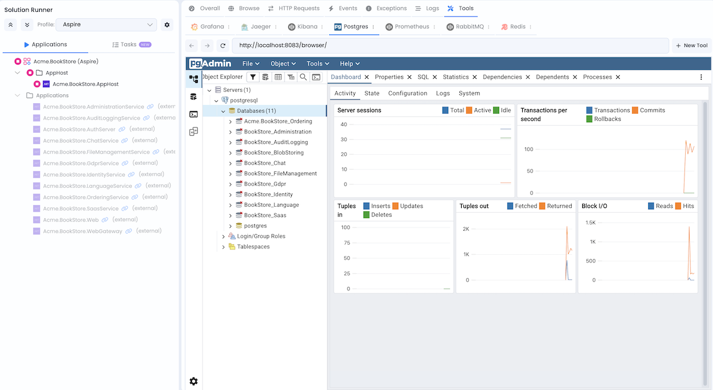

## Get Started Today

Ready to experience the power of .NET Aspire with ABP? Create a new microservice solution in ABP Studio and enable the .NET Aspire integration option. For detailed documentation, visit our [.NET Aspire Integration Guide](https://abp.io/docs/latest/solution-templates/microservice/aspire-integration).

To learn more about .NET Aspire, visit: [https://aspire.dev](https://aspire.dev/get-started/what-is-aspire/)

We are excited to bring this integration to you and can't wait to hear your feedback. If you have any questions or suggestions, please drop a comment below.

Happy coding!

**The Volosoft Team**
