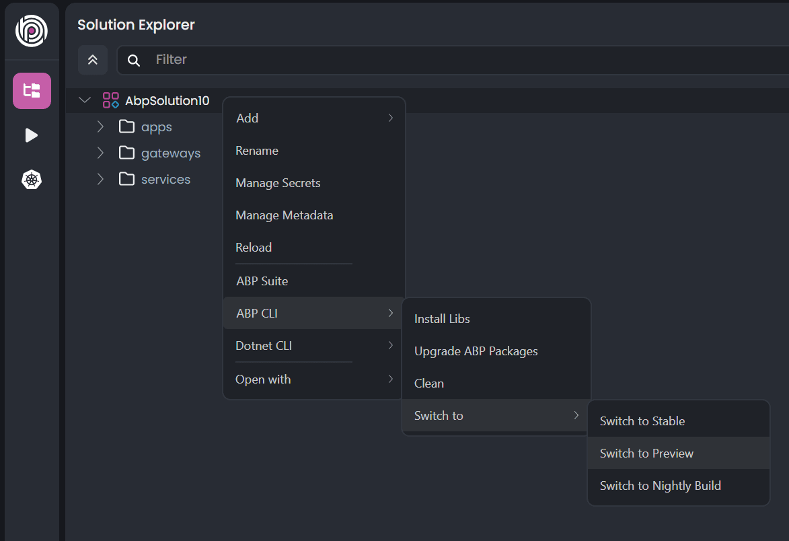
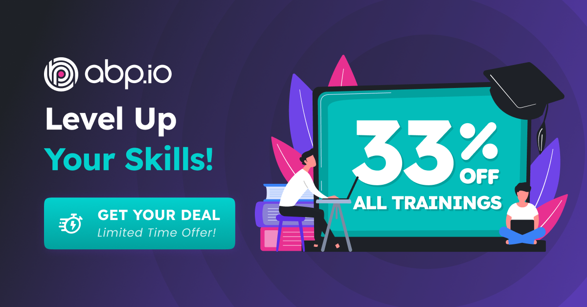
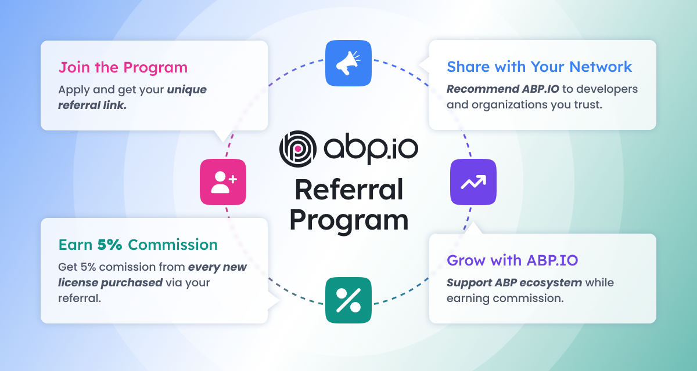
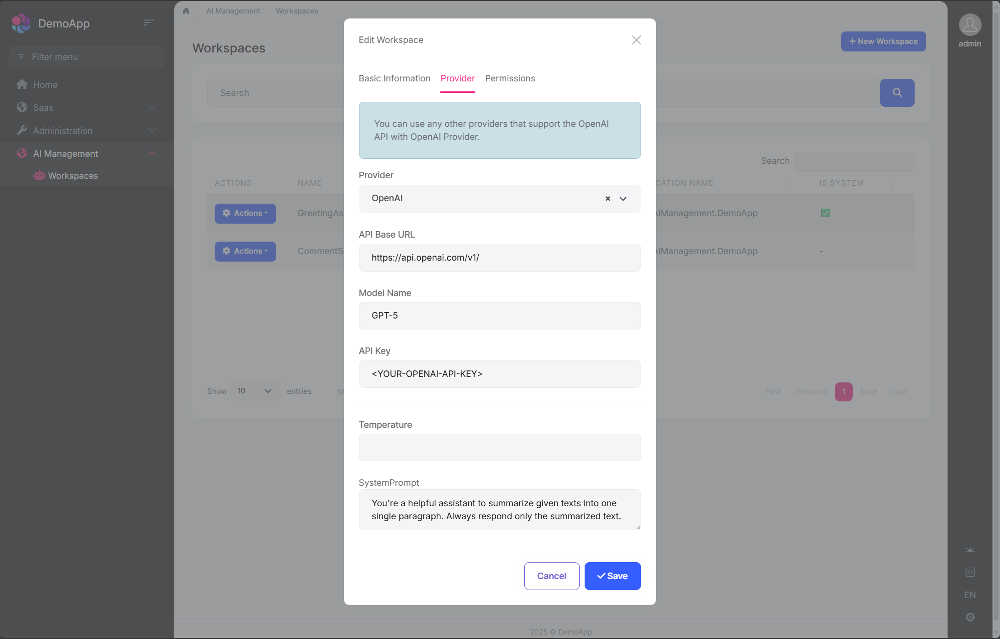
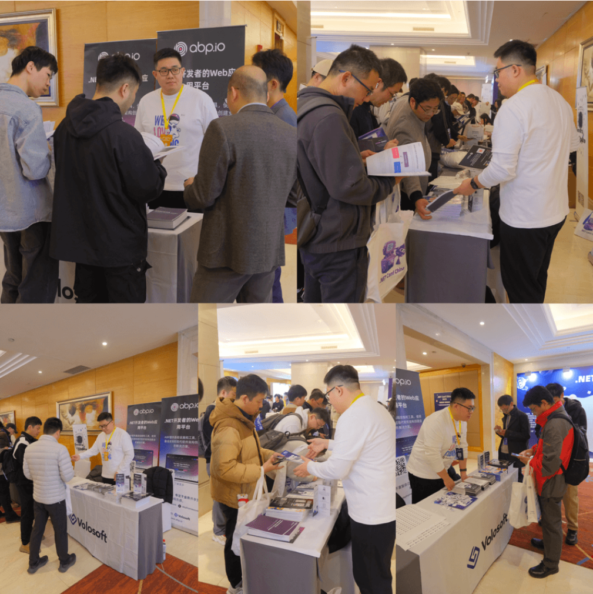
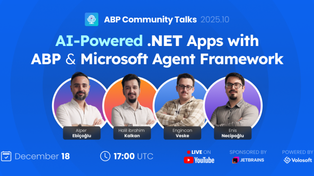

# ABP Platform 10.1 RC Has Been Released

We are happy to release [ABP](https://abp.io) version **10.1 RC** (Release Candidate). This blog post introduces the new features and important changes in this new version.

Try this version and provide feedback for a more stable version of ABP v10.1! Thanks to you in advance.

## Get Started with the 10.1 RC

You can check the [Get Started page](https://abp.io/get-started) to see how to get started with ABP. You can either download [ABP Studio](https://abp.io/get-started#abp-studio-tab) (**recommended**, if you prefer a user-friendly GUI application - desktop application) or use the [ABP CLI](https://abp.io/docs/latest/cli).

By default, ABP Studio uses stable versions to create solutions. Therefore, if you want to create a solution with a preview version, first you need to create a solution and then switch your solution to the preview version from the ABP Studio UI:

## Migration Guide

There are a few breaking changes in this version that may affect your application. Please read the migration guide carefully, if you are upgrading from v10.0 or earlier: [ABP Version 10.1 Migration Guide](https://abp.io/docs/10.1/release-info/migration-guides/abp-10-1).

## What's New with ABP v10.1?

In this section, I will introduce some major features released in this version.
Here is a brief list of titles explained in the next sections:

//TODO: list and create sections!!!

## Community News

### Special Offer: Level Up Your ABP Skills with 33% Off Live Trainings!

We're excited to announce a special limited-time offer for developers looking to master the ABP Platform! Get **33% OFF** on all ABP live training sessions and accelerate your learning journey with hands-on guidance from ABP experts.

**Why Join ABP Live Trainings?**

Our live training sessions provide an immersive learning experience where you can:

- **Learn from the Experts**: Get direct instruction from ABP team members and experienced trainers who know the platform inside and out.
- **Hands-On Practice**: Work through real-world scenarios and build actual applications during the sessions.
- **Interactive Q&A**: Ask questions in real-time and get immediate answers to your specific challenges.
- **Comprehensive Coverage**: From fundamentals to advanced topics, our trainings cover everything you need to build production-ready applications with ABP.
- **Certificate of Completion**: Receive a certificate upon completing the training to showcase your ABP expertise.

Don't miss this opportunity to invest in your skills and career. Whether you're new to ABP or looking to advance your expertise, our live trainings provide the structured learning path you need to succeed.

> 👉 [Learn more and claim your discount here](https://abp.io/community/announcements/improve-your-abp-skills-with-33-off-live-trainings-hjnw57xu)

### Introducing the ABP Referral Program

We're thrilled to announce the launch of the **ABP.IO Referral Program**, a new way for our community members to earn rewards while helping others discover the ABP Platform!

**How It Works:**

ABP's Referral Program is simple and rewarding:

1. **Get Your Unique Referral Link**: Sign up for the program and receive your personalized referral link.
2. **Share with Your Network**: Share your link with colleagues, friends, and fellow developers who could benefit from ABP.
3. **Earn Rewards**: When someone purchases an ABP Commercial license through your referral link, **you earn 5% commission**!

By joining the referral program, you're not just earning rewards and also you're helping other developers discover a platform that can significantly improve their productivity and project success.

> 👉 [Join the ABP.IO Referral Program](https://abp.io/community/announcements/introducing-abp.io-referral-program-b59obhe7)

### Announcing AI Management Module

We are excited to announce the [AI Management Module](https://abp.io/docs/10.0/modules/ai-management), a powerful new module to the ABP Platform that makes managing AI capabilities in your applications easier than ever!

**What is the AI Management Module?**

Built on top of the [ABP Framework's AI infrastructure](https://abp.io/docs/latest/framework/infrastructure/artificial-intelligence), the **AI Management Module** allows you to manage AI workspaces dynamically without touching your code. Whether you're building a customer support chatbot, adding AI-powered search, or creating intelligent automation workflows, this module provides everything you need to manage AI integrations through a user-friendly interface.

**Key Features:**

- **Multi-Provider Support**: Allows integrating with multiple AI providers including OpenAI, Google Gemini, Anthropic Claude, and more from a single unified API.
- **Buit-In Chat Interface**
- **Ready to Use Chat Widget**
- and more... (RAG & MCP supports are on the way!)

👉 [Read the announcement post for more...](https://abp.io/community/announcements/introducing-the-ai-management-module-nz9404a9)

### We Were At .NET Conf China 2025!

The ABP team participated in **.NET Conf China 2025** in Shanghai, celebrating the release of .NET 10 (LTS) and the achievements of the .NET community in China. 

**Event Highlights:**

The conference brought together hundereds of developers and featured Scott Hanselman's opening keynote announcing .NET 10's availability, focused on four pillars: AI, cloud-native, cross-platform, and performance. The event covered three main themes: performance improvements, AI integration, and cross-platform development, with in-depth sessions on topics ranging from Avalonia and Blazor to AI agents and enterprise adoption.

**ABP's Participation:**

At the ABP booth, we showcased our developer platform with live demonstrations of modular architecture, multi-tenancy support, and built-in authentication systems. We hosted interactive raffles with prizes including ABP stickers, the _Mastering ABP Framework_ book, and Bluetooth headphones. The booth was a hub for sharing experiences, impromptu code walkthroughs, and meaningful conversations with Chinese developers about ABP's future.

> 👉 [Read the full event recap](https://abp.io/community/announcements/.net-conf-china-2025-fz03gfge)

### Community Talks 2025.10: AI-Powered .NET Apps with ABP & Microsoft Agent Framework

In our latest ABP Community Talks session, we dove deep into the world of **Artificial Intelligence** and its integration with the ABP Framework. This session explored Microsoft's cutting-edge AI libraries: **Extensions AI**, **Semantic Kernel**, and the **Microsoft Agent Framework**.

**What We Covered:**

We introduced the new **AI Management Module**, discussing its current status and roadmap. The session included practical demonstrations on building intelligent applications with the Microsoft Agent Framework within ABP projects, showing how these technologies empower developers to create AI-powered .NET applications.

> 👉 [Missed the live session? Click here to watch the full session](https://www.youtube.com/live/tEcd2H6yXQk)

### New ABP Community Articles

There are exciting articles contributed by the ABP community as always. I will highlight some of them here:

- [Salih Özkara](https://github.com/salihozkara) has published 3 new articles:
    - [Building Dynamic XML Sitemaps with ABP Framework](https://abp.io/community/articles/building-dynamic-xml-sitemaps-with-abp-framework-n3q6schd)
    - [Implement Automatic Method-Level Caching in ABP Framework](https://abp.io/community/articles/implement-automatic-methodlevel-caching-in-abp-framework-4uzd3wx8)
    - [Building Production-Ready LLM Applications with .NET: A Practical Guide](https://abp.io/community/articles/building-production-ready-llm-applications-with-net-ya7qemfa)
- [Adnan Ali](https://abp.io/community/members/adnanaldaim) has published 2 new articles:
    - [Integrating AI into ABP.IO Applications: The Complete Guide to Volo.Abp.AI and AI Management Module](https://abp.io/community/articles/integrating-ai-into-abp.io-applications-the-complete-guide-jc9fbjq0)
    - [How ABP.IO Framework Cuts Your MVP Development Time by 60%](https://abp.io/community/articles/how-abp.io-framework-cuts-your-mvp-development-time-by-60-8l7m3ugj)
- [My First Look and Experience with Google AntiGravity](https://abp.io/community/articles/my-first-look-and-experience-with-google-antigravity-0hr4sjtf) by [Alper Ebiçoğlu](https://twitter.com/alperebicoglu)
- [TOON vs JSON for LLM Prompts in ABP: Token-Efficient Structured Context](https://abp.io/community/articles/toon-vs-json-b4rn2avd) by [Suhaib Mousa](https://abp.io/community/members/suhaib-mousa)

Thanks to the ABP Community for all the content they have published. You can also [post your ABP-related (text or video) content](https://abp.io/community/posts/create) to the ABP Community.

## Conclusion

This version comes with some new features and a lot of enhancements to the existing features. You can see the [Road Map](https://abp.io/docs/10.1/release-info/road-map) documentation to learn about the release schedule and planned features for the next releases. Please try ABP v10.1 RC and provide feedback to help us release a more stable version.

Thanks for being a part of this community!