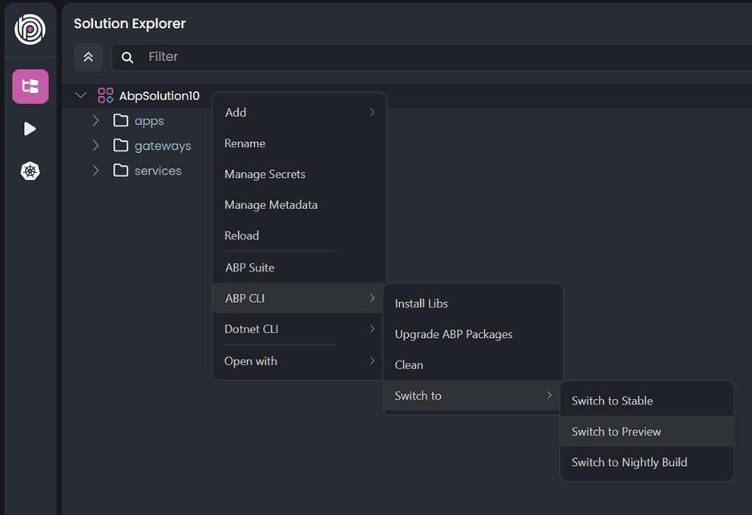
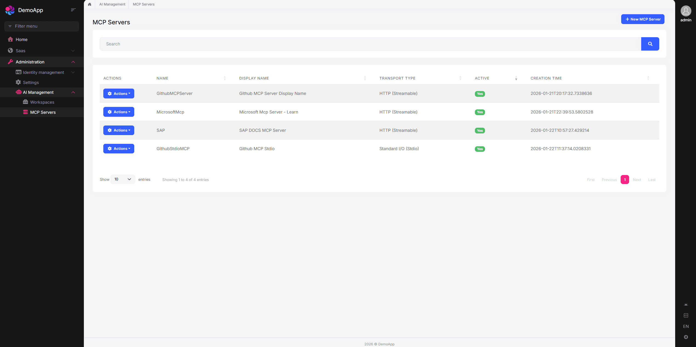
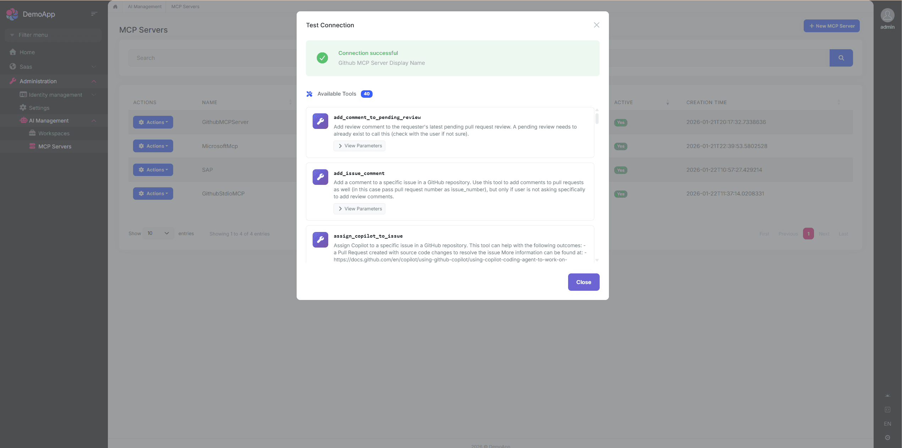
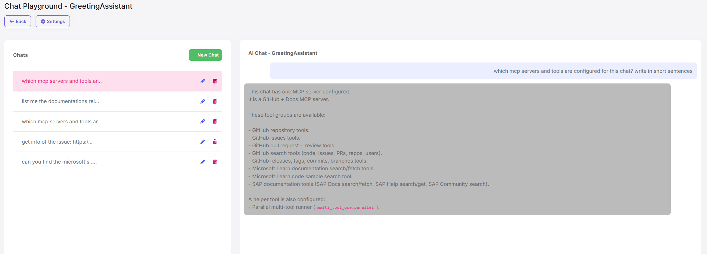
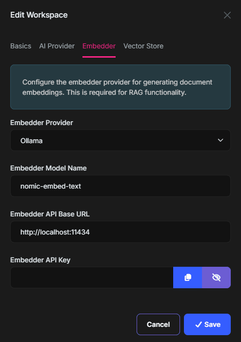
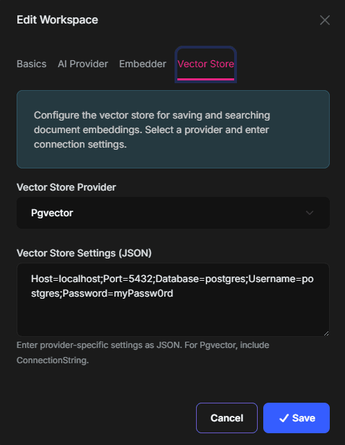
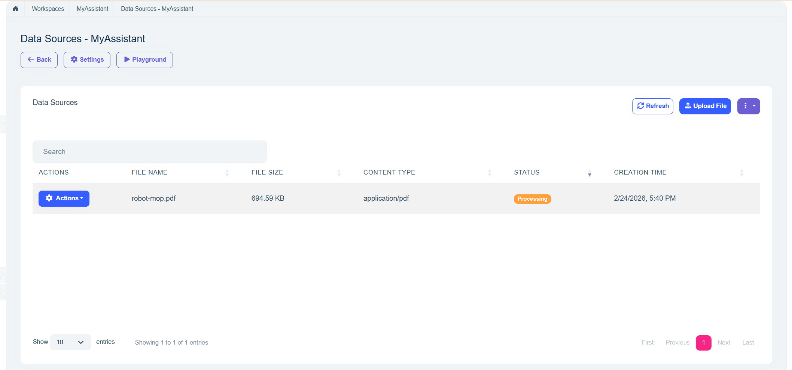
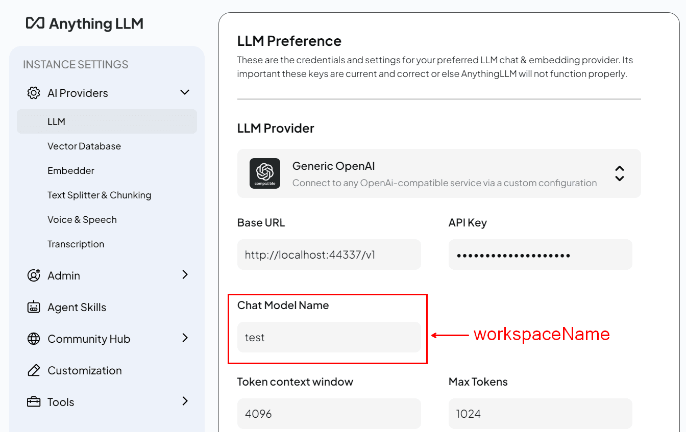
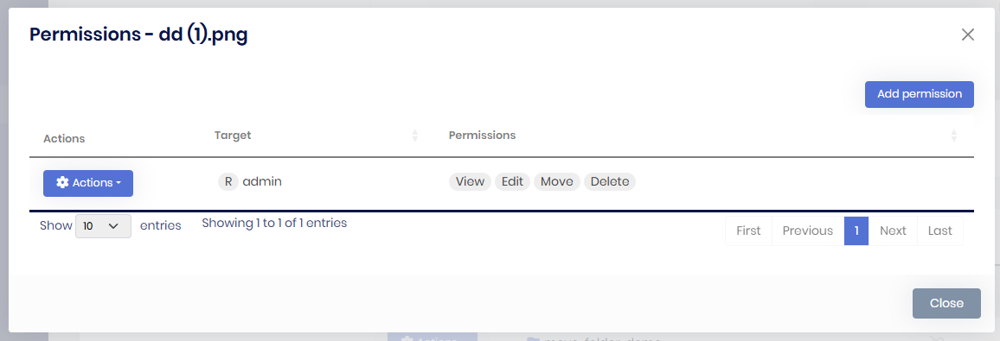

# ABP Platform 10.2 RC Has Been Released

We are happy to release [ABP](https://abp.io) version **10.2 RC** (Release Candidate). This blog post introduces the new features and important changes in this new version.

Try this version and provide feedback for a more stable version of ABP v10.2! Thanks to you in advance.

## Get Started with the 10.2 RC

You can check the [Get Started page](https://abp.io/get-started) to see how to get started with ABP. You can either download [ABP Studio](https://abp.io/get-started#abp-studio-tab) (**recommended**, if you prefer a user-friendly GUI application - desktop application) or use the [ABP CLI](https://abp.io/docs/latest/cli).

By default, ABP Studio uses stable versions to create solutions. Therefore, if you want to create a solution with a preview version, first you need to create a solution and then switch your solution to the preview version from the ABP Studio UI:



## Migration Guide

There are a few breaking changes in this version that may affect your application. Please read the migration guide carefully, if you are upgrading from v10.1 or earlier: [ABP Version 10.2 Migration Guide](https://abp.io/docs/10.2/release-info/migration-guides/abp-10-2).

## What's New with ABP v10.2?

In this section, I will introduce some major features released in this version.
Here is a brief list of titles explained in the next sections:

- Multi-Tenant Account Usage: Shared User Accounts
- Prevent Privilege Escalation: Assignment Restrictions for Roles and Permissions
- `ClientResourcePermissionValueProvider` for OAuth/OpenIddict
- Angular: Hybrid Localization Support
- Angular: Extensible Table Row Detail
- Angular: CMS Kit Module Features
- Blazor: Upgrade to Blazorise 2.0
- Identity: Single Active Token Providers
- TickerQ Package Upgrade to 10.1.1
- AI Management: MCP (Model Context Protocol) Support
- AI Management: RAG with File Upload
- AI Management: OpenAI-Compatible Chat Endpoint
- File Management: Resource-Based Authorization
- Angular: CMS Kit Pro Implementation

### Multi-Tenant Account Usage: Shared User Accounts

ABP v10.2 introduces **Shared User Accounts**: a single user account can belong to multiple tenants, and the user can choose or switch the active tenant when signing in. This enables a "one account, multiple tenants" experience — for example, inviting the same email address into multiple tenants.

When you use Shared User Accounts:

- Username/email uniqueness becomes **global** (Host + all tenants)
- Users are prompted to select the tenant at login if they belong to multiple tenants
- Users can switch between tenants using the tenant switcher in the user menu
- Tenant administrators can invite existing or new users to join a tenant

Enable shared accounts by configuring `UserSharingStrategy`:

```csharp
Configure<AbpMultiTenancyOptions>(options =>
{
    options.IsEnabled = true;
    options.UserSharingStrategy = TenantUserSharingStrategy.Shared;
});
```

> See the [Shared User Accounts](https://abp.io/docs/10.2/modules/account/shared-user-accounts) documentation for details.

### Prevent Privilege Escalation: Assignment Restrictions for Roles and Permissions

ABP v10.2 implements a unified **privilege escalation prevention** model to address security vulnerabilities where users could assign themselves or others roles or permissions they do not possess.

**Role Assignment Restriction:** Users can only assign or remove roles they currently have. Users cannot add new roles to themselves (removal only) and cannot assign or remove roles they do not possess.

**Permission Grant/Revoke Authorization:** Users can only grant or revoke permissions they currently have. Validation applies to both grant and revoke operations.

**Incremental Permission Protection:** When updating user or role permissions, permissions the current user does not have are treated as non-editable and are preserved as-is during updates.

Users with the `admin` role can assign any role and grant/revoke any permission. All validations are enforced on the backend — the UI is not a security boundary.

> See [#24775](https://github.com/abpframework/abp/pull/24775) for more details.

### `ClientResourcePermissionValueProvider` for OAuth/OpenIddict

ABP v10.2 adds **ClientResourcePermissionValueProvider**, extending resource-based authorization to OAuth clients. When using IdentityServer or OpenIddict, clients can now have resource permissions aligned with the standard user and role permission model.

This allows you to control which OAuth clients can access which resources, providing fine-grained authorization for API consumers. The implementation integrates with ABP's existing resource permission infrastructure.

> See [#24515](https://github.com/abpframework/abp/pull/24515) for more details.

### Angular: Hybrid Localization Support

ABP v10.2 introduces **Hybrid Localization** for Angular applications, combining server-side and client-side localization strategies. This gives you flexibility in how translations are loaded and resolved — you can use server-provided localization, client-side fallbacks, or a mix of both.

This feature is useful when you want to reduce initial load time, support offline scenarios, or have environment-specific localization behavior. The Angular packages have been updated to support the hybrid approach seamlessly.

> See the [Hybrid Localization](https://abp.io/docs/10.2/framework/ui/angular/hybrid-localization) documentation and [#24731](https://github.com/abpframework/abp/pull/24731).

### Angular: Extensible Table Row Detail

ABP v10.2 adds the **ExtensibleTableRowDetailComponent** for expandable row details in extensible tables. You can now display additional information for each row in a collapsible detail section.

The feature supports row detail templates via both direct input and content child component. It adds toggle logic and emits `rowDetailToggle` events, making it easy to customize the behavior and appearance of expandable rows in your data tables.

> See [#24636](https://github.com/abpframework/abp/pull/24636) for more details.

### Angular: CMS Kit Module Features

ABP v10.2 brings **CMS Kit features to Angular**, completing the cross-platform UI coverage for the CMS Kit module. The Angular implementation includes: Blogs, Blog Posts, Comments, Menus, Pages, Tags, Global Resources, and CMS Settings.

Together with the CMS Kit Pro Angular implementation (FAQ, Newsletters, Page Feedbacks, Polls, Url forwarding), ABP now provides full Angular UI coverage for both the open-source CMS Kit and CMS Kit Pro modules.

> See [#24234](https://github.com/abpframework/abp/pull/24234) for more details.

### Blazor: Upgrade to Blazorise 2.0

ABP v10.2 upgrades the [Blazorise](https://blazorise.com/) library to **version 2.0** for Blazor UI. If you are upgrading your project to v10.2 RC, please ensure that all Blazorise-related packages are updated to v2.0 in your application.

Blazorise 2.0 includes various improvements and changes. Please refer to the [Blazorise 2.0 Release Notes](https://blazorise.com/news/release-notes/200) and the [ABP Blazorise 2.0 Migration Guide](https://abp.io/docs/10.2/release-info/migration-guides/blazorise-2-0-migration) for upgrade instructions.

> See [#24906](https://github.com/abpframework/abp/pull/24906) for more details.

### Identity: Single Active Token Providers

ABP v10.2 introduces a **single active token** policy for password reset, email confirmation, and change-email flows. Three new token providers are available: `AbpPasswordResetTokenProvider`, `AbpEmailConfirmationTokenProvider`, and `AbpChangeEmailTokenProvider`.

When a new token is generated, it invalidates any previously issued tokens for that purpose. This improves security by ensuring that only the most recently issued token is valid. Token lifespan can be customized via the respective options classes for each provider.

> See [#24926](https://github.com/abpframework/abp/pull/24926) for more details.

### TickerQ Package Upgrade to 10.1.1

**If you are using the TickerQ integration packages** (`Volo.Abp.TickerQ`, `Volo.Abp.BackgroundJobs.TickerQ`, or `Volo.Abp.BackgroundWorkers.TickerQ`), you need to apply breaking changes when upgrading to ABP 10.2. TickerQ has been upgraded from 2.5.3 to 10.1.1, which only targets .NET 10.0 and contains several API changes.

Key changes include:

- `UseAbpTickerQ` moved from `IApplicationBuilder` to `IHost` — use `context.GetHost().UseAbpTickerQ()` in your module
- Entity types renamed: `TimeTicker` → `TimeTickerEntity`, `CronTicker` → `CronTickerEntity`
- Scheduler and dashboard configuration APIs have changed
- New helpers: `context.GetHost()`, `GetWebApplication()`, `GetEndpointRouteBuilder()`

> **Important:** Do **not** resolve `IHost` from `context.ServiceProvider.GetRequiredService<IHost>()`. Always use `context.GetHost()`. See the [ABP Version 10.2 Migration Guide](https://abp.io/docs/10.2/release-info/migration-guides/abp-10-2) for the complete list of changes.

### AI Management: MCP (Model Context Protocol) Support

_This is a **PRO** feature available for ABP Commercial customers._

The [AI Management Module](https://abp.io/docs/10.2/modules/ai-management) now supports [MCP (Model Context Protocol)](https://modelcontextprotocol.io/), enabling AI workspaces to use external MCP servers as tools. MCP allows AI models to interact with external services, databases, APIs, and more through a standardized protocol.



You can create and manage MCP servers via the AI Management UI. Each MCP server supports one of the following transport types: **Stdio** (runs a local command), **SSE** (Server-Sent Events), or **StreamableHttp**. For HTTP-based transports, you can configure authentication (API Key, Bearer token, or custom headers). Once MCP servers are defined, you can associate them with workspaces. When a workspace has MCP servers associated, the AI model can invoke tools from those servers during chat conversations — tool calls and results are displayed in the chat interface.

You can test the connection to an MCP server after creating it to verify connectivity and list available tools before use:



When a workspace has MCP servers associated, the AI model can invoke tools from those servers during chat conversations. Tool calls and results are displayed in the chat interface.



> See the [AI Management documentation](https://abp.io/docs/10.2/modules/ai-management#mcp-servers) for details.

### AI Management: RAG with File Upload

_This is a **PRO** feature available for ABP Commercial customers._

The AI Management module supports **RAG (Retrieval-Augmented Generation)** with file upload, which enables workspaces to answer questions based on the content of uploaded documents. When RAG is configured, the AI model searches the uploaded documents for relevant information before generating a response.

To enable RAG, configure an **embedder** (e.g., OpenAI, Ollama) and a **vector store** (e.g., PgVector) on the workspace:

| Embedder | Vector Store |
| --- | --- |
|  |  |

You can then upload documents (PDF, Markdown, or text files, max 10 MB) through the workspace management UI. Uploaded documents are automatically processed — their content is chunked, embedded, and stored in the configured vector store:



When you ask questions in the chat interface, the AI model uses the uploaded documents as context for accurate, grounded responses.

> See the [AI Management — RAG with File Upload](https://abp.io/docs/10.2/modules/ai-management#rag-with-file-upload) documentation for configuration details.

### AI Management: OpenAI-Compatible Chat Endpoint

_This is a **PRO** feature available for ABP Commercial customers._

The AI Management module exposes an **OpenAI-compatible REST API** at the `/v1` path. This allows any application or tool that supports the OpenAI API format — such as [AnythingLLM](https://anythingllm.com/), [Open WebUI](https://openwebui.com/), [Dify](https://dify.ai/), or custom scripts using the OpenAI SDK — to connect directly to your AI Management instance.

**Example configuration from AnythingLLM**:



Each AI Management **workspace** appears as a selectable model in the client application. The workspace's configured AI provider handles the actual inference transparently. Available endpoints include `/v1/chat/completions`, `/v1/models`, `/v1/embeddings`, `/v1/files`, and more. All endpoints require authentication via a Bearer token in the `Authorization` header.

> See the [AI Management — OpenAI-Compatible API](https://abp.io/docs/10.2/modules/ai-management#openai-compatible-api) documentation for usage examples.

### File Management: Resource-Based Authorization

_This is a **PRO** feature available for ABP Commercial customers._

The **File Management Module** now supports **resource-based authorization**. You can control access to individual files and folders per user, role, or client. Permissions can be granted at the resource level via the UI, and the feature integrates with ABP's resource permission infrastructure.



This feature is **implemented for all three supported UIs: MVC/Razor Pages, Blazor, and Angular**, providing a consistent experience across your application regardless of the UI framework you use.

### Other Improvements and Enhancements

- **Angular signal APIs**: ABP Angular packages migrated to signal queries, output functions, and signal input functions for alignment with Angular 21 ([#24765](https://github.com/abpframework/abp/pull/24765), [#24766](https://github.com/abpframework/abp/pull/24766), [#24777](https://github.com/abpframework/abp/pull/24777)).
- **Angular Vitest**: ABP Angular templates now use Vitest as the default testing framework instead of Karma/Jasmine ([#24725](https://github.com/abpframework/abp/pull/24725)).
- **Ambient auditing**: Programmatic disable/enable of auditing via `IAuditingHelper.DisableAuditing()` and `IsAuditingEnabled()` ([#24718](https://github.com/abpframework/abp/pull/24718)).
- **Complex property auditing**: Entity History and ModifierId now support EF Core complex properties ([#24767](https://github.com/abpframework/abp/pull/24767)).
- **RabbitMQ correlation ID**: Correlation ID support added to RabbitMQ JobQueue for distributed tracing ([#24755](https://github.com/abpframework/abp/pull/24755)).
- **Concurrent config retrieval**: `MvcCachedApplicationConfigurationClient` now fetches configuration and localization concurrently for faster startup ([#24838](https://github.com/abpframework/abp/pull/24838)).
- **Environment localization fallback**: Angular can use `environment.defaultResourceName` when the backend does not provide it ([#24589](https://github.com/abpframework/abp/pull/24589)).
- **JS proxy namespace fix**: Resolved namespace mismatch for multi-segment company names in generated proxies ([#24877](https://github.com/abpframework/abp/pull/24877)).
- **Audit Logging max length**: Entity/property type full names increased to 512 characters to reduce truncation ([#24846](https://github.com/abpframework/abp/pull/24846)).
- **AI guidelines**: Cursor and Copilot AI guideline documents added for ABP development ([#24563](https://github.com/abpframework/abp/pull/24563), [#24593](https://github.com/abpframework/abp/pull/24593)).

## Community News

### New ABP Community Articles

As always, exciting articles have been contributed by the ABP community. I will highlight some of them here:

- [Enis Necipoğlu](https://abp.io/community/members/enisn) has published 2 new posts:
  - [ABP Framework's Hidden Magic: Things That Just Work Without You Knowing](https://abp.io/community/articles/hidden-magic-things-that-just-work-without-you-knowing-vw6osmyt)
  - [Implementing Multiple Global Query Filters with Entity Framework Core](https://abp.io/community/articles/implementing-multiple-global-query-filters-with-entity-ugnsmf6i)
- [Suhaib Mousa](https://abp.io/community/members/suhaib-mousa) has published 2 new posts:
  - [.NET 11 Preview 1 Highlights: Faster Runtime, Smarter JIT, and AI-Ready Improvements](https://abp.io/community/articles/dotnet-11-preview-1-highlights-hspp3o5x)
  - [TOON vs JSON for LLM Prompts in ABP: Token-Efficient Structured Context](https://abp.io/community/articles/toon-vs-json-b4rn2avd)
- [Fahri Gedik](https://abp.io/community/members/fahrigedik) has published 2 new posts:
  - [Building a Multi-Agent AI System with A2A, MCP, and ADK in .NET](https://abp.io/community/articles/building-a-multiagent-ai-system-with-a2a-mcp-iefdehyx)
  - [Async Chain of Persistence Pattern: Designing for Failure in Event-Driven Systems](https://abp.io/community/articles/async-chain-of-persistence-pattern-wzjuy4gl)
- [Alper Ebiçoğlu](https://abp.io/community/members/alper) has published 2 new posts:
  - [NDC London 2026: From a Developer's Perspective and My Personal Notes about AI](https://abp.io/community/articles/ndc-london-2026-a-.net-conf-from-a-developers-perspective-07wp50yl)
  - [Which Open-Source PDF Libraries Are Recently Popular? A Data-Driven Look At PDF Topic](https://abp.io/community/articles/which-opensource-pdf-libraries-are-recently-popular-a-g68q78it)
- [Stop Spam and Toxic Users in Your App with AI](https://abp.io/community/articles/stop-spam-and-toxic-users-in-your-app-with-ai-3i0xxh0y) by [Engincan Veske](https://abp.io/community/members/EngincanV)
- [How AI Is Changing Developers](https://abp.io/community/articles/how-ai-is-changing-developers-e8y4a85f) by [Liming Ma](https://abp.io/community/members/maliming)
- [JetBrains State of Developer Ecosystem Report 2025 — Key Insights](https://abp.io/community/articles/jetbrains-state-of-developer-ecosystem-report-2025-key-z0638q5e) by [Tarık Özdemir](https://abp.io/community/members/mtozdemir)
- [Integrating AI into ABP.IO Applications: The Complete Guide to Volo.Abp.AI and AI Management Module](https://abp.io/community/articles/integrating-ai-into-abp.io-applications-the-complete-guide-jc9fbjq0) by [Adnan Ali](https://abp.io/community/members/adnanaldaim)

Thanks to the ABP Community for all the content they have published. You can also [post your ABP related (text or video) content](https://abp.io/community/posts/create) to the ABP Community.

## Conclusion

This version comes with some new features and a lot of enhancements to the existing features. You can see the [Road Map](https://abp.io/docs/10.2/release-info/road-map) documentation to learn about the release schedule and planned features for the next releases. Please try ABP v10.2 RC and provide feedback to help us release a more stable version.

Thanks for being a part of this community!
