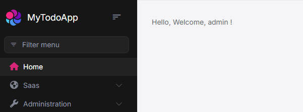
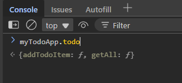
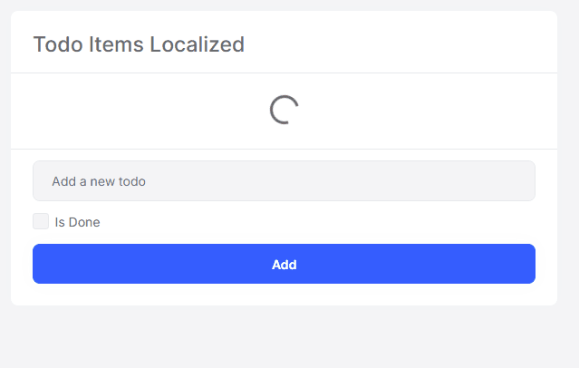
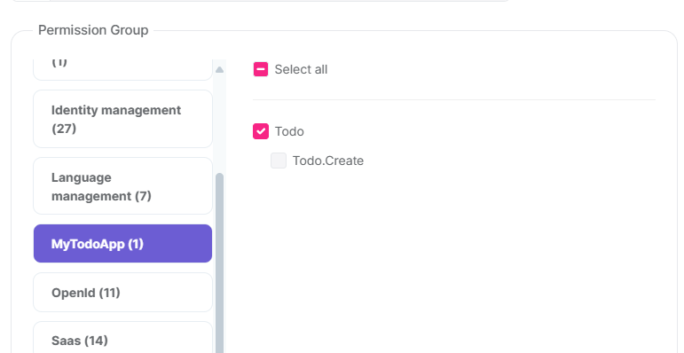
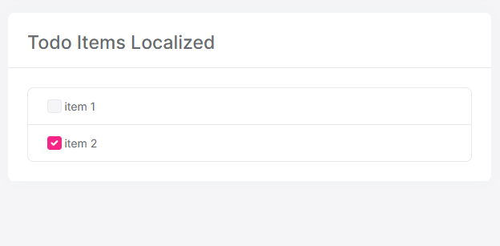

# Using Vue components in your Razor Pages ABP Application

In modern web development, integrating dynamic front-end frameworks with server-side technologies has become increasingly essential for creating responsive and interactive applications. This article explores how to effectively use Vue components within Razor Pages in an ABP Framework application. We will delve into the process of consuming endpoints through ABP Client Proxies, leveraging ABP's powerful localization features to enhance user experience, and implementing ABP permissions to ensure secure access control. By the end of this guide, you will have a comprehensive understanding of how to seamlessly blend Vue.js with Razor Pages, empowering you to build robust and user-friendly applications.

This arcitle won't use any SPA approach. The goal of this article to use Razor Pages with simple Vue components to eliminate jQuery while developing MVC application.

## Creating the Solution

Let's create a simple TODO list application to demonstrate how to use Vue components in Razor Pages. I'll build a really simple backend without connection to a database for demonstration purposes. We will focus to the frontend part.

- Creating solution with ABP CLI:

```bash
abp new MyTodoApp -t app-nolayers -csf
```

## Configure Vue

We need to add `@abp/vue` package to the project to use Vue components.

```bash
npm install @abp/vue
```

- Install client libraries by using ABP CLI:

```bash
abp install-libs
```

As a last step, we need to configure our bundle in `ConfigureBundles` method in `MyTodoAppModule.cs` file:

```csharp
private void ConfigureBundles()
{
    Configure<AbpBundlingOptions>(options =>
    {
        // ...

        options.ScriptBundles.Configure(
            // Or BasicThemeBundles.Scripts.Global
            // Or LeptonXLiteThemeBundles.Scripts.Global
            // 👇 Depends on the theme you are using
            LeptonXThemeBundles.Scripts.Global,
            bundle =>
            {
                bundle.AddFiles("/global-scripts.js");
                // 👇 Make sure to add this line
                bundle.AddContributors(typeof(VueScriptContributor));
            }
        );
    });
}
```

> If your IDE doesn't recognize `VueScriptContributor`, you can add it manually:
>
> ```csharp
> using Volo.Abp.AspNetCore.Mvc.UI.Packages.Vue;
> ```

Now we're ready to use Vue components in our Razor Pages.

## Creating a Vue Component

Let's create a simple Vue component to display the TODO list.

### Passing a simple message to the component

- Remove existing html coes in `Index.cshtml` and replace with the following code:

```html
<div id="vue-app">
    <todo-component :message="'Welcome, @CurrentUser.UserName !'"></todo-component>
</div>
```

- Navigate to `Index.cshtml.js` file and add the following code:
```js
Vue.component('todo-component', {
    template: '<div>Hello, {{ message }}</div>',
    props: ['message']
});

new Vue({
    el: '#vue-app'
});
```

Run the application and you should see the following output:



> _Hard refresh might be required to see the component since we added a new vue js file to the bundle._
> 
> If still you can't see the component, please check the browser console for any errors.

### Interacting with the component

Let's add a button to the component to interact with the component.

- Add another component in the `Index.cshtml` file:

```html
<div id="vue-app">
    <message-component :message="'Welcome, @CurrentUser.UserName !'"></message-component>
    <counter-component></counter-component>
</div>
```

```js
Vue.component('counter-component', {
    template:`
    <div class="card">
        <div class="card-body">
            <p>Count: {{ count }}</p>
            <button class="btn btn-primary" @click="increment">Increment</button>
        </div>
    </div>
    `,
    data: function () {
        return {
            count: 0
        };
    },
    methods: {
        increment: function () {
            this.count++;
        }
    }
});
```

> _Do not replicate `new Vue({})` code block in the file. It's already in the `Index.cshtml.js` file. Keep it as it is._

Run the application and you should see the following output:


## Using ABP Client Proxy, Authorization and Localization


### Building the backend
Before we go, let's build our backend to use in the component.

- Creating a simple Application Service:

```csharp
public class TodoAppService : MyTodoAppAppService, ITodoAppService
{
    public static List<TodoItem> Items { get; } = new List<TodoItem>();

    [Authorize("Todo.Create")]
    public async Task<TodoItem> AddTodoItemAsync(TodoItem input)
    {
        Items.Add(input);
        return input;
    }

    [Authorize("Todo")]
    public async Task<List<TodoItem>> GetAllAsync()
    {
        await Task.Delay(1500);
        return Items;
    }
}
```

- `TodoItem.cs`

```csharp
public class TodoItem
{
    public string Description { get; set; }
    public bool IsDone { get; set; }
}
```

- `ITodoAppService.cs`

```csharp
public interface ITodoAppService
{
    Task<List<TodoItem>> GetAllAsync();
    Task<TodoItem> AddTodoItemAsync(TodoItem input);
}
```

- Run the application and if you can see the following client proxy in the browser console, you're ready to go:

    

> [!NOTE]
> If you can't see the client proxy in the browser console, please check the [Dynamic JavaScript Proxies](https://abp.io/docs/latest/framework/ui/mvc-razor-pages/dynamic-javascript-proxies) to learn how to enable it.

- Add a new permission in the `MyTodoAppPermissionDefinitionProvider.cs` file:
```csharp
public override void Define(IPermissionDefinitionContext context)
{
    var myGroup = context.AddGroup(MyTodoAppPermissions.GroupName);

    var todo = myGroup.AddPermission("Todo");
    todo.AddChild("Todo.Create");
}
```
> _I go without localization or constants for simplicity._

- Add a localization key in the `en.json` file:

```json
{
    "TodoItems": "Todo Items Localized"
}
```

### Building the Vue Component: Using ABP Localization, Authorization and Client Proxy

Since the component it directly loaded into the page, we can access the `abp` object in the page. 

So we can use:

- `abp.localization.localize()` to localize a string.
- `abp.auth.isGranted()` to check the authorization.
- `myTodoApp.todo.getAll()` and `myTodoApp.todo.addTodoItem` to call the Application Service.

inside **Vue Component** code.

- Let's add another component named `todo-component` and usee all the **ABP Features** in it.

```html
<div id="vue-app">
    <!-- ... -->
    <todo-component></todo-component>
</div>
```

- Implement the `todo-component` in `Index.cshtml.js` file:

```js
Vue.component('todo-component', {
    template: `
    <div class="card" v-if="abp.auth.isGranted('Todo')">
        <div class="card-header border-bottom">
            <h3>{{ abp.localization.localize('TodoItems') }}</h3>
        </div>
        <div class="card-body">
            <div v-if="isBusy" class="w-100 text-center"> 
                <div class="spinner-border" role="status">
                    <span class="visually-hidden">Loading...</span>
                </div>
            </div>
            <ul v-else-if="todos.length > 0" class="list-group">
                <li class="list-group-item" v-for="item in todos" :key="item.description">
                    <input class="form-check-input" type="checkbox" v-model="item.isDone">
                    <label class="form-check-label">{{ item.description }}</label>
                </li>
            </ul>
            <p v-else>No todos yet</p>
        </div>
        <div v-if="abp.auth.isGranted('Todo.Create')" class="card-footer d-flex flex-column gap-2 border-top pt-2">
            <input class="form-control" type="text" v-model="newTodo.description" placeholder="Add a new todo">
            <div class="form-check">
                <input class="form-check-input" type="checkbox" v-model="newTodo.isDone" id="isDone">
                <label class="form-check-label" for="isDone">Is Done</label>
            </div>

            <button class="btn btn-primary" @click="addTodo">Add</button>
        </div>
    </div>
    `,
    data: function () {
        return {
            newTodo: {
                description: '',
                isDone: false
            },
            isBusy: false,
            todos: []
        };
    },
    methods: {
        addTodo() {
            myTodoApp.todo.addTodoItem(this.newTodo);
            this.newTodo = { description: '', isDone: false };
            this.todos.push(this.newTodo);

            // Preferrable, you can load entire list of todos again.
            // this.loadTodos();
        },
        async loadTodos() {
             if (!abp.auth.isGranted('Todo')) {
                return;
            }
            this.isBusy = true;
            this.todos = await myTodoApp.todo.getAll();
            this.isBusy = false;
        }
    },
    mounted() {
        this.loadTodos();
    }
});
```

And see the result:




Since we use `abp.auth.isGranted()` to check the authorization, we can see the component only if we have the permission.

Whenever you remove `Todo.Create` permission, you can see the component is not rendered.




You won't see the card footer:


