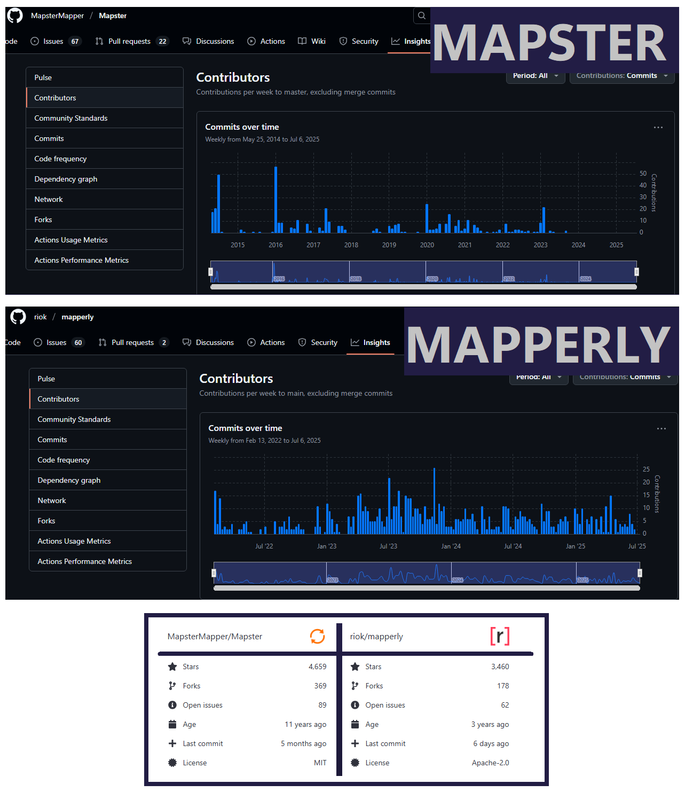

# AutoMapper Starts Charging: Replace with Cost-Free Alternatives


---

## Introduction

[AutoMapper](https://automapper.io/) has been one of the most popular mapping library for .NET apps. It has been free and [open-source](https://github.com/LuckyPennySoftware/AutoMapper) since 2009. On April 16, 2025, Jimmy Bogard (the owner of the library) decided to make it commercial for his own reasons to be sustained. You can read this article about what happened to AutoMapper [here](https://www.jimmybogard.com/automapper-and-mediatr-licensing-update/).

In ABP Framework we have also used AutoMapper for object mappings. After AutoMapper announced its commercial transition, we also needed to replace it. Because ABP Framework is open-source and under [LGPL-3.0 license](https://github.com/abpframework/abp#LGPL-3.0-1-ov-file).   

> That's why, **we decided to replace AutoMapper with Mapperly**.

In this article, we'll discuss the alternatives of AutoMapper so that you can cut down on costs and maximize performance while retaining control over your codebase. 

Also AutoMapper uses heavily reflection. And reflection comes with a performance cost if used indiscriminately, and compile-time safety is limited. Let's see how we can overcome these...


## Why We Chose Mapperly

We looked up different alternatives of AutoMapper, here's the initial issue of AutoMapper replacement https://github.com/abpframework/abp/issues/23243.

 The ABP team started Mapperly integration with this initial commit https://github.com/abpframework/abp/commit/178d3f56d42b4e5acb7e349470f4a644d4c5214e. And this is our Mapperly integration package : https://github.com/abpframework/abp/tree/dev/framework/src/Volo.Abp.Mapperly. 

We filtered down all the alternatives into 2 options: Mapster and Mapperly. You 




Here are some considerations for developers who are used to ABP and AutoMapper. 

### [Mapster](https://github.com/MapsterMapper/Mapster):

* ✔ It is similar to AutoMapper, configuring mappings through code.
* ✔ Support for dependency injection and complex runtime configuration.
* ❌ It is looking additional Mapster maintainers ([Call for additional Mapster maintainers MapsterMapper/Mapster#752](https://github.com/MapsterMapper/Mapster/discussions/752))

### [Mapperly](https://github.com/riok/Mapperly):

- ✔ It generates mapping code(` source generator`) during the build process.
- ✔ It is actively being developed and maintained.
- ❌ It is a static `map` method, which is not friendly to dependency injection.
- ❌ The configuration method is completely different from AutoMapper, and there is a learning curve.


Both Mapster and Mapperly, generate mapping code at compile time. This is very important because it guarantees the mappings are working well. Also they provide type safety and improved performance. Another advantages of these libraries, they eliminate runtime surprises and offer better IDE support.

---


## When Mapperly Will Come To ABP

Mapperly integration will be delivered with ABP v10. If you have already defined AutoMapper configurations, you can still keep and use them. But the framework will use Mapperly. So there'll be 2 mapping integrations in your app. You can also remove AutoMapper from your final application and use one mapping library: Mapperly. It's up to you! Check [AutoMapper pricing table](https://automapper.io/#pricing).


## Migrating from AutoMapper to Mapperly

In ABP v10, we will be migrating from AutoMapper to Mapperly. And we wrote a document for this migration path. You can read the migration steps  at https://github.com/abpframework/abp/blob/dev/docs/en/release-info/migration-guides/AutoMapper-To-Mapperly.md

Also for ABP, you can check out how you will define DTO mappings based on Mapperly at this document 👉 https://github.com/abpframework/abp/blob/dev/docs/en/framework/infrastructure/object-to-object-mapping.md


## Cost-Free Alternatives to AutoMapper

Check out the comparison table for key features vs. AutoMapper.


|                     | **AutoMapper (Paid)**                           | **Mapster (Free)**                        | **AgileMapper (Free)**                      | **Manual Mapping**                               |
| ------------------: | ----------------------------------------------- | ----------------------------------------- | ------------------------------------------- | ------------------------------------------------ |
|  **License & Cost** | Paid/commercial                                 | Free, MIT License                         | Free, Apache 2.0                            | Free (no library)                                |
|     **Performance** | Slower due to reflection & conventions          | Very fast (code generation)               | Good, faster than AutoMapper                | Fastest (direct assignment)                      |
|   **Ease of Setup** | Easy, but configuration-heavy                   | Easy, minimal config                      | Simple, flexible configuration              | Manual coding required                           |
|        **Features** | Rich features, conventions, nested mappings     | Strong typed mappings, projection support | Dynamic & conditional mapping               | Whatever you code                                |
| **Maintainability** | Hidden mappings can be hard to debug            | Explicit & predictable                    | Readable, good balance                      | Very explicit, most maintainable                 |
|        **Best For** | Large teams used to AutoMapper & willing to pay | Teams wanting performance + free tool     | Developers needing flexibility & simplicity | Small/medium projects, performance-critical apps |

There others like **ExpressMapper**, **ValueInjecter**, **AgileMapper**. These are not very popular but also free and offer a different balance of simplicity and features.


### Mapping Examples for AutoMapper, Mapster, AgileMapper

Here are concise, drop-in **side-by-side C# snippets** that map the same model with AutoMapper, Mapster, AgileMapper, and manual mapping.

 

#### Models used in all examples

We'll use these models to show the mapping examples for AutoMapper, Mapster, AgileMapper.

```csharp
public sealed class Order
{
    public int Id { get; init; }
    public Customer Customer { get; init; } = default!;
    public List<OrderLine> Lines { get; init; } = new();
    public DateTime CreatedAt { get; init; }
}

public sealed class Customer
{
    public int Id { get; init; }
    public string Name { get; init; } = "";
    public string? Email { get; init; }
}

public sealed class OrderLine
{
    public int ProductId { get; init; }
    public int Quantity { get; init; }
    public decimal UnitPrice { get; init; }
}

public sealed class OrderDto
{
    public int Id { get; init; }
    public string CustomerName { get; init; } = "";
    public int ItemCount { get; init; }
    public decimal Total { get; init; }
    public string CreatedAtIso { get; init; } = "";
}
```


#### AutoMapper Example (Paid)

```csharp
public sealed class OrderProfile : Profile
{
    public OrderProfile()
    {
        CreateMap<Order, OrderDto>()
            .ForMember(d => d.CustomerName, m => m.MapFrom(s => s.Customer.Name))
            .ForMember(d => d.ItemCount,   m => m.MapFrom(s => s.Lines.Sum(l => l.Quantity)))
            .ForMember(d => d.Total,       m => m.MapFrom(s => s.Lines.Sum(l => l.Quantity * l.UnitPrice)))
            .ForMember(d => d.CreatedAtIso,m => m.MapFrom(s => s.CreatedAt.ToString("O")));
    }
}

// registration
services.AddAutoMapper(typeof(OrderProfile));

// mapping
var dto = mapper.Map<OrderDto>(order);

// EF Core projection (common pattern)
var list = dbContext.Orders
    .ProjectTo<OrderDto>(mapper.ConfigurationProvider)
    .ToList();
```

**NuGet Packages:**

- https://www.nuget.org/packages/AutoMapper 
- https://www.nuget.org/packages/AutoMapper.Extensions.Microsoft.DependencyInjection 


#### Mapster Example (Free, MIT)

```csharp
TypeAdapterConfig<Order, OrderDto>.NewConfig()
    .Map(d => d.CustomerName, s => s.Customer.Name)
    .Map(d => d.ItemCount,    s => s.Lines.Sum(l => l.Quantity))
    .Map(d => d.Total,        s => s.Lines.Sum(l => l.Quantity * l.UnitPrice))
    .Map(d => d.CreatedAtIso, s => s.CreatedAt.ToString("O"));

// one-off
var dto = order.Adapt<OrderDto>();

// DI-friendly registration
services.AddSingleton(TypeAdapterConfig.GlobalSettings);
services.AddScoped<IMapper, ServiceMapper>();

// EF Core projection (strong suit)
var mappedList = dbContext.Orders
    .ProjectToType<OrderDto>()   // Mapster projection
    .ToList();

```

**NuGet Packages:**

- https://www.nuget.org/packages/Mapster 
- https://www.nuget.org/packages/Mapster.DependencyInjection
- https://www.nuget.org/packages/Mapster.SourceGenerator (for performance improvement)


#### AgileMapper Example (Free, Apache-2.0)

```csharp
var mapper = Mapper.CreateNew(cfg =>
{
    cfg.WhenMapping
       .From<Order>()
       .To<OrderDto>()
       .Map(ctx => ctx.Source.Customer.Name).To(dto => dto.CustomerName)
       .Map(ctx => ctx.Source.Lines.Sum(l => l.Quantity)).To(dto => dto.ItemCount)
       .Map(ctx => ctx.Source.Lines.Sum(l => l.Quantity * l.UnitPrice)).To(dto => dto.Total)
       .Map(ctx => ctx.Source.CreatedAt.ToString("O")).To(dto => dto.CreatedAtIso);
});

var mappedDto = mapper.Map(order).ToANew<OrderDto>();
```

**NuGet Packages:**

* https://www.nuget.org/packages/AgileObjects.AgileMapper

  

#### Manual (Pure) Mapping (no library)

Straightforward, fastest, and most explicit. Good for simple applications which doesn't need long term maintenance.  Hand-written mapping is faster, safer, and more maintainable. And for tiny mappings, you can still use manual mapping.

* Examples of when manual mapping is better than libraries.

```csharp
public static class OrderMapping
{
    public static OrderDto ToDto(this Order s) => new()
    {
        Id = s.Id,
        CustomerName = s.Customer.Name,
        ItemCount = s.Lines.Sum(l => l.Quantity),
        Total = s.Lines.Sum(l => l.Quantity * l.UnitPrice),
        CreatedAtIso = s.CreatedAt.ToString("O")
    };
}

// usage
var dto = order.ToDto();

// EF Core projection (best for perf + SQL translation)
var mappedList = dbContext.Orders.Select(s => new OrderDto
    {
        Id = s.Id,
        CustomerName = s.Customer.Name,
        ItemCount = s.Lines.Sum(l => l.Quantity),
        Total = s.Lines.Sum(l => l.Quantity * l.UnitPrice),
        CreatedAtIso = s.CreatedAt.ToString("O")
    }).ToList();
```


### Conclusion

* AutoMapper’s new paid strategy force many companies to replace it. In this article, we've seen different alternatives. In the upcoming period, these open-source alternatives will be more popular, and maintainers will add new features by the time new developers join those communities.
* As ABP Team, we picked Mapperly, open-source, flexible, and cost-free. Your requirements might be different, your project is not a framework so you decide the best one for you.
