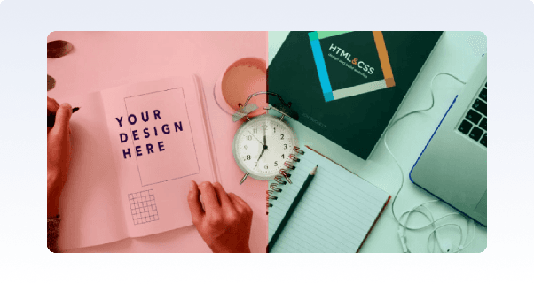
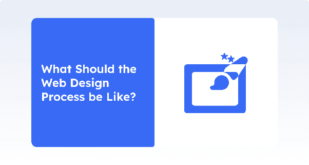
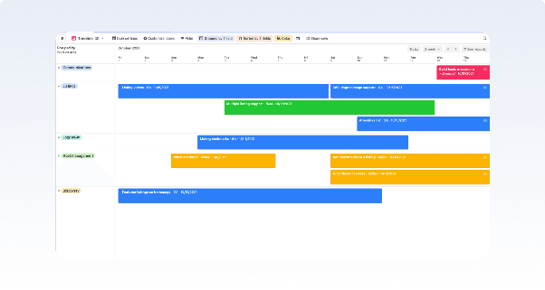
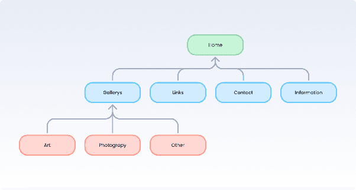
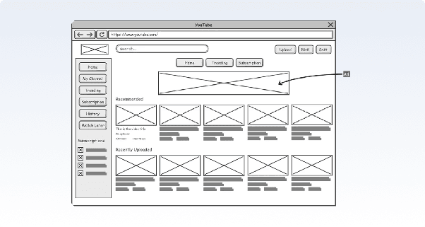
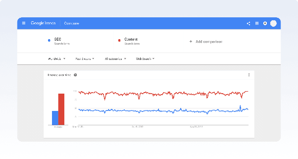
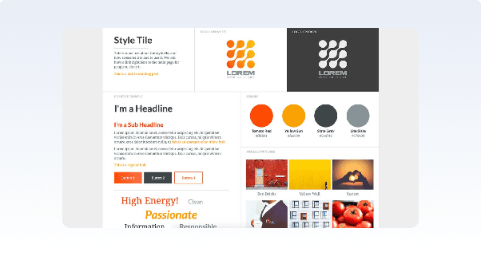

# Web Design Basics for Graphic Designers Who Don't Code

## Introduction

As a **designer**, I have been working on **logos**, **posters**, and **social media announcement** **visuals** for years. However, when it comes to the web, I used to hold back saying “I **don’t know how to code**.” We have all thought about this at some point and unfortunately, we still think about it from time to time.

🚀 **Good news**: We can learn **web design** without writing code and design **user-friendly**, **aesthetic, and functional web interfaces** using basic knowledge.

In this article, we will talk about the **basics of web design**, its **differences from graphic design**, and whether it is possible to do **web design without knowing how to code**.

## Differences Between Graphic Design & Web Design

### What is Graphic Design?

Graphic design is creating **visual content** that conveys a message to a **specific audience**. Graphic designers use various **visual elements** such as **color**, **typography**, **imagery**, and **layout** to communicate a message effectively. They work on a wide range of projects, including **logos**, **websites**, **packaging**, **advertisements, and branding**.

### What is Web Design? 

Web design is the process of creating a website that can be viewed on computers or mobile devices. Like graphic design, web design also involves creating **graphics**, **typography**, **and visuals**, but they use the **internet** as the communication channel.

### Graphic Design

* Graphic Design is concerned with **visuals** and **appearance**.  
* Graphic design focuses on visually conveying specific messages or ideas through **typography**, **visuals**, **colors**, and i**llustrations**.  
* Graphic design focuses on how objects **look**.  
* Graphic designers **do not need coding knowledge**.  
* Graphic design is **static**.

### Web Design

* Web design is user experience–focused.  
* Web design aims to create **functional** and **user-friendly** **websites** that provide the **best experience** for users.  
* Web design considers **search engine optimization** when creating websites.  
* Web designers need to have **knowledge of HTML**, **CSS**, and other web development languages to create **functional and responsive designs**.  
* Web design is **dynamic**.

## Fundamental Principles of Web Design (Applicable Without Coding)

Companies and **brands** from almost every sector request the **creation of their own websites**. This way, they gain the opportunity to introduce their **services**, **prices**, and themselves to their **target audiences**. However, for this to have the desired effect, the website must be **designed properly**. What are the **fundamental principles** to pay attention to when designing a website? Now, it’s time to answer this question by introducing the basics. Here are the **indispensable principles in web design**.

  ### 1\) User-Centered Designs:

Users always value **ease and practicality** when receiving a service. For this reason, it is important for websites to be designed in a user-centered way. **Easy to find menus**, **fast usage**, and the **easy to locate any information** are very important. With **user centered design**, it is possible to create websites that are **easy to use** and also **satisfy users**.  
  

  ### 2\) Responsive Designs:

It is very important for the website and its design to be **usable on every digital platform**. Therefore, the designed sites must have a **responsive design**. This means easy access to the site on a **phone**, **tablet**, or **computer**. This also ensures that users continue to prefer the site.

  ### 3\) Visual Hierarchy:

The page must have **visuals related to itself**, and **product content** should be matched with the **correct visuals**. It is also very important for visual elements to be placed according to their order of importance. On web pages, content compatible with visuals must be provided with **sufficient and accurate information**.

  ### 4\) Color and Typography Selection:

Color and typography selection is very important for handling visuals, colors, and text in a certain **harmony**. For the site to **attract attention** or for the relevant pages to achieve the expected interaction, the use of color and the chosen font style and font color must be harmonious. A design that is both **easy to read** and **eye catching** without causing any disturbance should be preferred.

  ### 5\) Content and Layout Structure:

One of the most desired features on web pages is **content organization**. Content that is **unrelated to the pages, creates confusion while reading**, or **lacks simplicity**, such as overly frequent paragraphs, incorrect fonts, and similar factors, causes web pages to have less impact. **Content structure** also includes **placing related topics sequentially** and **adding them to the menu**. For example, on a website created for shoes, if shoe types are grouped separately, users find it easier. Options like high heels, sandals, and sneakers help users find what they are looking for more easily, which in turn ensures positive site feedback.

  ### 6\) Speed Optimization:

As with every type of service, speed is very important for services provided through web pages. Easy navigation between pages, error-free performance, and ease of use are very important for users. No one wants to shop or use a service on a website that takes a long time to load, because everyone prefers websites to save time.

  ### 7\) Consistency:

For a service to be preferred, it must first be reliable. This is directly related to the information, visuals, and everything on the website. The information in the content, visuals, and content details must be consistent and should not raise any questions in visitors’ minds. Otherwise, negative feedback can later affect customer preferences and damage the brand image.

## Is It Possible to Do Web Design Without Coding?

In the past, it was not possible to create a website without at least some basic coding knowledge. However, today, almost anyone can build a website. Even if you have not written a **single line of code**.

The biggest helpers for those who want to do **web development without coding** are **No-Code** and **Low-Code** platforms. These tools help users **design websites** without dealing with **technical details**. 

Systems like **Wix**, **Webflow**, **Shopify**, and **WordPress** are very common in this area.

The web development process on these platforms is carried out through practical methods such as **drag-and-drop**, selecting **ready-made templates**, and filling out forms.

### **No Code**

As the name suggests, it allows you to create websites, mobile applications, automations, and workflows **without writing a single line of code**.

* **How Does It Work**? They usually have a visual editor. You create the skeleton of your application by dragging and dropping ready “building blocks” such as buttons, forms, and visuals onto your canvas. Then, you determine what these elements will do (for example, “go to this page when this button is clicked”) by selecting options from the menus.  
* **Who Uses It**? It is perfect for entrepreneurs, marketers, product managers, designers, and anyone who wants to quickly test an idea.  
* **Examples**: Platforms like Webflow, Bubble, Adalo, and Glide allow you to create a wide range of products, from complex web applications to mobile apps.

### **Low Code**

Low-Code systems require a bit more **technical knowledge** but still **do not require learning full-scale programming**.

* **How Does It Work**? You handle 80% of the work with drag-and-drop, and for the remaining 20% that requires customization, you add small code snippets.  
* **Who Uses It**? It is generally preferred by IT departments of corporate companies and technical teams that want to develop more complex, scalable applications.  
* **Examples**: Platforms like OutSystems and Mendix are used to build large, integrated systems that manage a company’s internal processes.

## What Should the Web Design Process be Like?

**Web design** is a passionate field but can be **overwhelming** at times. When starting out, coming up with a plan on how to tackle your website or a web app idea often feels daunting: Where should you begin?Web designers often think about the **web design process** with a focus on **technical matters** such as wireframes, code, and content management. But great

design isn’t about how you integrate the social media buttons or even slick visuals. **Great design** is actually about having **a website creation process** that aligns with an **overarching strategy.**

Doing all the thinking beforehand ensures that you don’t forget anything crucial. It also frees up headspace for doing the actual work, avoids overwhelm, improves efficiency, and allows you to build better websites on repeat.

But how do you achieve that harmonious synthesis of elements? Through a **holistic web design** process that takes both **form and function** into account.

We have already covered the fundamentals, now, I'll share the steps to an **effective web design process.**

Let's get started.

### 1\) Goal Identification

In this **initial stage**, the designer needs to identify the end goal of the website design, usually in close collaboration with the client or other stakeholders. Questions to explore and answer in this stage of the design and website development process include:

* ### Who is the site for?

* What do they hope to find or do there?  
* Is the main purpose of this website to inform, to sell (e-commerce, for everyone?), or to entertain?  
* Does the website need to clearly convey the **brand's core message**, or is it part of a broader **brand strategy** with its own unique focus?  
* If there are any, which **competitor sites** exist, and how should this site be **inspired by them** / how should it differ from them?

To have clear answers to above questions will lead to the **successful execution** of the project.

### What Purpose Will the Website Serve?

Whatever the project you’re taking on, you always want each and every initiative you take to achieve the goals you’ve set for it**. Goal setting is critical** because it will be key in making decisions throughout the project by asking yourself the right questions and **prioritizing tasks and efforts**.

As basic as it may seem, following the **SMART framework** is always a great idea when setting your goals, to **ensure effectiveness:** 

**S \- SPECIFIC**  
Your goal is direct, detailed, and meaningful.

M \- MEASURABLE  
Your goal is quantifiable to track progress or success.

**A \- ATTAINABLE**  
Your goal is realistic and you have the tools and/or resources to attain it.

**R \- RELEVANT**  
Your goal aligns with your company mission.

**T \- TIME-BASED**  
Your goal has a deadline.

### 2\) Scope Definition

This is easier said than done when starting out, so it is best to approach it with caution : Everyone has once been guilty of saying a project “will be done by next week” before realizing they dramatically **underestimated** how hard it would be.

Nevertheless, **setting** a timeline will help a lot with **accountability**, both internal and external, and will help **break down the project in distinct stages**.

You don’t have to reinvent anything from scratch, as a lot of tools such as Airtable’s timeline view will help you put the timeline together.

Source: [Airtable](https://blog.airtable.com/introducing-airtables-new-timeline-view/)

### 3\) Sitemap and Wireframe Creation

The site map forms the foundation of a well-designed website. It gives web designers a clear idea of the **information architecture** of the website and explains the **relationships** between various **pages and content elements**. 

Building a web site without a site map is like building a house without a plan. And it rarely ends well.

Time to start building the first iteration of your project\! To put it shortly, **wireframes** serve as a blueprint, a visual guide representing the skeletal framework of a website or application. It will be a raw version of your project, a great way to get your **initial idea down** in its first “physical” form.

  

Source: [Afolayan Daniel](https://medium.com/fbdevclagos/4-reasons-why-wire-frame-is-important-during-website-or-mobile-app-development-46fabdf47190)  

While it won’t be functional yet, it’ll be a major web design step to share with your team, potential leads or even investors, and will highlight issues that you might not have thought about previously. Wireframes are a great opportunity to move fast, once they’re ready, you’ll be able to:

* Gather early feedback;  
* Run UX testing groups;  
* Iterate on your timeline if necessary;  
* Get concept validation.

There are different ways to create wireframes. You can of course sketch them out on paper to start with, but creating a digital version will eventually be much more practical to share them.

#### Tools for sitemapping and wireframing;

* Pen/pencil and paper.  
* Balsamiq.  
* Moqups.  
* Sketch.  
* Axure.  
* Webflow.  
* Slickplan.  
* Writemaps.  
* Mindnode.  
* Figma.  
* Sketch.

### 4\) Content Creation  
A website should offer more than just a simple design and attractive graphics. An effective content strategy is essential to capture users’ interest and to make the site stand out in search engines.

  
When it comes to content, search engine optimization is only  
half of the battle.

There are two main goals that you need to focus on while creating content.

#### **Goal 1 Content encourages engagement and action:**

First of all, content drives readers to take action and encourages them to perform the actions necessary to achieve a site's goals. This is influenced both by the content itself (writing) and by the way it is presented (typography and structural elements).

Boring, lifeless, and lengthy writing rarely holds visitors' attention for long enough. Short, fluent, and engaging content captures them and makes them click through to other pages. Even if your pages need a lot of content (which they often do), properly "breaking it up" into short paragraphs supported by visuals can help create a light and engaging feel.

#### **Goal 2 Search Engine Optimization**:

Content also increases a site's visibility in the eyes of search engines. The practice of creating and developing content to achieve a good ranking in search results is called search engine optimization or SEO.

Identifying your keywords and key phrases correctly is very important for the success of any website.

### 5\) Visual Elements

Style Tile: a free style tile / moodboard template built by Mat Vogels.

It is time to create the **visual style** of the site. This part of the design process is usually shaped by **existing brand elements, color choices**, and **logos** specified by the client. However, it is also the stage of the web design process where a **good web designer can truly shine**.

**Visuals play a more important** **role** in web design than ever before. High quality visuals not only give a website a professional look and feel, but also convey a message, are mobile friendly, and help build trust.

**Visual design is a way of communicating** with the web site users to make the site as **appealing to them** as possible.  When done right, it can determine the site’s being one of the major successes amongst competitors. On the other hand, any mistake might put it in risk of becoming just another ordinary web site. 

**Tools for visual elements**:

* (Sketch, Illustrator, Photoshop, Figma, vb.)  
* Visual Style Guides.

  
### 6\) Development & Platforms

**Front-End Development**: The parts that users interact with (HTML, CSS, JavaScript).

**Back-End Developmen**t: Database and server-side processes (PHP, Python, Node.js).

**No-Code Platforms**: Publishing on platforms like Webflow, Bubble, Adalo, Glide.

### 7\) Testing

When your site has all the visuals and content, you are ready to test.  
Once the **first iteration** of your website/web app is ready, it’s time for some **testing** to make sure it **runs smoothly**.

A website should undergo a detailed testing process before going live.  
Items to check during the testing process:

* Mobile Compatibility.  
* Functionality across different browsers.  
* Functionality of forms and buttons.

Alongside these steps, setting up website uptime monitoring is essential to ensure the site remains functional after launch, providing immediate alerts if any downtime occurs. Ultimately, while testing is an important part of the web design process, it’s not worth losing sleep over. **Done is always better than perfect** and when in doubt, keep this quote in mind.

*“If you are not embarrassed by the first version of your product, you've launched too late.”  \- Reid Hoffman, founder of LinkedIn*

### 8\) Website Launch

Now it’s time for everyone’s favorite part of the website design process: When everything has been thoroughly tested and you’re happy with the site, you can start.

Don’t expect this to go perfectly. There may still be some elements that need fixing. Web design is a fluid and ongoing process that requires constant maintenance.

Web design and design in general is about finding the right balance between form and function. You need to use the right fonts, colors, and design motifs. But the way users navigate and experience your site is just as important.

## Conclusion

Previously, when we wanted to turn our designs into reality, the barrier of learning and using a programming language tool stood in our way. This barrier has now been removed thanks to **No-Code tools**. With these tools, even without coding knowledge, there is now a way to bring your designs to life.

## Resources

* Bulut, B. (2025, July 20). *Kod yazmayı bilmeden yazılımcı olmak nasıl mümkün oldu?* Webtekno. [https://www.webtekno.com/kod-bilmeden-yazilimci-olmak-nasil-mumkun-oldu-h159799.html](https://www.webtekno.com/kod-bilmeden-yazilimci-olmak-nasil-mumkun-oldu-h159799.html)  
    
* Ectasarim. (2024, Kasım 10). *Web tasarım ilkeleri nelerdir? Önemli hususlar*. [https://www.ectasarim.com/web-tasarim-ilkeleri/](https://www.ectasarim.com/web-tasarim-ilkeleri/?utm_source=chatgpt.com)

* Meazey, M. (2020, February 12). *The web design process in 7 simple steps*. *Webflow Blog*. [https://webflow.com/blog/the-web-design-process-in-7-simple-steps](https://webflow.com/blog/the-web-design-process-in-7-simple-steps)  
    
* University of California Office of the President. (2016). *How to write SMART goals: A how-to guide.* University of California. [https://www.ucop.edu/local-human-resources/\_files/performance-appraisal/How+to+write+SMART+Goals+v2.pdf](https://www.ucop.edu/local-human-resources/_files/performance-appraisal/How+to+write+SMART+Goals+v2.pdf)
