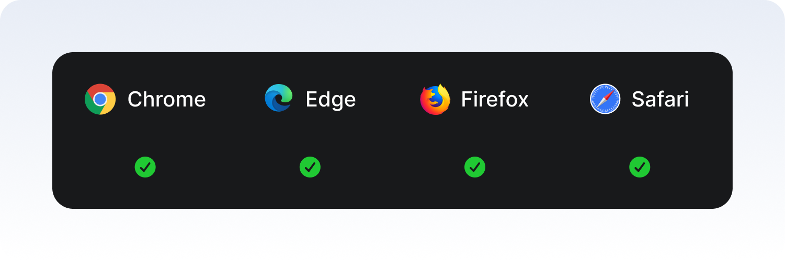

#  10 Modern HTML & CSS Techniques Every Designer Should Know in 2025

HTML and CSS are developing with new features every year. In 2025, things are much more excited than before; because now only classic labels and simple styles are not enough. There are many modern techniques that strengthen the user experience, make the design more flexible and make our business serious easier. In this article, I have compiled 10 of each designer for you.

Let's start ...

## Modern HTML Techniques


### 1. <details> and <summary> tag

This structure offers a structure where users can open and turn off according to their wishes.
If you need to examine in detail;

````
<details>
	<p>Proin magna felis, vestibulum non felis quis, consequat commodo ligula. </p>
	<p>Sed at purus magna. Sed auctor nisl velit.</p>
</details>
````
This is the general use. If we do not specify a special title, the **Details** title comes by default. To change this, we should use `<summary>`.

````
<details>
	<summary>Lorem Ipsum</summary>
	<p>Proin magna felis, vestibulum non felis quis, consequat commodo ligula. </p>
	<p>Sed at purus magna. Sed auctor nisl velit.</p>
</details>
````

#### Styling

The `<summary>` element can be styled with CSS; its color, font, background, and other properties can be customized. 

Additionally, the default triangle marker of `<summary>` can also be styled using `::marker`.
The marker is a small sign indicating that the structure is open or closed. 
We can use the `:: marker` pseudo-element to style it.  But we should use it as `::marker` which belongs to the `<summary>`.

**👉**  *HTML Demo* : https://codepen.io/halimekarayay/pen/OPyKBZM


#### Attributes

##### Open  Attribute
By default, the structure is **closed**. We can change the default open/closed state using `open`.

    <details open>
	    <summary>This is a title</summary>
	    <p>Lorem Ipsum is simply dummy text of the printing and typesetting industry</p>
	    <p>Lorem Ipsum is simply dummy text of the printing and typesetting industry</p>
    </details>


#####  Name

This feature allows multiple `<details>` to move into a group by connecting to each other. Only one of them is open at the same time. This feature allows developers to easily create user interface features such as accordion without writing a script.

    
    <details name="requirements">
      <summary>Graduation Requirements</summary>
      <p>
        Sed eu ipsum magna. Ut ultricies arcu nec lectus interdum, sit amet elementum diam elementum.
      </p>
    </details>
    <details name="requirements">
      <summary>System Requirements</summary>
      <p>
        Curabitur porta quis mi id gravida. Ut convallis, ligula quis blandit sagittis.
      </p>
    </details>
    <details name="requirements">
      <summary>Job Requirements</summary>
      <p>
        Suspendisse malesuada arcu eget condimentum pretium.
      </p>
    </details>
    
**👉**  *HTML Demo* : [https://codepen.io/halimekarayay/pen/MYaNzmP](https://codepen.io/halimekarayay/pen/MYaNzmP)

 

##### *More Information*
 - [https://css-tricks.com/using-styling-the-details-element/](https://css-tricks.com/using-styling-the-details-element/) 
 -  [https://developer.mozilla.org/en-US/docs/Web/HTML/Reference/Elements/details](https://developer.mozilla.org/en-US/docs/Web/HTML/Reference/Elements/details)
---


### 2.  <dialog> Tag
`<dialog>` tag is a modern label used to create native modal and popup in HTML. 
As of 2025, it is now supported in many browser and can be easily controlled with Javascript.

    // HTML
    <dialog id="myDialog">
	    <p>This is a modal window.</p>
	    <button id="closeBtn">Close</button>
    </dialog>
    <button id="openBtn">Open Modal</button>
    
      
    // JS
    <script>
	    const dialog = document.getElementById('myDialog');
	    const openBtn = document.getElementById('openBtn');
	    const closeBtn = document.getElementById('closeBtn');
	    
	    openBtn.addEventListener('click', () => {
		    dialog.showModal();
	    });
	    
	    closeBtn.addEventListener('click', () => {
		    dialog.close();
	    });
    </script>

 - `showModal()`: It opens the `<dialog>` modal.
 - `show()`: It opens the `<dialog>` like a normal popup.
 - `close():` Closes `<dialog>`

**👉**  *HTML Demo* :[https://codepen.io/halimekarayay/pen/XJmvojX](https://codepen.io/halimekarayay/pen/XJmvojX)

#### Use in Form


    // HTML
    <button id="openBtn">Login</button>
    <dialog id="loginDialog">
	    <form method="dialog">
		    <label>Username <input name="username" required></label><br><br>
		    <label>Password: <input type="password" name="password" required></label>
		    <menu>
				<button value="cancel">Cancel</button>
			    <button value="ok">Login</button>
		    </menu>
	    </form>
    </dialog>
    
      
    // JS
    <script>
    const dialog = document.getElementById('loginDialog');
    const openBtn = document.getElementById('openBtn');
    
    openBtn.addEventListener('click', () => {
	    dialog.showModal();
    });
    
    dialog.addEventListener('close', () => {
	    console.log('Dialog closed, returnValue:', dialog.returnValue);
    });
    </script>

 - `method = "dialog"` form is switched off automatically.
 - `button value="..."` with the user's selection value can be obtained.

**👉**  *HTML Demo* : [https://codepen.io/halimekarayay/pen/VYvoqPr](https://codepen.io/halimekarayay/pen/VYvoqPr)


#### Style and Design

    // CSS
    dialog {
	    border: none;
	    border-radius: 10px;
	    padding: 20px;
	    width: 400px;
	    box-shadow: 0 5px 15px rgba(0,0,0,0.3);
    }
    dialog::backdrop {
	    background: rgba(0, 0, 0, 0.5);
    }

  

 - `dialog::backdrop` when the modal is opened, the background darkens.
 - Size, color and shade can be fully customized with CSS.
 
**👉**  *HTML Demo* : [https://codepen.io/halimekarayay/pen/VYvoqPr](https://codepen.io/halimekarayay/pen/VYvoqPr)


##### *More Information*

 - [https://developer.mozilla.org/enUS/docs/Web/HTML/Reference/Elements/dialog](https://developer.mozilla.org/en-US/docs/Web/HTML/Reference/Elements/dialog)

---

### 3. inert Attribute

`inert attr()` temporarily makes an element interactive. 
So the user cannot focus on that area with the Tab key, Screen Reader does not see, clickable links do not work.

    <div inert>
	    <button>This button cannot be clicked</button>
    </div>

  

#### Specifically, `inert` does the following:
-   Prevents the click event from being fired when the user clicks on the element.
-   Prevents the focus event from being raised by preventing the element from gaining focus.
-   Prevents any contents of the element from being found/matched during any use of the browser's find-in-page feature.
-   Prevents users from selecting text within the element — akin to using the CSS property user-select to disable text selection.
-   Prevents users from editing any contents of the element that are otherwise editable. 
-   Hides the element and its content from assistive technologies by excluding them from the accessibility tree.
    
`````
<div>
	<label for="button1">Button 1</label>
	<button id="button1">I am not inert</button>
</div>

<div inert>
	<label for="button2">Button 2</label>
	<button id="button2">I am inert</button>	
</div>
`````

  

**👉**  *HTML Demo* : [https://codepen.io/halimekarayay/pen/WbQVLBb](https://codepen.io/halimekarayay/pen/WbQVLBb)


##### *More Information*:
- [https://developer.mozilla.org/en-US/docs/Web/HTML/Reference/Global_attributes/inert](https://developer.mozilla.org/en-US/docs/Web/HTML/Reference/Global_attributes/inert)

---
### 4. Popover  Attribute

In the past, we had to write javascript to create opened windows such as tooltip, modal or dropdown. No need for this anymore: Thanks to HTML5's new butt attribute, we can manage the pop-up windows completely without writing a single line of Javascript. This feature supports accessibility, provides automatic focus management and eliminates the additional library load.

    <button popovertarget="info">Show information</button>
    <div id="info" popover>
	    <p>This content opens when clicking.</p>
    </div>

- `popover attribute`  makes `<div>`  into a pop-up window
- `popovertarget="info"` button triggers the related popover.
    

#### Styling
Popovers are actually normal DOM elements, only the browser adds the logic of **opening/closing**. So you can style it as you wish:

    [popover] {
	    padding: 1rem;
	    border-radius: 8px;
	    background: white;
	    box-shadow: 0 4px 16px rgba(0,0,0,.2);
    }

*In summary:* A brand new feature that allows the `popover attr()` HTML to produce opensable windows on its own.
Less JavaScript means more accessibility and easier care.

**👉**  *HTML Demo* :  [https://codepen.io/halimekarayay/pen/ByoXMwo](https://codepen.io/halimekarayay/pen/ByoXMwo)


##### *More Information*:
 https://developer.mozilla.org/en-US/docs/Web/HTML/Reference/Global_attributes/popover

---
### 5. Fetchpriority Attribute

Performance on web pages has always been one of the most critical issues. As of 2025, we can clearly state which resource should be loaded first thanks to the `fetchpriority attribute` supported by browsers. This seriously improves the user experience, especially for visuals and important files.

Scanners normally load resources according to their algorithms. But for example, if there is a large hero image at the top of the page, it is very important that it comes quickly. That's where `fetchpriority` comes into play.

`fetchpriority` can take three values:
 - `high`  → priority.
 - `low` →  then load it.
 - `auto` →  default.
 

Improves the LCP (Largest Contentful Paint) metric, the “visible” of the page is accelerated.
It provides a more fluent first experience to the user.
It makes a big difference, especially in multi -ly illustrated pages or heavy -based projects.


 
##### *More Information*:
- [https://developer.mozilla.org/en-US/docs/Web/API/HTMLImageElement/fetchPriority](https://developer.mozilla.org/en-US/docs/Web/API/HTMLImageElement/fetchPriority)


## Modern CSS Techniques

### 1. CSS Nesting

CSS Nesting provides the ability to write a style rule into another style rule. In the past, this feature was possible only in prepromessors (eg Sass, Less), but now most of the browsers began to gain native support. With this feature, you can make style files more read, modular and easier to manage. In addition, the repetitive selector spelling is more comfortable to maintain the code.

Let's think of a simple **HTML** scenario:

    <div class="card">
	    <h2>Lorem Ipsum </h2>
	    <p>Morbi maximus elit leo, in molestie mi dapibus vel.</p>
	    <a href="#">Continue</a>
    </div>

  

If the common classic css is to be used, it is as follows:

    .card {
	    padding: 1rem;
	    border: 1px solid #ccc;
    }
    .card h2 {
	    font-size: 1.5rem;
    }
    .card p {
	    font-size: 1rem;
    }
    .card a {
	    color: blue;
	    text-decoration: none;	
    } 
    .card a:hover {
	    text-decoration: underline;
    }

  

You can write the same style as CSS nesting as follows:

    .card {
	    padding: 1rem;
	    border: 1px solid #ccc;
	    h2 { 
		    font-size: 1.5rem;
	    }
	    p {
		    font-size: 1rem;
	    }
	    a {
	    color: blue;
	    text-decoration: none;
		    &:hover {
			    text-decoration: underline;
		    }
	    }
    }
This structure increases readability by collecting style rules in a single block for the items in `.card`.

#### Recommendation

- You can use CSS Nesting directly in your project, but I suggest you pay attention to the following points:  
- If the users of the target audience use old browsers (eg old Android browser, old iOS safari), think of Fallback Style or Polyfill.  
- If the code is compiled (such as PostCSS), use the correct versions of Plugin who control nesting support.  
- Deep Nesting can cause style complexity; Limit 2–3 levels for readability.


##### *More Information*: 
- https://developer.mozilla.org/en-US/docs/Web/CSS/CSS_nesting/Using_CSS_nesting
- https://www.w3.org/TR/css-nesting-1

---

### 2. @container Queries (Container Query)


We have used **media query** for **responsive design** for years: we have written different styles according to the screen width. But sometimes a component (eg a card) should behave differently in a different container. Here `@Container Queries` comes into play.  
  
**Media query** looks at the width of the entire page. But sometimes it looks small when a card is lined up side by side, it should look big when it is alone. In this case, instead of looking at the page width, it would make more sense to look at the inclusive width of the card.

-  The browser checks the condition in `@container` for each parent (parent) element.
- If the parent element is **marked as a container,** (`container-type` is given), its size is examined.
- So `@container` automatically connects to the nearest **“ container ”** upper element.


       .card-list {
           container-type: inline-size;
        }
        
        @container (min-width: 400px) {
			.card {
				flex-direction: row;
			}
		}

-   `.card-list` → container.
-   `.card` → child.
- When we say `@container (min-width: 400px),` the browser measures the width of the `.card` `.card-list`.
- If the `.card-list` width is greater than 400px, the style is working.
   
   
#### If there is more than one container

If there is more than one container in the same hierarchy, the browser is based on the closest.


    // HTML 
    <section class="wrapper">
      <div class="card-list">
        <div class="card">...</div>
      </div>
    </section>

    // CSS
    .wrapper {
          container-type: inline-size;
        }
        
        .card-list {
          container-type: inline-size;
        }
        
        @container (min-width: 600px) {
          .card {
            background: lightblue;
          }
        } 

 
#### container-name

 If you want to say, **"which container should be looked at",** you should add the `container-name`:

    .card-list {
      container-type: inline-size;
      container-name: cards;
    }
    
    @container cards (min-width: 600px) {
      .card {
        background: lightblue;
      }
    }

The browser is directly targeted by `.card-list`, and does not look at another container.

##### *More Information*: 
https://developer.mozilla.org/en-US/docs/Web/CSS/CSS_containment/Container_queries


---
### 3. :has() Selector 

CSS has always been able to give style for years. But it was not possible to “choose the parent according to his child”. Here `:has()` filled this gap and created the **parent selector revolution** in the world of CSS.

- It is possible to replace the upper element according to user interactions.   
- We can only solve many conditions with JavaScript with CSS.  
- Form validation, card structures, Dropdown menus are very practical.

For example, marking the form with incorrect input with red edges:

    form:has(input:invalid) {
    	border: 2px solid red;
    }
    
In the dropdown menu, emphasizing the menu, which has an element of hover:

    .menu:has(li:hover) {
      background: #f0f0f0;
    }
    
In the card structure, giving different styles to the cards that contain pictures:

    .card:has(img) {
      border: 1px solid #ccc;
      padding: 1rem;
    }

- It allows you to write more **readable css**.  
- Reduces the need for JavaScript in many places.  
- It provides great convenience especially for **forms, navigation menus and card grids**.

##### *More Information*: 
- http://developer.mozilla.org/en-US/docs/Web/CSS/:has
- https://www.w3.org/TR/selectors-4/#has-pseudo

---

 ### 4. Subgrid 
CSS grid revolutionized the world of layout, but there was a missing:  
The child grid elements in a grid could not directly use the line and column alignment of the parent grid. Here `subgrid` solves this problem.

- Provides consistent alignment.  
- Nested saves grid from repetitive definitions in their structures.  
- It produces cleaner, flexible and sustainable layouts.


Main grid:

    .grid {
      display: grid;
      grid-template-columns: 200px 1fr;
      grid-template-rows: auto auto;
      gap: 1rem;
    }


Child grid (subgrid):

    .article {
      display: grid;
      grid-template-columns: subgrid;  
      grid-column: 1 / -1;         
    }


HTML example:

    <div class="grid">
      <header>Title</header>
      <div class="article">
        <h2>Article Title</h2>
        <p><Article Content</p>
      </div>
      <footer>Footer content</footer>
    </div>

In this structure, `.article` forms its own grid, but it takes over its columns ** from parent grid **. 
Thus, both the title, the article content and the foother appear to the same.


- Layout is more regular with **less CSS code**.  
- Especially in **complex page designs** (blog, dashboard, magazine designs) great convenience

##### *More Information*: 
- https://developer.mozilla.org/en-US/docs/Web/CSS/CSS_grid_layout/Subgrid
- https://web.dev/articles/css-subgrid

---

### 5. Scroll-driven Animations (scroll-timeline, view-timeline)

In the past, we had to use a **javascript** to move a item with scroll or to start animation.
But now thanks to the new feature of CSS, we can do this **directly with CSS**. This provides both performance and less coded solution.

- `@scroll-Timeline:` Allows us to use a scroll field as “timeline .. So the animation progresses as the page shifts down.  
- `animation-Timeline:` It ensures that animation is synchronized with this scroll movement.

Let's make a box move to the right as a box shifts down:

    // HTML
    <div class="scroller">
      <div class="box"></div>
    </div>
    
    // CSS
    .scroller {
      height: 200vh; 
      background: linear-gradient(white, lightblue);
    }
    
    .box {
      width: 100px;
      height: 100px;
      background: tomato;
    
      animation: moveRight 1s linear;
      animation-timeline: scroll();
    }
    
    @keyframes moveRight {
      from { transform: translateX(0); }
      to { transform: translateX(300px); }
    }

📌 Here, `animation-timeline: scroll ();` when we say, the box is moving as scroll progresses. In other words, the percentage of progression of scroll is → animation progress. 

#### Usage with view-timeline

In some cases, we may want the animation to **work while a particular item appears**. 
That's where the `view-timeline` comes into play.

    // HTML
    <div class="container">
      <div class="card">I am animated</div>
    </div>
    
    // CSS
    .container {
      height: 150vh;
      background: lightgray;
    }
    
    .card {
      margin: 100px auto;
      width: 200px;
      height: 100px;
      background: pink;
    
      animation: fadeIn 1s linear;
      animation-timeline: view();
    }
    
    @keyframes fadeIn {
      from { opacity: 0; transform: translateY(50px); }
      to { opacity: 1; transform: translateY(0); }
    }

📌 Here `.card` when it begins to be visible, the animation comes into play.

**👉**  *HTML Demo* :  https://codepen.io/halimekarayay/pen/myVbmZy


##### *More Information*: 
https://developer.chrome.com/docs/css-ui/scroll-driven-animations

-----

**In conclusion,** HTML and CSS are evolving every year, giving us the opportunity to do more with less code. The 10 techniques we covered in this article are among the must-know tools for modern web projects in 2025. Of course, technology keeps moving forward; but once you start adding these features to your projects, you’ll not only improve the user experience but also speed up your development process. Don’t be afraid to experiment—because the future of the web is being shaped by these new standards. 🚀
