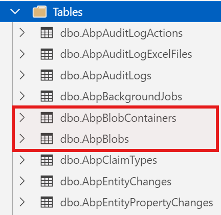

# Where and How to Store Your BLOB Objects in .NET?

When building modern web applications, managing BLOBs (Binary Large Objects) such as images, videos, documents, or any other file types is a common requirement. Whether you're developing a CMS, an e-commerce platform, or almost any other kind of application, you'll eventually ask yourself: **"Where should I store these files?"**

In this article, we'll explore different approaches to storing BLOBs in .NET applications and demonstrate how the ABP Framework simplifies this process with its flexible [BLOB Storing infrastructure](https://abp.io/docs/latest/framework/infrastructure/blob-storing). ABP Provides [multiple storage providers](https://abp.io/docs/latest/framework/infrastructure/blob-storing#blob-storage-providers) such as Azure, AWS, Google, Minio, Bunny etc. But for the simplicity of this article, we will only focus on the **Database Provider**, showing you how to store BLOBs in database tables step-by-step.

## Understanding BLOB Storage Options

Before diving into implementation details, let's understand the common approaches for storing BLOBs in .NET applications. Mainly, there are three main approaches:

1. Database Storage
2. File System Storage
3. Cloud Storage

### 1. Database Storage

The first approach is to store BLOBs directly in the database alongside your relational data (_you can also store them separately_). This approach uses columns with types like `VARBINARY(MAX)` in SQL Server or `BYTEA` in PostgreSQL.

**Pros:**
- ✅ Transactional consistency between files and related data
- ✅ Simplified backup and restore operations (everything in one place)
- ✅ No additional file system permissions or management needed

**Cons:**
- ❌ Database size can grow significantly with large files
- ❌ Potential performance impact on database operations
- ❌ May require additional database tuning and optimization
- ❌ Increased backup size and duration

### 2. File System Storage

The second obvious approach is to store BLOBs as physical files in the server's file system. This approach is simple and easy to implement. Also, it's possible to use these two approaches together and keep the metadata and file references in the database.

**Pros:**
- ✅ Better performance for large files
- ✅ Reduced database size and improved database performance
- ✅ Easier to leverage CDNs and file servers
- ✅ Simple to implement file system-level operations (compression, deduplication)

**Cons:**
- ❌ Requires separate backup strategy for files
- ❌ Need to manage file system permissions
- ❌ Potential synchronization issues in distributed environments
- ❌ More complex cleanup operations for orphaned files

### 3. Cloud Storage (Azure, AWS S3, etc.)

The third approach can be using cloud storage services for scalability and global distribution. This approach is powerful and scalable. But it's also more complex to implement and manage.

**Best for:**
- Large-scale applications
- Multi-region deployments
- Content delivery requirements

## ABP Framework's BLOB Storage Infrastructure

The ABP Framework provides an abstraction layer over different storage providers, allowing you to switch between them with minimal code changes. This is achieved through the **IBlobContainer** (and `IBlobContainer<TContainerType>`) service and various provider implementations.

> ABP provides several built-in providers, which you can see the full list [here](https://abp.io/docs/latest/framework/infrastructure/blob-storing#blob-storage-providers).

Let's see how to use the Database provider in your application step by step.

### Demo: Storing BLOBs in Database in an ABP-Based Application

First, create a new ABP-based application if you don't have one yet. The UI is not important for this demo, so you can use any UI framework you want, we will only focus on the services and will see the `IBlobContainer` service in action and also will see the database tables that are created for the BLOB Storing.

I assume that you have already created a new ABP-based application, if you haven't yet, you can create a new one using the following command:

```bash
abp new BlobStoringDemo
```

This will create a new ABP-based layered application with the name `BlobStoringDemo`. (UI as **MVC** and database as **SQL Server** by default).

#### Using the Database Provider

Since, you created a layered application, it uses the BLOB Storing infrastructure and the Database Provider by default. If you check your *Domain, *DomainShared and *EntityFrameworkCore modules, you will see the relevant depends on statements:

```csharp
[DependsOn(
    //...
    typeof(BlobStoringDatabaseDomainModule) // <-- This is the Database Provider
    )]
public class BlobStoringDemoDomainModule : AbpModule
{
    //...
}
```

Since, we are only using the Database Provider, and it's already added to the relevant modules, we don't need to make any configuration changes in the module. If you want to use multiple providers, you need to explicitly make the configuration in your project, for example, even it's not necessary, you can add the following configuration to your *EntityFrameworkCore module to configure the Database Provider:

```csharp
Configure<AbpBlobStoringOptions>(options =>
{
    options.Containers.ConfigureDefault(container => 
    {
        container.UseDatabase();
    });
});
```

After this configuration (it's optional, because we are only using the Database Provider), now, we can run the `DbMigrator` project to create the database and seed the initial data:

```bash
cd src/BlobStoringDemo.DbMigrator
dotnet run
```

Once the migration is applied, you can check your database to see the relevant tables:



- `AbpBlobContainers` table is used to store the BLOB containers configurations. (You can have multiple containers and manage them separately)
- `AbpBlobs` table is used to store the BLOB data.

So, whenever we save a BLOB, it will be stored in the `AbpBlobs` table (the content of the BLOB) and the container configuration will be stored in the `AbpBlobContainers` table (the name of the container, TenantId, extra properties, etc.).

Now, we can use the `IBlobContainer` service to store and retrieve the BLOB data. For that purpose, let's create a new application service to store and retrieve the BLOB data:

```csharp
using System.Threading.Tasks;
using Volo.Abp.Application.Services;
using Volo.Abp.BlobStoring;

namespace BlobStoringDemo
{
    public class FileAppService : ApplicationService, IFileAppService
    {
        private readonly IBlobContainer _blobContainer;

        public FileAppService(IBlobContainer blobContainer)
        {
            _blobContainer = blobContainer;
        }

        public async Task SaveFileAsync(string fileName, byte[] fileContent)
        {
            // Save the file
            await _blobContainer.SaveAsync(fileName, fileContent);
        }

        public async Task<byte[]> GetFileAsync(string fileName)
        {
            // Get the file
            return await _blobContainer.GetAllBytesAsync(fileName);
        }

        public async Task<bool> FileExistsAsync(string fileName)
        {
            // Check if file exists
            return await _blobContainer.ExistsAsync(fileName);
        }

        public async Task DeleteFileAsync(string fileName)
        {
            // Delete the file
            await _blobContainer.DeleteAsync(fileName);
        }
    }
}
```

Here, we are doing the following:

- Injecting the `IBlobContainer` service.
- Saving the BLOB data to the database with the `SaveAsync` method. (_it allows to use byte arrays or streams_)	
- Retrieving the BLOB data from the database with the `GetAllBytesAsync` method.
- Checking if the BLOB exists with the `ExistsAsync` method.
- Deleting the BLOB data from the database with the `DeleteAsync` method.

Now, the only thing you need to do is to use this service in your application to save and retrieve the BLOB data, ABP will handle the rest for you, and also you don't need to worry about the underlying storage implementation and the provider.

> The good point of this approach is that you can start with a provider and then switch to another provider without changing your application code. We will see that in the next section.

### Switching Between Providers

One of the biggest advantages of using ABP's BLOB Storage system is the ability to switch providers without changing your application code. 

For example, you might start with the [File System provider](https://abp.io/docs/latest/framework/infrastructure/blob-storing/file-system) during development and switch to [Azure Blob Storage](https://abp.io/docs/latest/framework/infrastructure/blob-storing/azure) for production:

**Development:**
```csharp
Configure<AbpBlobStoringOptions>(options =>
{
    options.Containers.ConfigureDefault(container =>
    {
        container.UseFileSystem(fileSystem =>
        {
            fileSystem.BasePath = Path.Combine(
                hostingEnvironment.ContentRootPath, 
                "Documents"
            );
        });
    });
});
```

**Production:**
```csharp
Configure<AbpBlobStoringOptions>(options =>
{
    options.Containers.ConfigureDefault(container =>
    {
        container.UseAzure(azure =>
        {
            azure.ConnectionString = "your azure connection string";
            azure.ContainerName = "your azure container name";
            azure.CreateContainerIfNotExists = true;
        });
    });
});
```

**Your application code remains unchanged!** You just need to install the appropriate package and update the configuration. You can even use pragmas (for example: `#if !DEBUG`) to switch the provider at runtime (or use similar techniques).

### Using Named BLOB Containers

ABP allows you to define multiple BLOB containers with different configurations. This is useful when you need to store different types of files using different providers. Here are the steps to implement it:

#### Step 1: Define a BLOB Container

```csharp
[BlobContainerName("profile-pictures")]
public class ProfilePictureContainer
{
}

[BlobContainerName("documents")]
public class DocumentContainer
{
}
```

#### Step 2: Configure Different Providers for Each Container

```csharp
Configure<AbpBlobStoringOptions>(options =>
{
    // Profile pictures stored in database
    options.Containers.Configure<ProfilePictureContainer>(container =>
    {
        container.UseDatabase();
    });

    // Documents stored in file system
    options.Containers.Configure<DocumentContainer>(container =>
    {
        container.UseFileSystem(fileSystem =>
        {
            fileSystem.BasePath = Path.Combine(
                hostingEnvironment.ContentRootPath, 
                "Documents"
            );
        });
    });
});
```

#### Step 3: Use the Named Containers

Once you have defined the BLOB Containers, you can use the `IBlobContainer<TContainerType>` service to access the BLOB containers:

```csharp
public class ProfileService : ApplicationService
{
    private readonly IBlobContainer<ProfilePictureContainer> _profilePictureContainer;

    public ProfileService(IBlobContainer<ProfilePictureContainer> profilePictureContainer)
    {
        _profilePictureContainer = profilePictureContainer;
    }

    public async Task UpdateProfilePictureAsync(Guid userId, byte[] picture)
    {
        var blobName = $"{userId}.jpg";
        await _profilePictureContainer.SaveAsync(blobName, picture);
    }
}
```

With this approach, you documents and profile pictures are stored in different containers and different providers. This is useful when you need to store different types of files using different providers and need scalability and performance.

## Conclusion

Managing BLOBs effectively is crucial for modern applications, and choosing the right storage approach depends on your specific needs.

ABP's BLOB Storing infrastructure provides a powerful abstraction that lets you start with one provider and switch to another as your requirements evolve, all without changing your application code. 

Whether you're storing files in a database, file system, or cloud storage, ABP's BLOB Storing system provides a flexible and powerful way to manage your files.