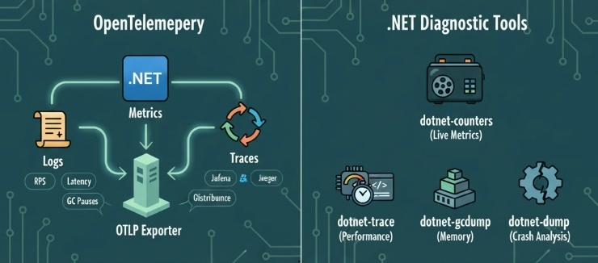
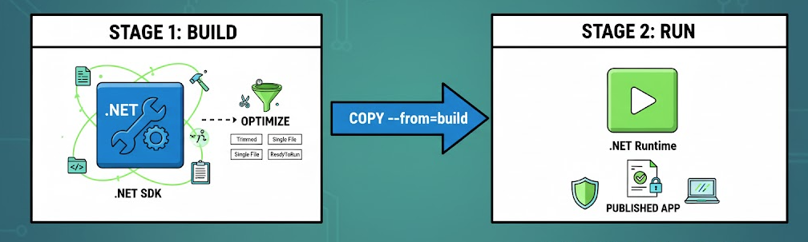
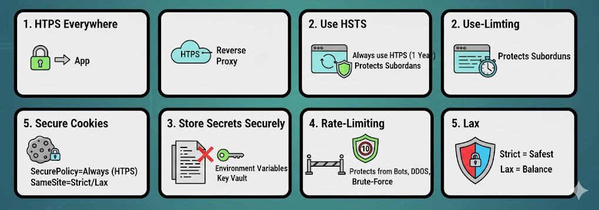
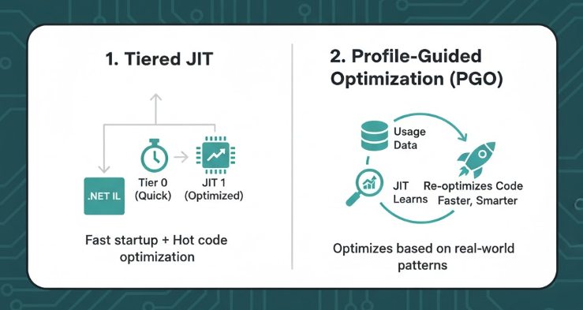
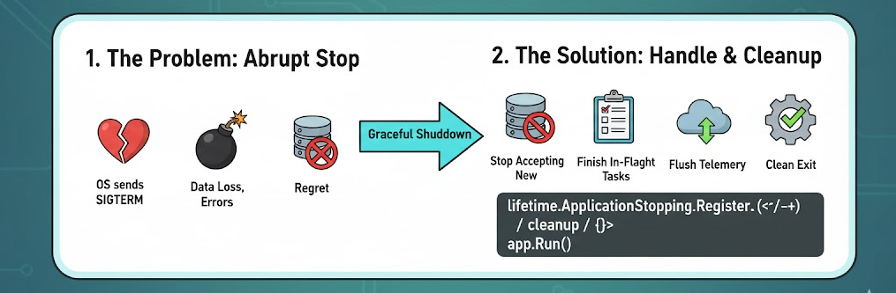
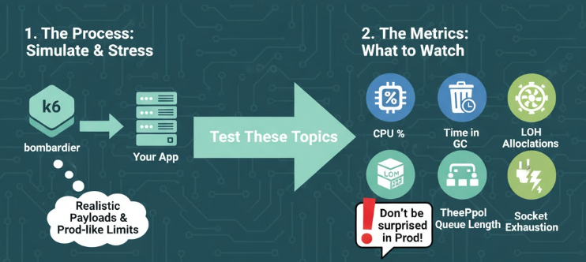
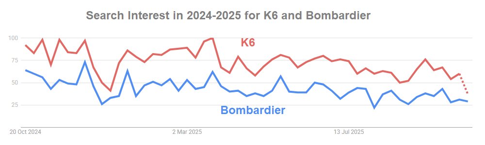

*If you’ve landed directly on this article, note that it’s part-2 of the series. You can read part-1 here: [Optimize Your .NET App for Production (Part 1)](https://abp.io/community/articles/optimize-your-dotnet-app-for-production-for-any-.net-app-wa24j28e)*

## 6)  Telemetry (Logs, Metrics, Traces)



The below code adds `OpenTelemetry` to collect app logs, metrics, and traces in .NET.

```csharp
builder.Services.AddOpenTelemetry()
  .UseOtlpExporter()
  .WithMetrics(m => m.AddAspNetCoreInstrumentation().AddHttpClientInstrumentation())
  .WithTracing(t => t.AddAspNetCoreInstrumentation().AddHttpClientInstrumentation());
```

- `UseOtlpExporter()` Tells it where to send telemetry. Usually that’s an OTLP collector (like Grafana , Jaeger, Tempo, Azure Monitor). So you can visualize metrics and traces in dashboards.
- `WithMetrics()` means it'll collects metrics. These metrics are Request rate (RPS), Request duration (latency), GC pauses, Exceptions, HTTP client timings.
- `.WithTracing(...)` means it'll collect distributed traces. That's useful when your app calls other APIs or microservices. You can see the full request path from one service to another with timings and bottlenecks.

###  .NET Diagnostic Tools

When your app is on-air, you should know about the below tools. You know in airplanes there's _black box recorder_ which is used to understand why the airplane crashed. For .NET below are our *black box recorders*.  They capture what happened without attaching a debugger.

| Tool                  | What It Does                            | When to Use                  |
| --------------------- | --------------------------------------- | ---------------------------- |
| **`dotnet-counters`** | Live metrics like CPU, GC, request rate | Monitor running apps         |
| **`dotnet-trace`**    | CPU sampling & performance traces       | Find slow code               |
| **`dotnet-gcdump`**   | GC heap dumps (allocations)             | Diagnose memory issues       |
| **`dotnet-dump`**     | Full process dumps                      | Investigate crashes or hangs |
| **`dotnet-monitor`**  | HTTP service exposing all the above     | Collect telemetry via API    |


------

## 7) Build & Run .NET App in Docker the Right Way



A multi-stage build is a Docker technique where you use one image for building your app and another smaller image for running it. Why we do multi-stage build, because the .NET SDK image is big but has all the build tools. The .NET Runtime image is small and optimized for production. You copy only the published output from the build stage into the runtime stage.

```dockerfile
# build
FROM mcr.microsoft.com/dotnet/sdk:9.0 AS build
WORKDIR /src
COPY . .
RUN dotnet restore
RUN dotnet publish -c Release -o /app/out -p:PublishTrimmed=true -p:PublishSingleFile=true -p:ReadyToRun=true

# run
FROM mcr.microsoft.com/dotnet/aspnet:9.0
WORKDIR /app
ENV ASPNETCORE_URLS=http://+:8080
EXPOSE 8080
COPY --from=build /app/out .
ENTRYPOINT ["./YourApp"]  # or ["dotnet","YourApp.dll"]
```

I'll explain what these Docker file commands;

**Stage1: Build**

* `FROM mcr.microsoft.com/dotnet/sdk:9.0 AS build`
   Uses the .NET SDK image including compilers and tools. The `AS build` name lets you reference this stage later.

* `WORKDIR /src`
  Sets the working directory inside the container.

* `COPY . .`
  Copies your source code into the container.

* `RUN dotnet restore`
   Restores NuGet packages.

* `RUN dotnet publish ...`
  Builds the project in **Release** mode, optimizes it for production, and outputs it to `/app/out`.
  The flags; 
  * `PublishTrimmed=true` -> removes unused code
  * `PublishSingleFile=true` -> bundles everything into one file
  * `ReadyToRun=true` -> precompiles code for faster startup

**Stage 2: Run**

- `FROM mcr.microsoft.com/dotnet/aspnet:9.0`
  Uses a lighter runtime image which no compiler, just the runtime.
- `WORKDIR /app`
  Where your app will live inside the container.
- `ENV ASPNETCORE_URLS=http://+:8080`
   Makes the app listen on port 8080 (and all network interfaces).
- `EXPOSE 8080`
   Documents the port your container uses (for Docker/K8s networking).
- `COPY --from=build /app/out .`
   Copies the published output from the **build stage** to this final image.
- `ENTRYPOINT ["./YourApp"]`
  Defines the command that runs when the container starts. If you published as a single file, it’s `./YourApp`.  f not, use `dotnet YourApp.dll`.


------

## 8) Security 



### HTTPS Everywhere Even Behind Proxy

Even if your app runs behind a reverse proxy like Nginx, Cloudflare or a load balancer, always enforce HTTPS. Why? Because internal traffic can still be captured if you don't use SSL and also cookies, HSTS, browser APIs require HTTPS. In .NET, you can easily enforce HTTPS like this:

```csharp
app.UseHttpsRedirection();
```


### Use HSTS  in  Production

HSTS (HTTP Strict Transport Security) tells browsers:

> Always use HTTPS for this domain — don’t even try HTTP again!

Once you set, browsers cache this rule, so users can’t accidentally hit the insecure version. You can easily enforce this as below:

```csharp
if (!app.Environment.IsDevelopment())
{
    app.UseHsts();
}
```

When you use HSTS, it sends browser this HTTP header: ` Strict-Transport-Security: max-age=31536000; includeSubDomains`. Browser will remember this setting for 1 year (31,536,000 seconds) that this site must only use HTTPS. And `includeSubDomains` option applies the rule to all subdomains as well (eg: `api.abp.io`, `cdn.abp.io`,  `account.abp.io` etc..)

### Store Secrets on Environment Variables or Secret Stores

Never store passwords, connection strings, or API keys in your code or Git. Then where should we keep them?

- Best/practical way is **Environment variables**. You can easily sett an environment variable in a Unix-like system as below:

  - ```bash
    export ConnectionStrings__Default="Server=...;User Id=...;Password=..."
    ```

- And you can easily access these environment variables from your .NET app like this:

  - ```csharp
    var conn = builder.Configuration.GetConnectionString("Default");
    ```

Or **Secret stores** like: Azure Key Vault, AWS Secrets Manager, HashiCorp Vault


### Add Rate-Limiting to Public Endpoints

Don't forget there'll be not naive guys who will use your app! We've many times faced this issue in the past on our public front-facing websites. So protect your public APIs from abuse, bots, and DDoS. Use rate-limiting!!! Stop brute-force attacks, prevent your resources from exhaustion...

In .NET,  there's a built-in rate-limit feature for .NET (System.Threading.RateLimiting):

```csharp
builder.Services.AddRateLimiter(_ => _
    .AddFixedWindowLimiter("default", options =>
    {
        options.PermitLimit = 100;
        options.Window = TimeSpan.FromMinutes(1);
    }));

app.UseRateLimiter();
```

- Also there's an open-source rate-limiting library -> [github.com/stefanprodan/AspNetCoreRateLimit](https://github.com/stefanprodan/AspNetCoreRateLimit)
- Another one -> [nuget.org/packages/Polly.RateLimiting](https://www.nuget.org/packages/Polly.RateLimiting)

### Secure Cookies

Cookies are often good targets for attacks. You must secure them properly otherwise you can face cookie stealing or CSRF attack.

```csharp
options.Cookie.SecurePolicy = CookieSecurePolicy.Always;
options.Cookie.SameSite = SameSiteMode.Strict; // or Lax
```

- **`SecurePolicy = Always`** -> only send cookies over HTTPS
- **`SameSite=Lax/Strict`** -> prevent CSRF (Cross-Site Request Forgery)
  - `Strict` = safest
  - `Lax` = good balance for login sessions


------

## 9) Startup/Cold Start



### Keep Tiered JIT On

The **JIT (Just-In-Time) compiler** converts your app’s Intermediate Language (IL) into native CPU instructions when the code runs. _Tiered JIT_ means the runtime uses 2 stages of compilation. Actually this setting is enabled by default in modern .NET. So just keep it on.

1. **Tier 0 (Quick JIT):**
    Fast, low-optimization compile → gets your app running ASAP.
    (Used at startup.)
2. **Tier 1 (Optimized JIT):**
    Later, the runtime re-compiles *hot* methods (frequently used ones) with deeper optimizations for speed.


### Use PGO (Profile-Guided Optimization)

PGO lets .NET learn from real usage of your app. It profiles which functions are used most often, then re-optimizes the build for that pattern. You can think of it as the runtime saying:

> I’ve seen what your app actually does... I’ll rearrange and optimize code paths accordingly.

In .NET 8+, you don’t have to manually enable PGO (Profile-Guided Optimization). The JIT collects runtime profiling data (e.g. which types are common, branch predictions) and uses it to generate more optimized code later. In .NET 9, PGO has been improved: the JIT uses PGO data for more patterns (like type checks / casts) and makes better decisions.


------

## 10) Graceful Shutdown



When we break up with our lover, we often argue and regret it later. When an application breaks up with an operating system, it should be done well 😘 ...
When your app stops, maybe you deploy a new version or Kubernetes restarts a pod... the OS sends a signal called `SIGTERM` (terminate). 
A **graceful shutdown** means handling that signal properly, finishing what’s running, cleaning up, and exiting cleanly (like an adult)!

```csharp
var app = builder.Build();
var lifetime = app.Services.GetRequiredService<IHostApplicationLifetime>();
lifetime.ApplicationStopping.Register(() =>
{
    // stop accepting, finish in-flight, flush telemetry
});
app.Run();
```

On K8s, set `terminationGracePeriodSeconds` and wire **readiness**/startup probes.

------

## 11) Load Test



Sometimes arguing with our lover is good. We can see her/his face before marrying 😀 Use **k6** or **bombardier**  and test with realistic payloads and prod-like limits. Don't be surprise later when your app is running on prod! These topics should be tested: `CPU %` , `Time in GC` ,  `LOH Allocations` , `ThreadPool Queue Length` and `Socket Exhaustion`. 

### About K6

- A modern load testing tool, using Go and JavaScript.

- 29K stars on GitHub
- GitHub address: https://github.com/grafana/k6

### About Bombardier

- Fast cross-platform HTTP benchmarking tool written in Go.

- 7K stars on GitHub
- GitHub address: https://github.com/codesenberg/bombardier

[](https://trends.google.com/trends/explore?cat=31&q=bombardier%20%2B%20benchmarking,k6%20%2B%20benchmarking)
