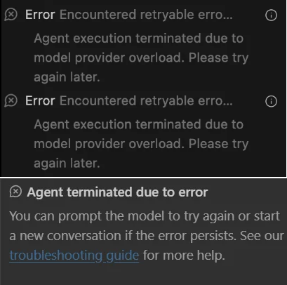

# Breaking the Laws of Coding: Google AntiGravity

Today, I tried the new code-editor AntiGravity by Google. The UI is almost same as Cursor because both are based on VS Code. That's why it was not hard to find what I'm looking for. First of all, the main difference as I see from the Cursor is; when I type a prompt in the agent section AntiGravity first creates a Task list and every time it finishes a task, it checks it. Actually Cursor has a similar functionality but AntiGravity took it one step further. Second thing which is good; AntiGravity uses Nano Banana 🍌... This is Google's image generation LLM. Why it's important because when you create a web page, you don't need to search for graphics, AntiGravity generates images automatically. 

Everything is not so perfect! When I tried AntiGravity, couple of times it stucked AI generation. I faced errors like this 👇

## Introduction

As .NET developers, we are accustomed to "heavy" lifting. We deal with heavy architectures, robust dependency injection containers, and IDEs like Visual Studio that sometimes feel like they carry the weight of the entire universe while loading.

We constantly seek lightweight solutions—faster build times, cleaner UI, and more responsive environments. Recently, I stumbled upon a tool that takes the concept of "lightweight" quite literally.

It is called **Google AntiGravity**, and while it may not replace your daily driver for ABP Framework development just yet, it introduces a radical new paradigm I like to call **Chaos-Driven Development (CDD)**.

## The User Interface: A Crash Course in Physics

The first thing you will notice about the AntiGravity "editor" is its refusal to adhere to standard grid layouts. In traditional tools like Visual Studio or JetBrains Rider, windows are docked. The Solution Explorer stays on the right; the Output window stays at the bottom.

In AntiGravity, the UI is dynamic—perhaps *too* dynamic. Upon initialization, the entire interface collapses under simulated physics. Elements that were once rigidly defined (like the Search Bar or the "I'm Feeling Lucky" button) are now free-floating objects that interact with the cursor.

> **Pro Tip:** If you are frustrated with a specific bug in your code, this interface allows you to physically grab the erroring module and throw it against the virtual wall. It is surprisingly therapeutic.

## Loose Coupling Taken Literally

One of the core tenets of the ABP Framework is **Modularity**. We strive for loose coupling between our Domain, Application, and Infrastructure layers.

AntiGravity visualizes this concept perfectly. When you interact with the environment, you will see that there are absolutely no rigid dependencies holding the visual elements together. They collide, bounce, and scatter.

## Feature Breakdown

While it lacks support for C# syntax highlighting or NuGet package management, it boasts several "unique" features:

1.  **Physics-Based Refactoring:** Moving a UI element isn't done via CSS or XAML. You simply drag it with your mouse and let gravity do the rest.
2.  **Zero-Latency Crashes:** When things fall apart, they do so instantly. There is no loading bar for the chaos.
3.  **The "Shake" Build:** If you vigorously shake your browser window, the elements react violently—a perfect metaphor for `dotnet build --force`.

## The Verdict

Is Google AntiGravity going to replace Visual Studio 2022 for your next enterprise ABP solution? **Absolutely not.**

However, is it an incredible way to decompress after spending four hours debugging an `AsyncHelper` deadlock? **100% yes.**

Sometimes, we take our architecture too seriously. Tools like this remind us that at the end of the day, code is just digital blocks that we are trying to stack together without them falling over.

## Differences Between Cursor and AntiGravity

It appears there was a bit of confusion in our previous "satire" article! In this timeline (November 2025), **Google Antigravity** is indeed a real, newly released **AI-first IDE** intended to compete with **Cursor**.

While **Cursor** has been the reigning champion of AI code editors, Google's **Antigravity** (powered by Gemini 3) introduces a different philosophy.

### 1. Philosophy: "Co-Pilot" vs. "Employee"

- **Cursor (The Super-Suit):** Cursor is built to make **YOU** a faster coder. It acts like an exoskeleton; it predicts your next move, auto-completes your thoughts, and helps you refactor while you type.4 You are still the driver; Cursor just makes the car go 200mph.
- **Antigravity (The Manager):5** Antigravity is built to let you **manage** coding tasks.6 It is "Agent-First."7 You don't just type code; you assign tasks to autonomous agents (e.g., "Fix the bug in the login flow and verify it in the browser"). It behaves more like a junior developer that you supervise.

### 2. The Interface

- **Cursor:** Looks and feels exactly like **VS Code**.10 If you know VS Code, you know Cursor. The AI is integrated into the text editor (CMD+K, Tab autocomplete).

- **Antigravity:** Introduces two distinct views:

  

  - **Editor View:** Similar to a standard IDE
  - **Manager View (Mission Control):** A dashboard where you see multiple "Agents" working in parallel.14 You can watch them plan, execute, and test tasks asynchronously.

### 3. Verification & Trust

- **Cursor:** You verify by reading the code diffs it suggests.
- **Antigravity:** Introduces **"Artifacts"**.17 Since the agents work autonomously, they generate "proof of work" documents—screenshots of the app running, browser logs, and execution plans—so you can verify *what* they did without necessarily reading every line of code immediately.

### 4. Capabilities

- **Cursor:** Best-in-class **Autocomplete** ("Tab" feature) and **Composer** (multi-file editing).19 It excels at "Vibe Coding"—getting into a flow state where the AI writes the boilerplate and you direct the logic.
- **Antigravity:** excels at **Autonomous Execution**.21 It has a built-in browser and terminal that the *Agent* controls.22 The Agent can write code, run the server, open the browser, see the error, and fix it—all without your intervention.

### 5. The Brains (Models)

- **Cursor:** Model Agnostic. You can switch between **Claude 3.5 Sonnet** (the community favorite), GPT-4o, and others.
- **Antigravity:** Built deeply around **Gemini 3 Pro**.25 It leverages Gemini's massive context window (1M+ tokens) to understand huge monorepos without needing as much "RAG" (indexing) trickery as Cursor.

### Summary Table

| **Feature**        | **Cursor**                                     | **Google Antigravity**                        |
| ------------------ | ---------------------------------------------- | --------------------------------------------- |
| **Core Concept**   | AI-Assisted Editing (Copilot)                  | Agentic Development (Autonomy)                |
| **Best Feature**   | **Tab Autocomplete** (predicts your next edit) | **Mission Control** (manages multiple agents) |
| **User Role**      | The Coder (Hands-on)                           | The Architect (Delegation)                    |
| **Context Window** | Large, but relies on RAG/Indexing              | Massive (Native Gemini 1M+ tokens)            |
| **Verification**   | Review Code Diffs                              | Review "Artifacts" (Screenshots, Plans)       |
| **Speed**          | Instant / Low Latency                          | Slower (Agents take time to "think" & "act")  |

If you want to write code faster and stay in the flow, stick with Cursor.27

If you want to delegate tasks (like "upgrade these 50 dependencies and run tests") while you sip coffee, try Antigravity.

## Try It Yourself

If you are ready to experience the chaos, you can access the tool here:
[**Launch Google AntiGravity**](https://antigravity.google/)