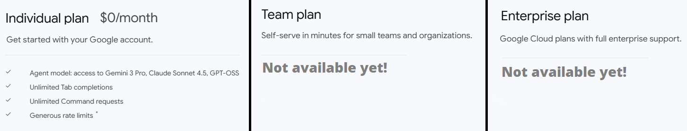
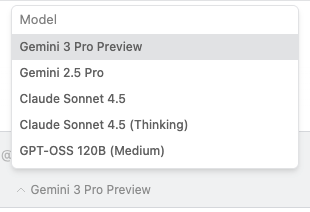
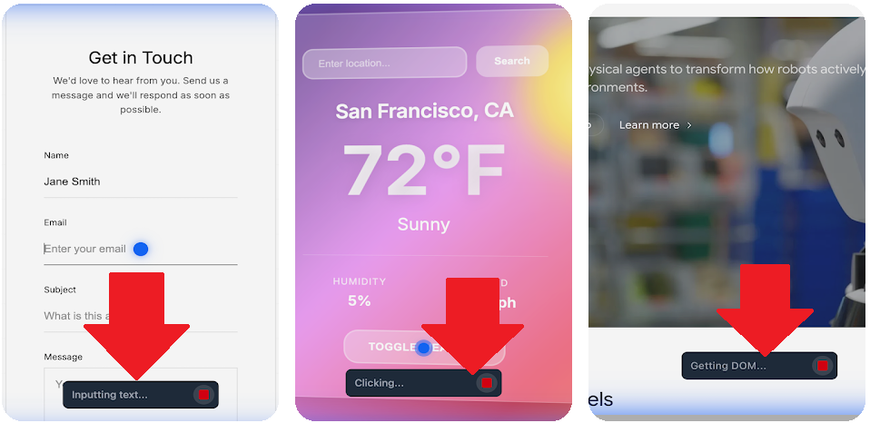
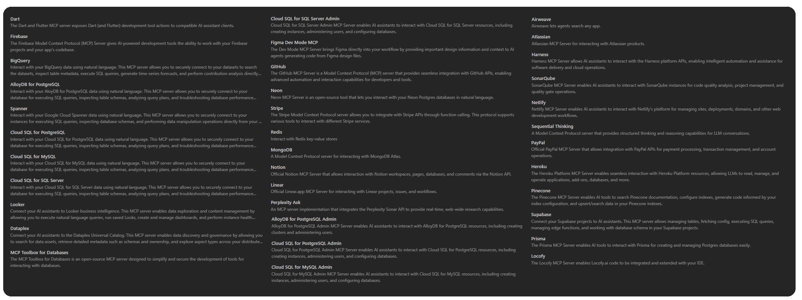

# My First Look and Experience with Google AntiGravity

## Is Google AntiGravity going to replace your main code editor?

Today, I tried the new code-editor AntiGravity by Google. They say it's beyond a code-editor. When I launch, I see the UI is almost same as Cursor. They're both based on VS Code. That's why it was not hard to find what I'm looking for. 

First of all, the main difference as I see from the Cursor is; when I type a prompt in the agent section **AntiGravity first creates a Task List** (like a road-map) and every time it finishes a task, it checks the corresponding task. Actually Cursor has a similar functionality but AntiGravity took it one step further. 

Second thing which was good to me; AntiGravity uses Nano Banana 🍌. This is Google's image generation LLM... Why it's important because when you create an app, you don't need to search for graphics, deal with image licenses. **AntiGravity generates images automatically and no license is required!** 

Third exciting feature for me; **AntiGravity is integrated with Google Chrome and can communicate with the running website**. When I first run my web project, it setups a browser extension which can see and interact with my website. And it can see the results, click somewhere else on the page, scroll, fill up the forms.

Another feature I loved is that **you can enter a new prompt even while AntiGravity is still generating a response**. It instantly prioritizes the latest input and adjusts the ongoing process if needed. But in Cursor, if you add a prompt before the cursor finishes, it simply queues it and runs it later.

And lastly, **AntiGravity is working very good with Gemini 3**.

Everything was not so perfect! When I tried AntiGravity, couple of times it stucked AI generation. I faced errors like this 👇

Also you **cannot debug your .NET application with AntiGravity.** This is Microsoft's policy that's why I cannot say it's a downside of AntiGravity. You need to use Microsft's original VS Code, Visual Studio or Rider

## How Much is AntiGravity?

Currently there's only individual plan is available for personal accounts and that's free! The contents of Team and Enterprise plans and prices are not announced yet. I used it with my company Google Workspace account which we pay so Gemini 3 is free on my account.

## More About AntiGravity

There have been many AI assisted IDEs like [Windsurf](https://windsurf.com/), [Cursor](https://cursor.com/), [Zed](https://zed.dev/), [Replit](https://replit.com/) and [Fleet](https://www.jetbrains.com/fleet/). This project is backed with Google. **But this time, since it’s one of the ‘Magnificent 7’ it’s making a name for itself.**  AntiGravity, uses a standard grid layout as others based on VS Code editor. It's very similar to Cursor, Visual Studio, Rider. 

## Supported LLMs:

Antigravity offers the below models which supports reasoning

- Gemini 3 Pro (high)
- Gemini 3 Pro (low)
- Claude Sonnet 4.5
- Claude Sonnet 4.5 (thinking)
- GPT-OSS

Antigravity also uses other supportive models in the background:

- **Nano banana**: This is used to generate images
- **Gemini 2.5 Pro UI Checkpoint**: It's for the browser subagent to trigger browser action such as clicking, scrolling, or filling in input.
- **Gemini 2.5 Flash**: For checkpointing and context summarization, this is used.
- **Gemini 2.5 Flash Lite**: And when it's need to make a semantic search in your code-base, this is used.

## AntiGravity Can See Your Website

This make a big difference from traditional IDEs. AntiGravity's browser agent is taking screenshots of pages when it wants to check the page. This is achieved by a Chrome Extension as a tool to the agent, and you can also prompt the agent to take a screenshot of a page. For example; it can iterating on website designs and implementations, it can perform UI Testing, it can monitoring dashboards, it can automating routine tasks like rerunning CI.
This is the link for the extension 👉 [chromewebstore.google.com/detail/antigravity-browser-exten/eeijfnjmjelapkebgockoeaadonbchdd](https://chromewebstore.google.com/detail/antigravity-browser-exten/eeijfnjmjelapkebgockoeaadonbchdd)

## MCP Integration

When we need MCP in a code-editor? Simply if we want to connect to a 3rd party service to complete our task we need MCP. So AntiGravity can connect to your DB and write proper SQL queries or it can pull in recent build logs from Netlify or Heroku. Also you canask AntiGravity to to connect GitHub for the best authentication pattern. AntiGravity currently supports these MCP servers: Airweave,AlloyDB for PostgreSQL,Atlassian,BigQuery,Cloud SQL for PostgreSQL,Cloud SQL for MySQL,Cloud SQL for SQL Server,Dart,Dataplex,Figma Dev Mode MCP,Firebase,GitHub,Harness,Heroku,Linear,Locofy,Looker,MCP Toolbox for Databases,MongoDB,Neon,Netlify,Notion,PayPal,Perplexity Ask,Pinecone,Prisma,Redis,Sequential Thinking,SonarQube,Spanner,Stripe and Supabase.

## Agent Settings

The major settings of Agent are:

- **Agent Auto Fix Lints**: I enabled this setting because I want the Agent automatically fixes its own mistakes for invalid syntax, bad formatting, unused variables, unreachable code or not following project coding standards... It makes extra tool calls that's why little bit expensive.
- **Auto Execution**: Sometimes Agent tries to build application or writing test code and running it, in these cases it executes command. I choose "Turbo"... With this option, Agent always runs the terminal command and controls my browser.
- **Review Policy**: How much control you are giving to agent. I choose "Always Proceed" because I mostly trust AI 😀. It means the Agent will never ask for review.

## Differences Between Cursor and AntiGravity

It appears there was a bit of confusion in our previous "satire" article! In this timeline (November 2025), **Google Antigravity** is indeed a real, newly released **AI-first IDE** intended to compete with **Cursor**.

While **Cursor** has been the reigning champion of AI code editors, Google's **Antigravity** (powered by Gemini 3) introduces a different philosophy.

### 1. Philosophy: "Co-Pilot" vs. "Employee"

- **Cursor (The Super-Suit):** Cursor is built to make you a faster coder. It acts like an exoskeleton; it predicts your next move, auto-completes your thoughts, and helps you refactor while you type.4 You are still the driver; Cursor just makes the car go 200mph.
- **Antigravity (The Manager):5** Antigravity is built to let you **manage** coding tasks.6 It is "Agent-First."7 You don't just type code; you assign tasks to autonomous agents (e.g., "Fix the bug in the login flow and verify it in the browser"). It behaves more like a junior developer that you supervise.

### 2. The Interface

- **Cursor:** Looks and feels exactly like **VS Code**.10 If you know VS Code, you know Cursor. The AI is integrated into the text editor (CMD+K, Tab autocomplete).

- **Antigravity:** Introduces two distinct views:
  - **Editor View:** Similar to a standard IDE
  - **Manager View (Mission Control):** A dashboard where you see multiple "Agents" working in parallel.14 You can watch them plan, execute, and test tasks asynchronously.

### 3. Verification & Trust

- **Cursor:** You verify by reading the code diffs it suggests.
- **Antigravity:** Introduces **"Artifacts"**.17 Since the agents work autonomously, they generate "proof of work" documents—screenshots of the app running, browser logs, and execution plans—so you can verify *what* they did without necessarily reading every line of code immediately.

### 4. Capabilities

- **Cursor:** Best-in-class **Autocomplete** ("Tab" feature) and **Composer** (multi-file editing).19 It excels at "Vibe Coding"—getting into a flow state where the AI writes the boilerplate and you direct the logic.
- **Antigravity:** excels at **Autonomous Execution**.21 It has a built-in browser and terminal that the *Agent* controls.22 The Agent can write code, run the server, open the browser, see the error, and fix it—all without your intervention.

### 5. The Brains (Models)

- **Cursor:** Model Agnostic. You can switch between **Claude 3.5 Sonnet** (the community favorite), GPT-4o, and others.
- **Antigravity:** Built deeply around **Gemini 3 Pro**.25 It leverages Gemini's massive context window (1M+ tokens) to understand huge monorepos without needing as much "RAG" (indexing) trickery as Cursor.

## Try It Yourself

If you are ready to experience the chaos, you can access the tool here: 
[**Launch Google AntiGravity**](https://antigravity.google/)