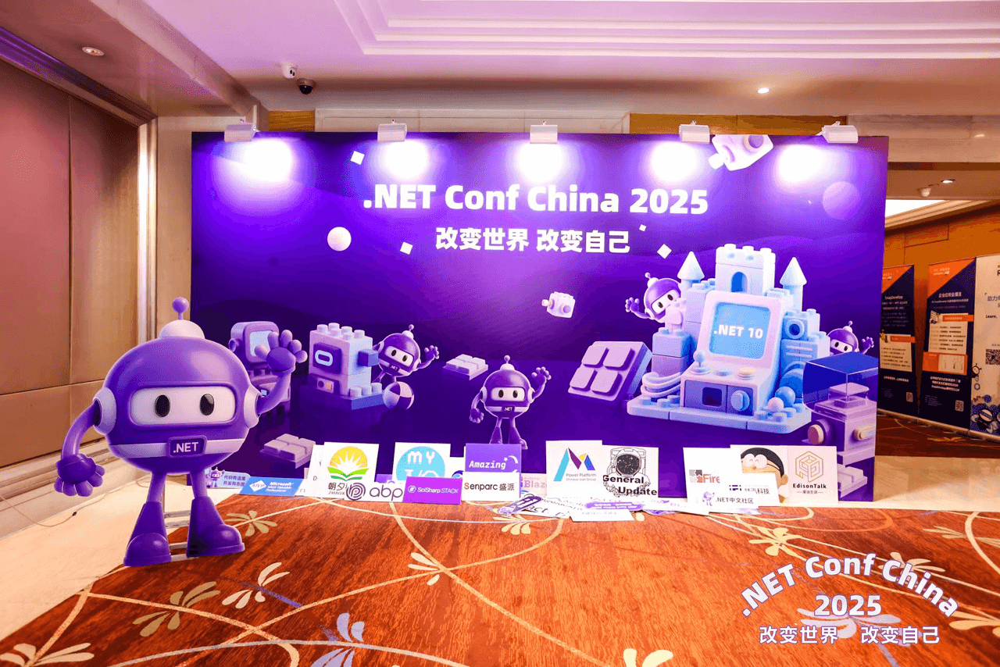
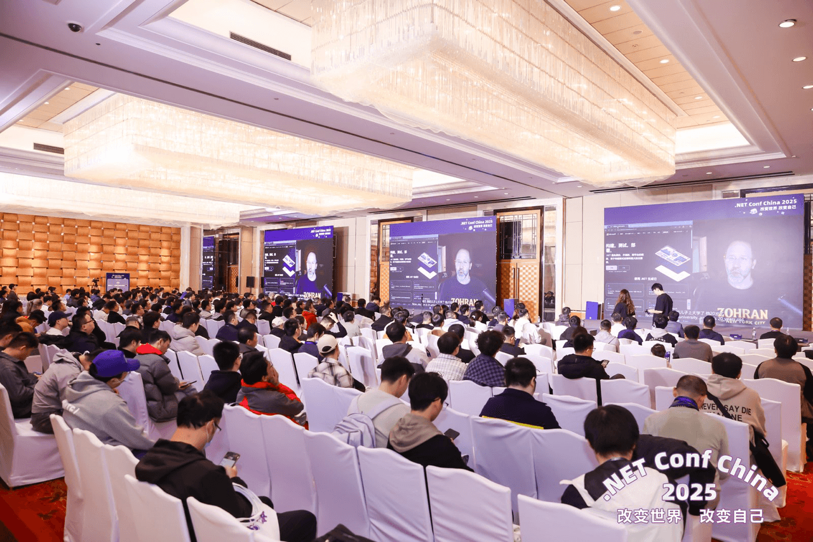
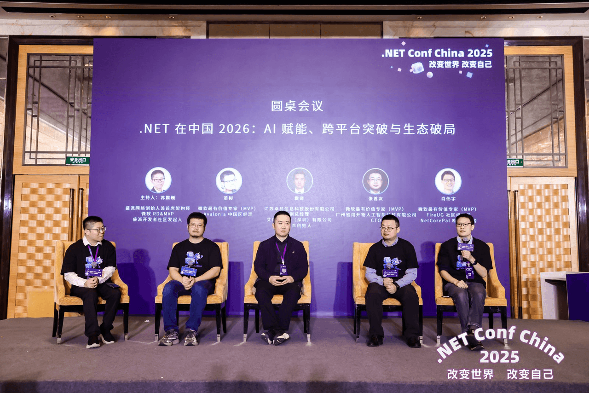
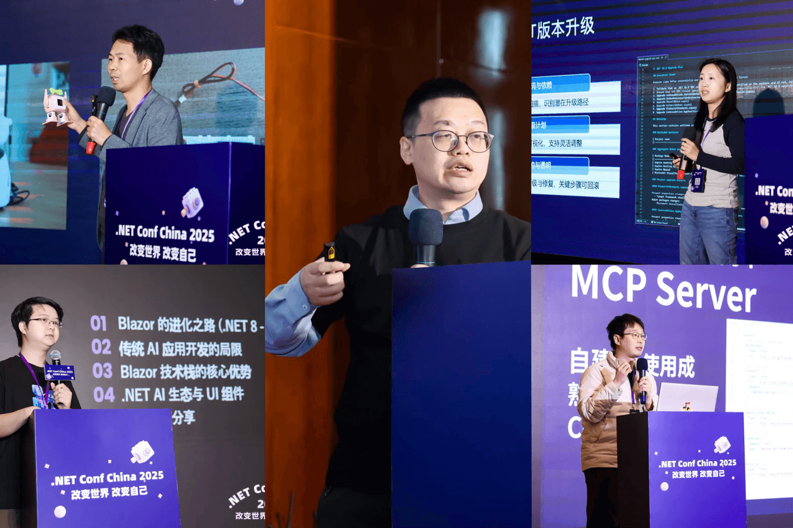
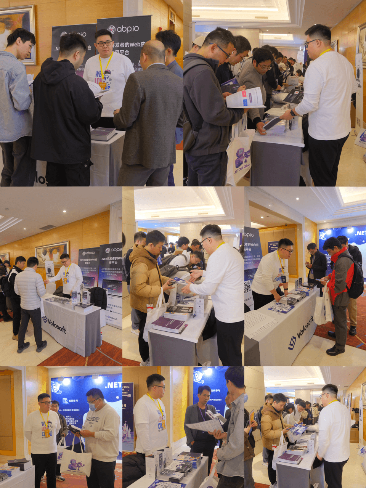
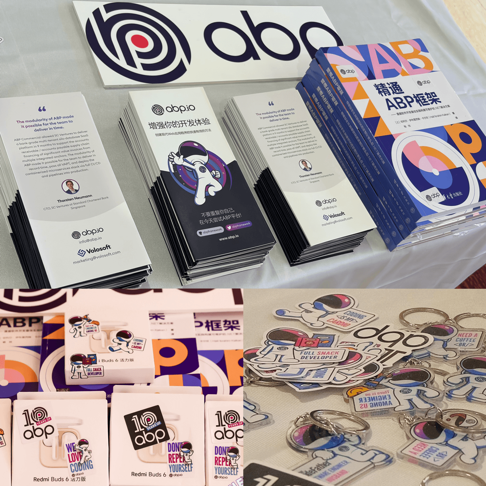
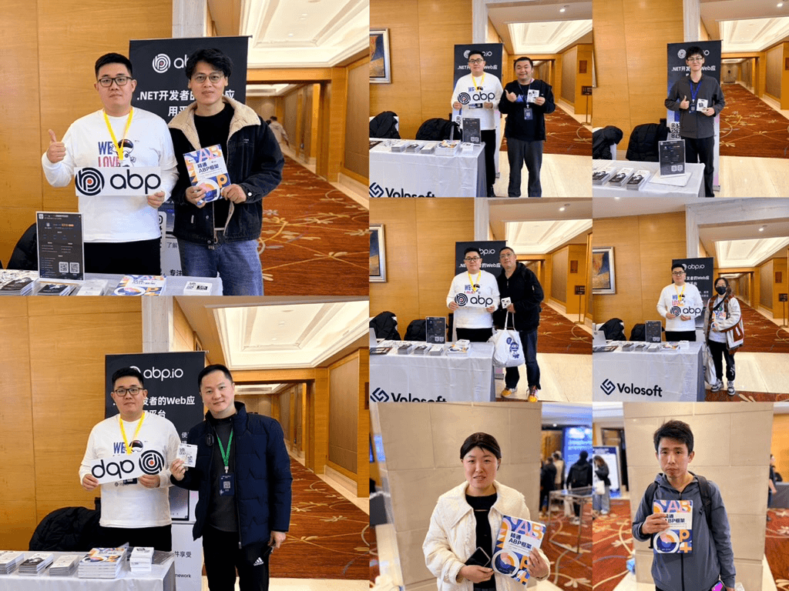
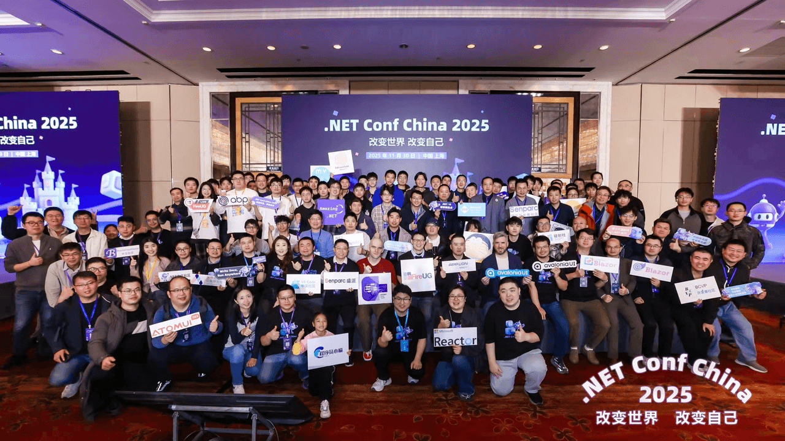

# .NET Conf China 2025: Changing the World, Changing Ourselves - See You Again in Shanghai

.NET Conf China 2025 is an annual community event for developers, celebrating the release of .NET 10 (LTS) and the achievements of the past year in China. As an extension of .NET Conf 2025, this event brings together local tech communities, well-known companies, and open-source organizations. It has become the largest .NET online and offline conference in China, dedicated to spreading .NET technology in Chinese and fostering collaboration and exchange.

## Event Highlights: Key Topics and Takeaways

This year’s conference focused on three main themes: performance improvements, AI integration, and cross-platform development. Topics covered how to achieve performance gains while maintaining engineering quality, balancing between multi-platform consistency and native capabilities, and taking generative AI from “demo-level” to “production-ready.” On the community and ecosystem side, the event showcased the .NET Foundation’s and domestic and international companies’ progress in supporting architectures like ARM, LoongArch, and RISC-V. It also highlighted best practices in DevOps, observability, and engineering toolchains, creating a complete path from ideas to implementation.

### Opening Keynote

Scott Hanselman opened the event with a video keynote. In his remarks, he shared some high-level thoughts on the development of .NET and conveyed an encouraging and positive message to the community. He also touched on the ongoing exploration of emerging technology trends, including AI, encouraging developers to stay open-minded and focus on long-term value and practical innovation. At the same time, he extended his best wishes for the success of the conference, hoping that all participants would gain inspiration from the exchanges and collectively contribute to the advancement of future technologies.

### Roundtable Discussion

The roundtable discussion, titled “Empowering with AI, Breaking Through Cross-Platform Barriers, and Ecosystem Innovation,” focused on practical implementation. It explored typical paths for large models and intelligent agents in enterprises, key considerations for choosing cross-platform UI frameworks, and the evolution of these frameworks. Panelists discussed questions like: How can AI capabilities be integrated into existing business processes instead of creating an “experimental” pipeline? How should cross-platform solutions be evaluated in terms of performance, ecosystem, and team skillsets? What are the unique opportunities for domestic ecosystems in the global tech landscape? And how can community collaboration help developers quickly adopt best practices? A shared consensus emerged: in the short term, focus on running scenarios; in the long term, return to engineering fundamentals. Both toolchains and methodologies are equally important.

### In-Depth Sessions

The afternoon featured four breakout sessions, covering a wide range of topics with deep dives into both foundational technologies and real-world project reviews:

- **Frontend and Cross-Platform:** Focused on the progress of Avalonia, Blazor, and WebAssembly, as well as the integrated experience of .NET Aspire in multi-service applications. Speakers shared insights on reusing core logic between desktop and web, shortening cold start times with incremental compilation and resource trimming, and performance profiling and optimization in WASM scenarios.
- **AI Agents and Enterprise Adoption:** Discussed multi-agent orchestration, the MCP plugin ecosystem, and enterprise data compliance. From common pitfalls of “demo-level” AI to the “five-step method” for moving from POC to production, the session covered use cases like knowledge retrieval, process automation, intelligent customer service, and developer assistants, emphasizing evaluation metrics, prompt engineering, and monitoring governance.
- **.NET Practices and Engineering:** Focused on the latest capabilities and performance practices of EF Core, the boundaries of NativeAOT, automated testing strategies, and observability implementation. Discussions included database migration strategies, caching and concurrency control for hot paths, end-to-end tracing, and structured logging.
- **Solutions and Case Studies:** From Clean Architecture/DDD to AI-powered business evolution, topics included application modernization, SaaS transformation, and edge-cloud collaboration in AIoT. Speakers broke down modular governance, team collaboration, and release strategies for complex systems, putting “delivering value continuously” at the center stage.

## ABP Booth Highlights: Showcases, Conversations, and Fun

The story of ABP began with a promise to create a better starting point. From the frustration of “copy-pasting boilerplate code,” we crafted a modular, opinionated framework. We chose open source and community collaboration. We founded Volosoft to turn our vision into reality with professional tools. Today, tens of thousands of developers explore the ABP framework, and thousands of teams rely on the ABP platform to deliver production-grade .NET applications faster and more securely.

At .NET Conf China 2025, we brought our “developer platform built for developers” to every visitor. Our booth demonstrations started with “a production-ready skeleton from the start”: modular layered architecture, built-in authentication and authorization systems, multi-tenancy support, audit logging, and localization—all out of the box. On the frontend and backend, ABP offers diverse options like MVC, Blazor, and Angular, enabling teams to quickly implement solutions on familiar stacks while maintaining flexibility for future evolution. We also showcased how ABP integrates with containerization, CI/CD, and observability, emphasizing “engineering built into the framework, not reinvented by every team.”

**Interaction and Prizes:** Sharing technology should also be warm and engaging. We hosted a QR code raffle at the booth, with prizes including ABP stickers, the book *Mastering ABP Framework*, and Bluetooth headphones. Multiple rounds of raffles and group photos made the interactions more memorable. Many developers shared their ABP experiences and plans for improvement right at the booth, and a few impromptu “code walkthroughs” naturally happened. The love and joy for technology were captured in every handshake and discussion.

## Looking Ahead: Building the Ecosystem Together

From an open-source journey to a complete development platform for the future, we’ve always believed that developers deserve a better starting point. Around performance, intelligence, and cross-platform capabilities, we will continue investing in engineering, ecosystem collaboration, and best practice sharing. We also welcome more partners to contribute through documentation and examples, share your experiences, and submit your ideas. Together, let’s make “useful infrastructure” more stable, efficient, and business-friendly.

We look forward to exchanging ideas, sharing practices, and building the ecosystem together at the next gathering. Technology meets creativity, and the possibilities are endless. We’re on the road and waiting for you at the next event.

See you next year at .NET Conf China 2026!

