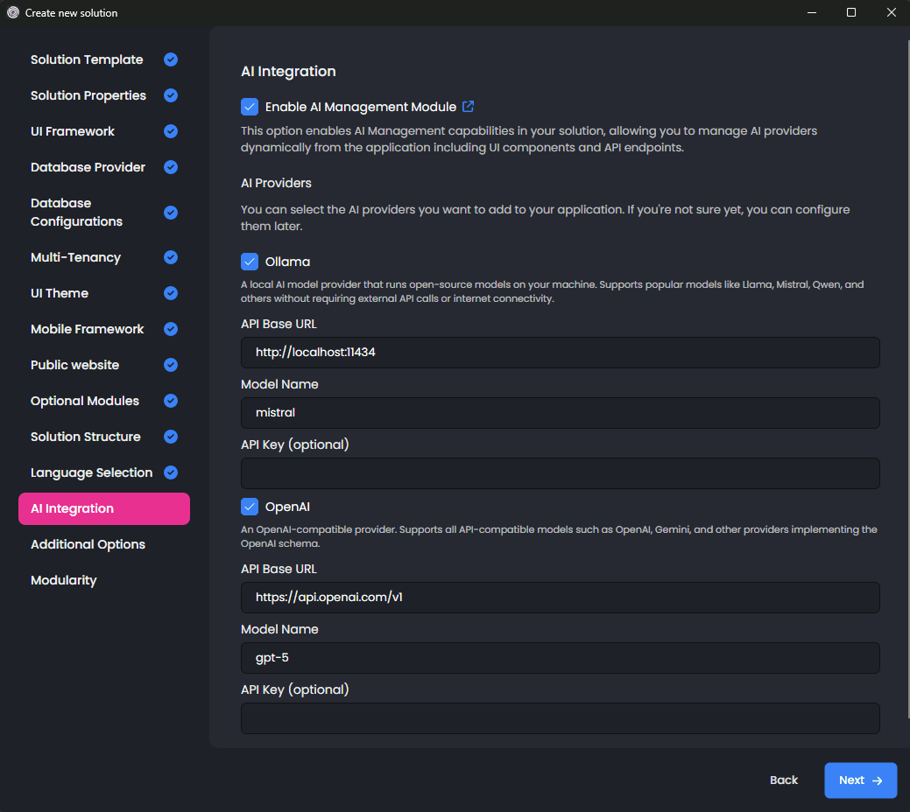

# Introducing the AI Management Module: Manage AI Integration Dynamically

We are excited to announce the **AI Management Module**, a powerful new addition to ABP Commercial that makes managing AI capabilities in your applications easier than ever. Say goodbye to configuration changes that require redeployment—now you can configure, test, and manage your AI integrations on the fly through an intuitive user interface!

## What is the AI Management Module?

Built on top of the [ABP Framework's AI infrastructure](https://abp.io/docs/latest/framework/infrastructure/artificial-intelligence), the AI Management Module allows you to manage AI workspaces dynamically without touching your code. Whether you're building a customer support chatbot, adding AI-powered search, or creating intelligent automation workflows, this module provides everything you need to manage AI integrations through a user-friendly interface.

> **Note**: The AI Management Module is currently in **preview** and available to ABP Team or higher license holders.

## What it offers?

### Manage AI Without Redeployment

Create, configure, and update AI workspaces directly from the UI. Switch between different AI providers (OpenAI, Azure OpenAI, Ollama, etc.), change models, adjust prompts, and test configurations—all without restarting your application or deploying new code.

### Built-In Chat Interface

Test your AI workspaces immediately with the included chat interface in playground pages. Verify your configurations work correctly before using them in production. Perfect for experimenting with different models, prompts, and settings.

### Flexible for Any Architecture

Whether you're building a monolith, microservices, or something in between, the module adapts to your needs:
- Host AI management directly in your application with full UI and database
- Deploy a centralized AI service that multiple applications can consume
- Use it as an API gateway pattern for your microservices

### Works with Any AI Provider

Even AI Management module doesn't implements all the providers by default, it provides an extensibility options with a good abstraction for other providers like Azure, Anthropic Claude, Google Gemini, and more. Or you can directly use the OpenAI adapter with LLMs that supports OpenAI API.

You can even add your own custom AI providers—[learn how in the documentation](../../modules/ai-management/index.md#implementing-custom-ai-provider-factories).

### Ready-to-Use Chat Widget

Drop a beautiful, pre-built chat widget into any page with minimal code. It includes streaming support, conversation history, and API integration for customization. [See the widget documentation](../../modules/ai-management/index.md#client-usage-mvc-ui) for details.

### Enterprise Security Built-In

Control who can manage and use AI workspaces with permission-based access control. Protect critical AI configurations, ensure proper tenant isolation in multi-tenant applications, and store API keys securely.

## Getting Started

Installation is straightforward using the [ABP Studio](https://abp.io/studio). You can just enable **AI Management** module while creating a new project with ABP Studio and configure your preferred AI provider and model in the solution creation wizard.

## Roadmap

### v10.0 ✅
- Workspace Management 
- MVC UI 
- Playground 
  -  Chat History _(Client-Side)_
- Client Components
- Integration to Startup Templates

### v10.1
- Blazor UI
- Angular UI
- Resource based authorization on Workspaces
- Agent-Framework compatibility examples

### Future Goals
- Microservice templates
- MCP Support
- RAG with file upload _(md, pdf, txt)_
- Chat History _(Server-Side Conversations)_
- OpenAI Compatible Endpoints
- Tenant-Based Configuration
- Extended RAG capabilities, _(ie. providing application data as tools)_

## Ready to Get Started?

The AI Management Module is available now for ABP Team and higher license holders. 

**Learn More:**
- [Complete Documentation](../../modules/ai-management/index.md) - All features, scenarios, and technical details
- [ABP AI Infrastructure](../../framework/infrastructure/artificial-intelligence/index.md) - Understanding AI workspaces
- [Installation Guide](../../modules/ai-management/index.md#how-to-install) - Get up and running quickly
- [Usage Scenarios](../../modules/ai-management/index.md#usage-scenarios) - Examples for different architectures

---

*The AI Management Module is currently in preview. We're excited to hear your feedback as we continue to improve and add new features!*