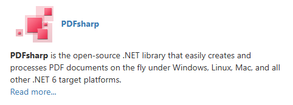
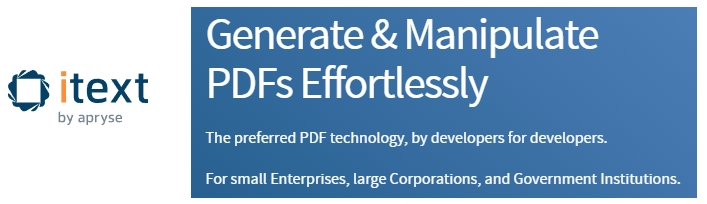
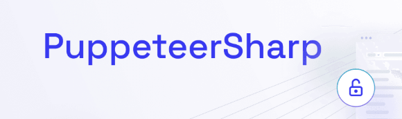

# Which Open-Source PDF Libraries Are Recently Popular ? A Data-Driven Look At PDF  Converters for .NET

For .NET developers, library selection shouldn't rely on lifetime popularity alone. Two signals better indicate health and future viability: **recent download momentum** (via NuGet usage) and **ongoing GitHub activity** (commits, stars). Libraries with high daily downloads and frequent commits are more likely to stay maintained, secure, and compatible with newer .NET versions.

This article compares some key PDF generation and automation libraries using these metrics from the last ~90 days that I wrote this article.

## Popularity Comparison of  .NET PDF Libraries (*ordered by score*)

| Library | GitHub Stars | Avg Daily NuGet Downloads | Total NuGet Downloads | **Popularity Score** |
|---------|---------------|-----------------------------|----------------------------|---------------------|
| **[Microsoft.Playwright](https://github.com/microsoft/playwright-dotnet)** | [2.9k](https://github.com/microsoft/playwright-dotnet) | [23k](https://www.nuget.org/packages/Microsoft.Playwright) | 39M | **71/100** |
| **[QuestPDF](https://github.com/QuestPDF/QuestPDF)** | [13.7k](https://github.com/QuestPDF/QuestPDF) | [8.2k](https://www.nuget.org/packages/QuestPDF) | 15M | **54/100** |
| **[PDFsharp](https://github.com/empira/PDFsharp)** | [862](https://github.com/empira/PDFsharp) | [9k](https://www.nuget.org/packages/PdfSharp) | 47M | **48/100** |
| **[iText](https://github.com/itext/itext-dotnet)** | [1.9k](https://github.com/itext/itext-dotnet) | [17.2k](https://www.nuget.org/packages/itext) | 16M | **44/100** |
| **[PuppeteerSharp](https://github.com/hardkoded/puppeteer-sharp)** | [3.8k](https://github.com/hardkoded/puppeteer-sharp) | [8.7k](https://www.nuget.org/packages/PuppeteerSharp) | 26M | **40/100** |

*Score Calculation: Weighted composite score based on GitHub Stars (30%), Avg Daily NuGet Downloads (40%), and Total NuGet Downloads (30%). All values normalized to 0-100 scale before weighting. Higher score indicates stronger overall momentum.*

## Library-by-Library Analysis

### [PDFsharp](https://docs.pdfsharp.net/)

**NuGet Package:** [PdfSharp](https://www.nuget.org/packages/PdfSharp) | **GitHub Repository:** [empira/PDFsharp](https://github.com/empira/PDFsharp)

**Primary use case:** Code-first PDF generation and manipulation (drawing graphics, text, images, merging, splitting). Not designed for HTML/browser rendering.

**Momentum signal:** **Stable**. High total downloads (47M) with steady daily adoption (~9k/day). Recent commit on January 6, 2026 (2 weeks ago) shows active maintenance. Version 6.2.3 supports .NET 8–10. [GitHub activity](https://github.com/empira/PDFsharp) is consistent, though the repository has a modest star count (862 stars) compared to newer alternatives.

**When to choose it:**

- When you need full control over PDF content via C# APIs
- For document generation without HTML/CSS dependencies
- In environments where browser engines are undesirable
- When working with graphics, vector content, or PDF manipulation workflows

---

### [iText](https://itextpdf.com/)

**NuGet Package:** [itext](https://www.nuget.org/packages/itext/) | **GitHub Repository:** [itext/itext-dotnet](https://github.com/itext/itext-dotnet)

**Primary use case:** Enterprise-grade PDF toolkit supporting generation, manipulation, digital signatures, forms, PDF/A/UA compliance, and HTML-to-PDF via add-ons.

**Momentum signal:** **Growing**. Solid download base (16M total) with healthy daily adoption (~17.2k/day, highest among code-first libraries). Very recent commit on January 18, 2026 (yesterday) shows active maintenance. Strong GitHub community (1.9k stars). The library continues to evolve with new features and .NET compatibility updates. [Repository activity](https://github.com/itext/itext-dotnet) remains strong.

**When to choose it:**

- For advanced PDF features: compliance (PDF/A, PDF/UA), digital signatures, form handling
- When enterprise licensing and vendor support are acceptable
- For complex PDF manipulation workflows beyond basic generation
- When HTML-to-PDF conversion is needed alongside code-based generation

---

### [Microsoft.Playwright](https://playwright.dev/dotnet/)

**NuGet Package:** [Microsoft.Playwright](https://www.nuget.org/packages/Microsoft.Playwright) | **GitHub Repository:** [microsoft/playwright-dotnet](https://github.com/microsoft/playwright-dotnet)

**Primary use case:** Browser automation and rendering. Converts HTML/CSS/JavaScript content to PDF via headless Chromium, WebKit, or Firefox engines.

**Momentum signal:** **Growing**. High download volume (39M total) with strong daily adoption (~23k/day, highest in the comparison). Repository shows active development with last commit on December 3, 2025. Strong Microsoft backing ensures long-term support and compatibility with latest .NET versions. [GitHub repository](https://github.com/microsoft/playwright-dotnet) has solid community engagement (2.9k stars). Growing adoption for web automation and PDF generation from HTML content.

**When to choose it:**

- When rendering HTML/CSS/JavaScript content with browser fidelity is required
- For dynamic content, SPAs, or web-based templates
- When PDF generation is part of a broader browser automation workflow
- When layout accuracy matching real browsers is critical

---

### [PuppeteerSharp](https://www.puppeteersharp.com/)

**NuGet Package:** [PuppeteerSharp](https://www.nuget.org/packages/PuppeteerSharp) | **GitHub Repository:** [hardkoded/puppeteer-sharp](https://github.com/hardkoded/puppeteer-sharp)

**Primary use case:** Similar to Playwright—browser-based rendering via headless Chromium for HTML-to-PDF conversion, screenshots, and automation.

**Momentum signal:** **Stable**. Recent commit on January 12, 2026 (last week) indicates active maintenance. Daily downloads (~8.7k/day) show steady usage, though lower than Playwright's ~23k/day. Total downloads (26M) demonstrate established adoption. [GitHub repository](https://github.com/hardkoded/puppeteer-sharp) has good community interest (3.8k stars), but growth appears slower than Playwright, which has Microsoft backing and broader browser support.

**When to choose it:**
- When you prefer Puppeteer's API model or have existing Puppeteer (JavaScript) workflows
- If Playwright's multi-browser approach is unnecessary
- For Chromium-specific rendering requirements
- When migrating from Node.js Puppeteer implementations

---

### [QuestPDF](https://github.com/QuestPDF/QuestPDF)

**NuGet Package:** [QuestPDF](https://www.nuget.org/packages/QuestPDF) | **GitHub Repository:** [QuestPDF/QuestPDF](https://github.com/QuestPDF/QuestPDF)

**Primary use case:** Code-first PDF generation with a fluent, component-based C# API. Designed for reports, invoices, and structured documents without HTML rendering.

**Momentum signal:** **Growing**. Strong download momentum (15M total, ~8.2k/day average) combined with very recent commits (January 18, 2026, yesterday) and highest [GitHub star count](https://github.com/QuestPDF/QuestPDF) (13.7k stars) among all libraries indicates rising adoption. Active development, modern API design, and .NET-native approach contribute to its growth and strong community engagement.

**When to choose it:**
- When you want expressive, code-driven layout control in C#
- For reports, invoices, and structured documents defined programmatically
- When avoiding browser dependencies is important
- For high-performance document generation in server environments
- When type safety and maintainable layout code are priorities

## Which Libraries Are Trending Up Right Now?

Based on the composite Popularity Score calculated from GitHub Stars, daily downloads, and total downloads:

### Code-First PDF Libraries

**[QuestPDF](https://github.com/QuestPDF/QuestPDF)** shows the strongest upward momentum in code-first libraries (Score: 54/100):

- Solid daily downloads (~8.2k/day) with 15M total downloads - [View on NuGet](https://www.nuget.org/packages/QuestPDF)
- Very recent commits (January 18, 2026, yesterday) - [View on GitHub](https://github.com/QuestPDF/QuestPDF)
- Highest community engagement (13.7k stars) among all libraries
- Modern API design attracting new projects

**[iText](https://github.com/itext/itext-dotnet)** shows strong momentum (Score: 44/100):

- Highest daily downloads among code-first libraries (~17.2k/day) - [View on NuGet](https://www.nuget.org/packages/itext)
- Very recent commits (January 18, 2026, yesterday) - [View on GitHub](https://github.com/itext/itext-dotnet)
- Strong community (1.9k stars) with 16M total downloads
- Enterprise-grade features continue to attract adoption

**[PDFsharp](https://github.com/empira/PDFsharp)** remains stable (Score: 48/100):

- Largest total download base (47M) with steady usage (~9k/day) - [View on NuGet](https://www.nuget.org/packages/PdfSharp)
- Recent maintenance (January 6, 2026, 2 weeks ago) - [View on GitHub](https://github.com/empira/PDFsharp)
- Mature and reliable, though community engagement (862 stars) is lower than newer alternatives

### HTML / Browser-Based PDF Libraries

**[Microsoft.Playwright (.NET)](https://github.com/microsoft/playwright-dotnet)** is trending strongest:

- Highest daily downloads overall (~23k/day) with 39M total - [View on NuGet](https://www.nuget.org/packages/Microsoft.Playwright)
- Active repository with recent commits (December 3, 2025) - [View on GitHub](https://github.com/microsoft/playwright-dotnet)
- Microsoft backing ensures long-term support
- Strong community (2.9k stars) and growing adoption for HTML-based PDF generation

**[PuppeteerSharp](https://github.com/hardkoded/puppeteer-sharp)** is stable but slower-growing:
- Solid daily downloads (~8.7k/day) with 26M total - [View on NuGet](https://www.nuget.org/packages/PuppeteerSharp)
- Active maintenance continues (January 12, 2026, last week) - [View on GitHub](https://github.com/hardkoded/puppeteer-sharp)
- Good community (3.8k stars), though download velocity is lower than Playwright
- Still viable for Chromium-focused workflows

## Summary & Recommendations

**For new code-first PDF projects:** **[QuestPDF](https://github.com/QuestPDF/QuestPDF)** offers the strongest community engagement (13.7k stars) and very recent commits, making it an excellent choice for modern projects. [Get it on NuGet](https://www.nuget.org/packages/QuestPDF) | **[iText](https://github.com/itext/itext-dotnet)** has the highest daily download rate (~17.2k/day) among code-first libraries and strong recent activity. [Get it on NuGet](https://www.nuget.org/packages/itext) | **[PDFsharp](https://github.com/empira/PDFsharp)** remains a solid, mature alternative with the largest total download base (47M) if you need lower-level control. [Get it on NuGet](https://www.nuget.org/packages/PdfSharp)

**For HTML-based PDF generation:** **[Microsoft.Playwright](https://github.com/microsoft/playwright-dotnet)** is the clear leader with the highest daily downloads (~23k/day) overall, active development, and broad browser engine support. [Get it on NuGet](https://www.nuget.org/packages/Microsoft.Playwright) | **[PuppeteerSharp](https://github.com/hardkoded/puppeteer-sharp)** remains viable with steady usage (~8.7k/day) but shows less growth compared to Playwright. [Get it on NuGet](https://www.nuget.org/packages/PuppeteerSharp)

**For enterprise/advanced features:** **[iText](https://github.com/itext/itext-dotnet)** provides the most comprehensive feature set with strong recent activity and highest code-first download velocity. Licensing should be carefully evaluated for commercial use. [Get it on NuGet](https://www.nuget.org/packages/itext)

---

*Data compiled from GitHub repositories and NuGet.org statistics as of January 19, 2026. Daily download averages reflect recent 90-day periods where available.*

