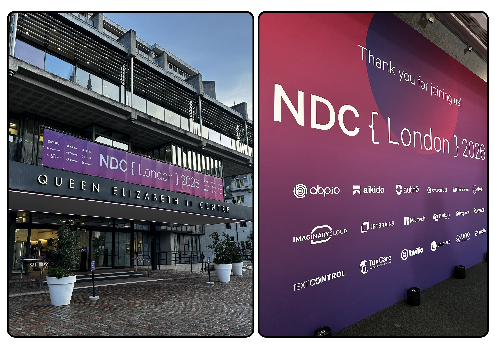
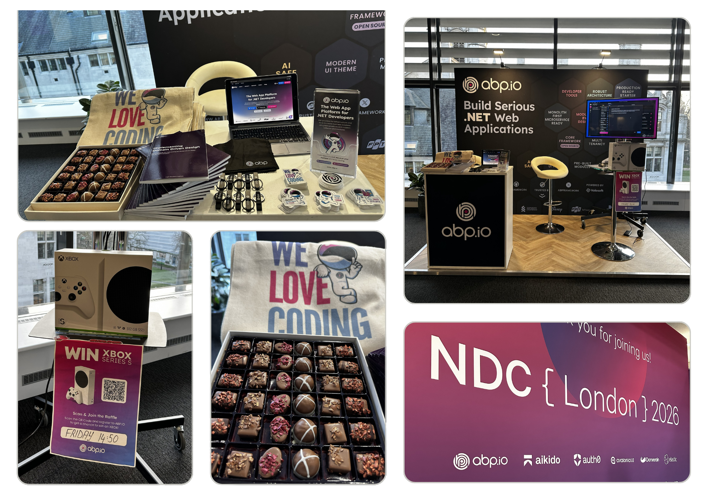
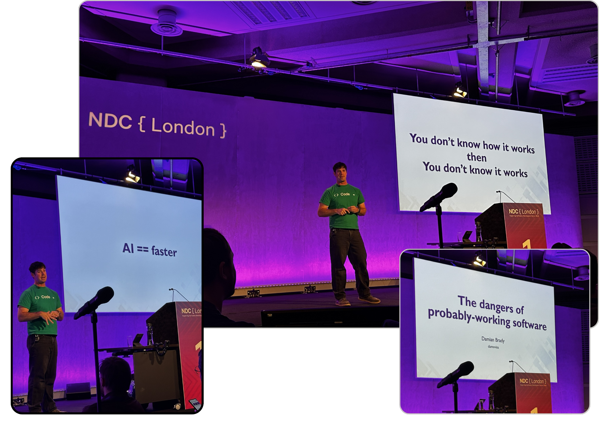
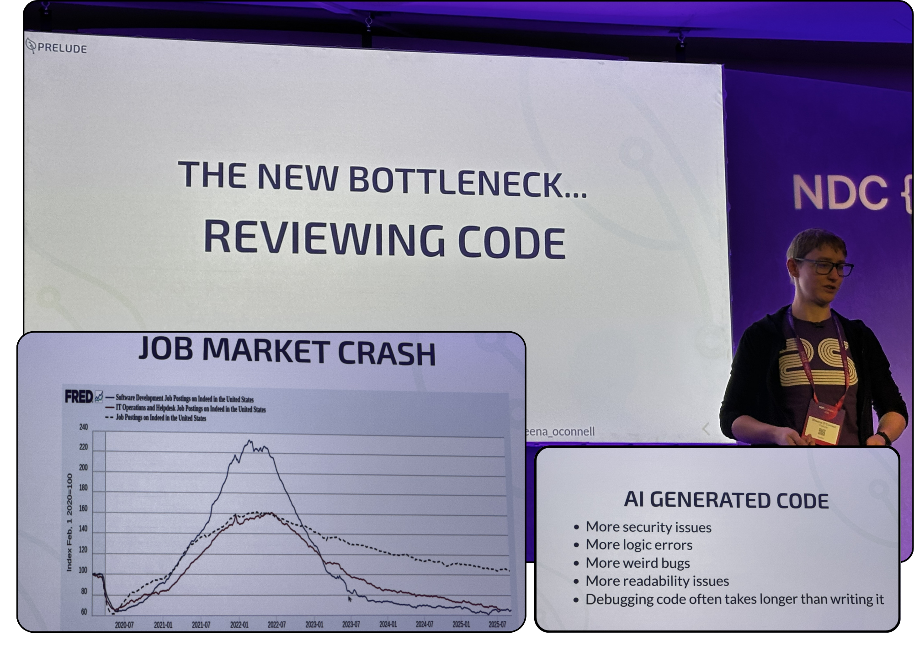
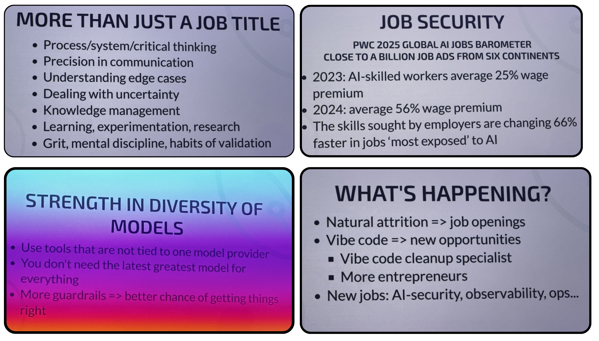
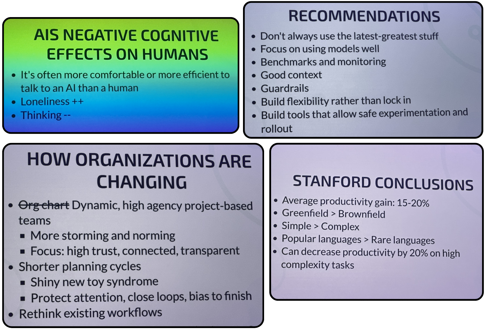
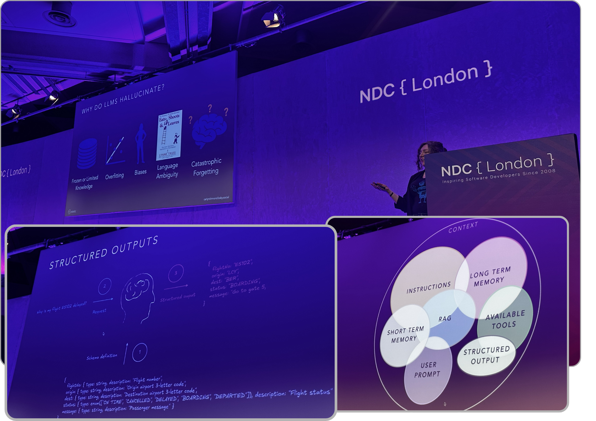

# What NDC London 2026 Looked Like From a Developer’s Perspective

This year we attended NDC London as a sponsor for [ABP](https://abp.io).  The conference was held at the same place [Queen Elizabeth II](https://qeiicentre.london/). I guess this is the best conf for .NET developers around the world (thanks to the NDC team). It was 3 full days started from 28 to 30 January 2026. As exhibitor we talked a lot with the attendees who stopped by our booth or while we were eating or in the conf rooms. 

This is the best opportunity to know what everyone is doing in software society. While I was explaining ABP to the people who first time heard, I also ask about what they do in their work. Developers mostly work on web platforms. And as you know there's an AI transformation in our sector. That's why I wonder if other people also stick to the latest AI trend! Well... not as I expected. In Volosoft, we are tightly following AI trends, using in our daily development, injecting this new technology to our product and trying to benefit this as much as possible. 

This new AI trend is same as the invention of printing (by Johannes Gutenberg in 1450) or it's similar to invention of calculators (by William S. Burroughs in 1886). The countries who benefit these inventions got a huge increase in their welfare level. So, we welcome this new AI invention in software development, design, devops and testing. I also see this as a big wave in the ocean, if you are prepared and developed your skills, you can play with it 🌊 and it's called surfing or you'll die in the ocean.  But not all the companies react this transformation quickly. Many developers use it like ChatGpt conversation (copy-paste from it) or using GitHub Co-Pilot in a limited manner. But as I heard from Steven Sanderson's session and other Microsoft employees, they are already using it to reproduce the bugs reported in the issues or creating even feature PRs via Co-Pilot. That's a good news for me!  

Here're some pictures from the conf and that's me on the left side with brown shoes :)

Another thing I see, there's a decrease in the number of attendees'. I don't know the real reason but probably the IT companies cut the budget for conferences. As you also hear, many companies layoff because of the AI replaces some of the positions. 

The food was great during the conference. It was more like eating sessions for me. Lots of good meals from different countries' kitchen. In the second day, there was a party. People grabbed their beers, wines, beverages and made some more networking. 

I was expecting more AI oriented sessions but it was less then my expectations. Even though I was an exhibitor, I tried to attend some of the session. I'll tell you my notes about these.

## Sessions / Talks

### The dangers of probably-working software | Damian Brady

The first session and keynote was from Damian Brady. He's part of Developer Advocacy team at GitHub. And the topic was "The dangers of probably-working software". He started with some negative impact of how generative AI is killing software, and he ended like this a not so bad, we can benefit from the AI transformation. First time I hear "sleepwalking" term for the development. He was telling when we generate code via AI, and we don't review well-enough, we're sleepwalkers. And that's correct! and good analogy for that case. This talk centers on a powerful lesson: *“**Don’t ship code you don’t truly understand.**”*
 Damian tells a personal story from his early .NET days when he implemented a **Huffman compression algorithm** based largely on Wikipedia. The code **“worked” in small tests** but **failed in production**. The experience forced him to deeply understand the algorithm rather than relying on copied solutions. Through this story, he explores themes of trust, complexity, testing, and mental models in software engineering.

#### What I learnt from this session 

- “It seems to work” is not the same as “I understand it.”
- Code copied from Wikipedia or StackOverflow is inherently risky in production.
- Passing tests on small datasets does not guarantee real-world reliability.
- Performance issues often surface only in edge cases.
- Delivery pressure can discourage deep understanding — to the detriment of quality.
- Always ask: “**When does this fail?**” — not just “**Why does this work?**”

### Playing the long game | Sheena O'Connell

Sheena is a former software engineer who now trains and supports tech educators. She talks about AI tools...
AI tools are everywhere but poorly understood; there’s hype, risks, and mixed results. The key question is how individuals and organisations should play the long game so skilled human engineers—especially juniors—can still grow and thrive. 
She showed some statistics about how job postings on Indeed platform dramatically decreasing for software developers. About AI generated-code, she tells, it's less secure, there might be logical problems or interesting bugs, human might not read code very well and understanding/debugging code might sometimes take much longer time.

Being an engineer is about much more than a job title — it requires systems thinking, clear communication, dealing with uncertainty, continuous learning, discipline, and good knowledge management. The job market is shifting: demand for AI-skilled workers is rising quickly and paying premiums, and required skills are changing faster in AI-exposed roles. There’s strength in using a diversity of models instead of locking into one provider, and guardrails improve reliability.

AI is creating new roles (like AI security, observability, and operations) and new kinds of work, while routine attrition also opens opportunities. At the same time, heavy AI use can have negative cognitive effects: people may think less, feel lonelier, and prefer talking to AI over humans.

Organizations are becoming more dynamic and project-based, with shorter planning cycles, higher trust, and more experimentation — but also risk of “shiny new toy” syndrome. Research shows AI can boost productivity by 15–20% in many cases, especially in simpler, greenfield projects and popular languages, but it can actually reduce productivity on very complex work. Overall, the recommendation is to focus on using AI well (not just the newest model), add monitoring and guardrails, keep flexibility, and build tools that allow safe experimentation.

We’re in a messy, fast-moving AI era where LLM tools are everywhere but poorly understood. There’s a lot of hype and marketing noise, making it hard even for technical people to separate reality from fantasy. Different archetypes have emerged — from AI-optimists to skeptics — and both extremes have risks. AI is great for quick prototyping but unreliable for complex work, so teams need guardrails, better practices, and a focus on learning rather than “writing more code faster.” The key question is how individuals and organizations can play the long game so strong human engineers — especially juniors — can still grow and thrive in an AI-driven world.

### Crafting Intelligent Agents with Context Engineering | Carly Richmond

Carly is a Developer Advocate Lead at Elastic in London with deep experience in web development and agile delivery from her years in investment banking. A practical UI engineer. She brings a clear, hands-on perspective to building real-world AI systems. In her talk on **“Crafting Intelligent Agents with Context Engineering,”** she argues that prompt engineering isn’t enough — and shows how carefully shaping context across data, tools, and systems is key to creating reliable, useful AI agents. She mentioned about the context of an AI process. The context consists of Instructions, Short Memory, Long Memory, RAG, User Prompts, Tools, Structured Output.

### Modular Monoliths | Kevlin Henney 

Kevlin frames the “microservices vs monolith” debate as a false dichotomy. His core argument is simple but powerful: problems rarely come from *being a monolith* — they come from being a **poorly structured one**. Modularity is not a deployment choice; it is an architectural discipline.

## **Notes from the Talk**

- A monolith is not inherently bad; a tangled monolith is.
- Architecture is mostly about **boundaries**, not boxes.
- If you cannot draw clean internal boundaries, you are not ready for microservices.
- Dependencies reveal your real architecture better than diagrams.
- Teams shape systems more than tools do (a modern reading of Conway’s Law).
- Splitting systems prematurely increases complexity without increasing clarity.
- Good modular design makes systems **easier to change, not just easier to scale**.

## **Lessons for Developers**

- Start with a well-structured modular monolith before considering microservices.
- Treat modules as real first-class citizens: clear ownership, clear contracts.
- Make dependency direction explicit — no circular graphs.
- Use internal architectural tests to prevent boundary violations.
- Organize code by *capability*, not by technical layer.
- Optimize for **cognitive load**, not deployment topology.
- If your team structure is messy, your architecture will be messy — fix people, not tech.

---

### AI Coding Agents & Skills | Steve Sanderson

In this session, Steve started how Microsoft is excessively using AI tools for PRs, reproducing bug reports etc... He says, we use brains and hands less then anytime. And he summarized the AI assisted development into 10 outlines. These are  Subagents, Plan Mode, Skills, Delegate, Memories, Hooks, MCP, Infinite Sessions, Plugins and Git Workflow. Let's see his ideas for each of these headings:

## **1. Subagents**

- Break big problems into smaller, specialized agents.
- Each subagent should have a clear responsibility and limited scope.
- Parallel work is better than one “smart but slow” agent.
- Reduces hallucination by narrowing context per agent.
- Easier to debug: you can inspect each agent’s output separately.

------

## **2. Plan Mode**

- Always start with a plan before generating code.
- The plan should be explicit, human-readable, and reviewable.
- Helps align expectations between you and the AI.
- Prevents wasted effort on wrong directions.
- Encourages structured thinking instead of trial-and-error coding.

------

## **3. Skills**

- Skills are reusable capabilities for AI agents.
- Treat skills like APIs: versioned, documented, and shareable.
- Prefer many small skills over one monolithic skill.
- Store skills in Git, not in chat history.
- Skills should integrate with real tools (CI, GitHub, browsers, etc.).

------

## **4. Delegate**

- Don’t micromanage — delegate well-defined tasks.
- Give clear inputs, constraints, and success criteria.
- Let the AI own the implementation details.
- Review outcomes instead of every intermediate step.
- Use delegation for repetitive or mechanical work.

------

## **5. Memories**

- Long-term memory should capture decisions, not chat noise.
- Store *why* something was done, not every detail of *how*.
- Keep memory sparse and structured.
- Treat memory like documentation that evolves over time.
- Be careful about leaking sensitive data into persistent memory.

------

## **6. Hooks**

- Hooks connect AI actions to your real workflow.
- Examples: pre-commit checks, PR reviews, test triggers.
- Hooks make AI proactive instead of reactive.
- They reduce manual context switching for developers.
- Best hooks are lightweight and predictable.

------

## **7. MCP (Model Context Protocol)**

- Standard way for models to talk to external tools.
- Enables safe, controlled access to systems (files, APIs, databases).
- Prevents random tool usage; everything is explicit.
- Encourages ecosystem of interoperable tools.
- Critical for production-grade AI assistants.

------

## **8. Infinite Sessions**

- AI should remember the “project context,” not just the last message.
- Reduces repetition and re-explaining.
- Enables deeper reasoning over time.
- Works best when combined with structured memory.
- Still requires periodic cleanup to avoid context bloat.

------

## **9. Plugins**

- Extend AI capabilities beyond core model features.
- Plugins should solve real workflow problems, not demos.
- Prefer composable plugins over custom hacks.
- Security matters — don’t give plugins unlimited access.
- Treat plugins like dependencies: review and maintain them.

------

## **10. Git Workflow**

- AI should operate inside your existing Git process.
- Generate small, focused commits — not giant changes.
- Use AI for PR descriptions and code reviews.
- Keep humans in the loop for design decisions.
- Branching strategy still matters; AI doesn’t replace it.

**Lessons for Developers from Steve's Talk**

- Coding agents work best when you treat them like programmable teammates, not autocomplete tools.
- “Skills” are the right abstraction for scaling AI assistants across a team.
- A skill is fundamentally a structured Markdown file + metadata + optional scripts/tools.
- Load **descriptions first, details later** — this keeps LLM context small and reliable.
- Treat skills like shared APIs: version them, review them, and store them in source control.
- Skills can be installed from Git repos (marketplaces), not just created locally.
- Slash commands make skills fast, explicit, and reproducible in daily workflow.
- Use skills to bridge AI ↔ real systems (e.g., GitHub Actions, Playwright, build status).
- Automation skills are most valuable when they handle end-to-end flows (browser + app + data).
- Let the agent *discover* the right skill rather than hard-coding every step.
- Prefer small, composable skills over one “god skill.”
- Skills reduce hallucination risk by constraining what the agent is allowed to do.

---

### My Personal Notes  about AI

- This is your code tech stack for a basic .NET project: 

  - Assembly > MSIL > C# > ASP.NET Core > NuGet + NPM  > Your Handmade Business Code 

    When we ask a development to an AI assisted IDE,  AI never starts from Assembly or even it's not writing an existing NPM package. It basically uses what's there on the market. So we know frameworks like ASP.NET Core, ABP will always be there after AI evolution. 

- Software engineer is not just writing correct syntax code to explain a program to computer. As an engineer you need to understand the requirements, design the problem, make proper decisions and fix the uncertainty. Asking AI the right questions is very critical these days.

- Tesla cars already started to go autonomous. As a driver, you don't need to care about how the car is driven. You need to choose the right way to go in the shortest time without hussle. 

- Nowadays, **developers big new issue is Reviewing the AI generated-code.** In the future, developers who use AI, who inspect AI generated code well and who tells the AI exactly what's needed will be the most important topics. Others (who's typing only code) will be naturally eliminated. Invest your time for these topics.

- We see that our brain is getting lazier, our coding muscles gets weaker day by day. Just like after calculator invention, we stopped calculate big numbers. We'll eventually forget coding. But maybe that's what it needs to be! 

- Also I don't think AI will replace developers. Think about washing machines. Since they came out, they still need humans to put the clothes in the machine, pick the best program, take out from the machine and iron. From now on, AI is our assistance in every aspect of our life from shopping, medical issues, learning to coding. Let's benefit from it.

