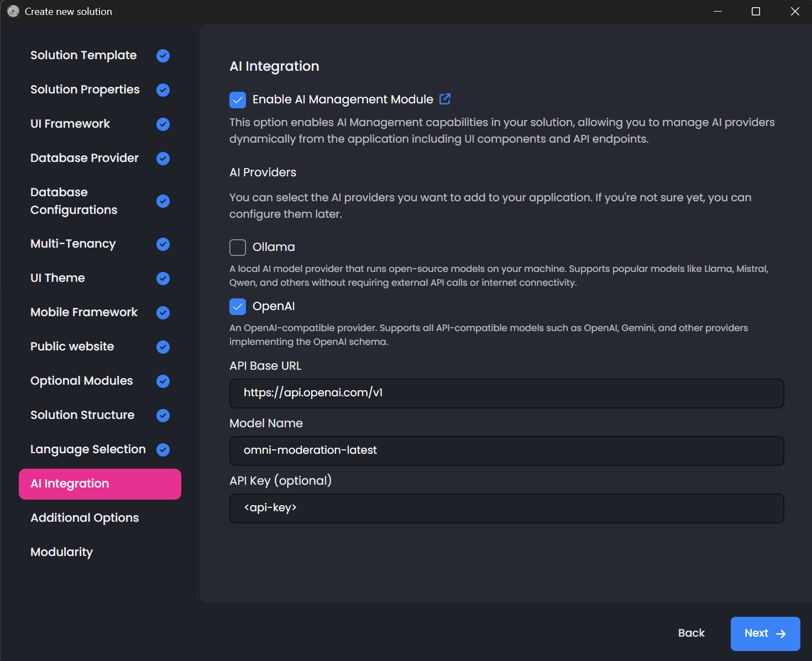
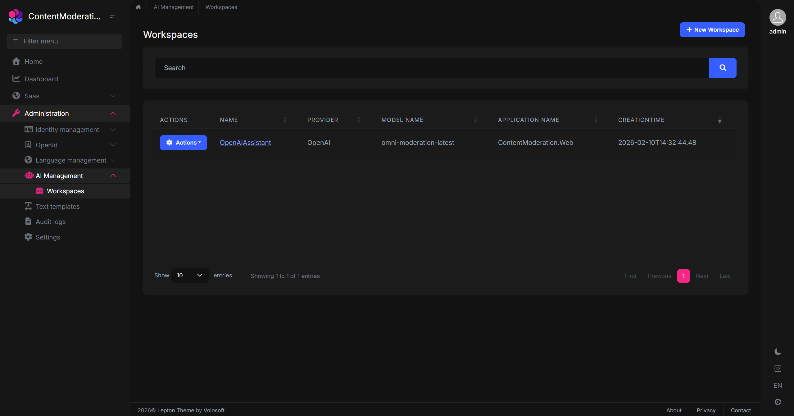
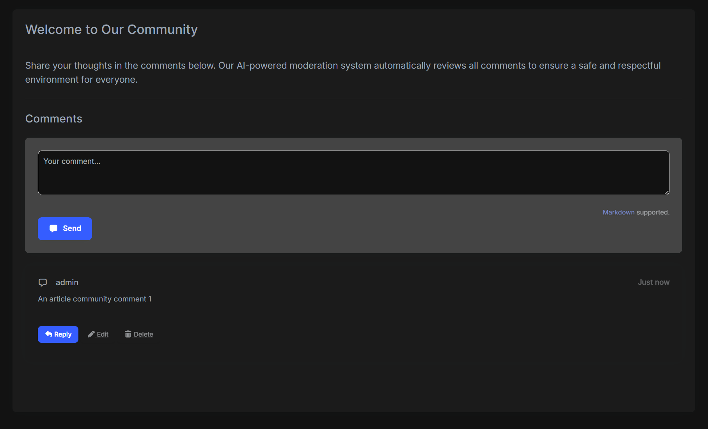
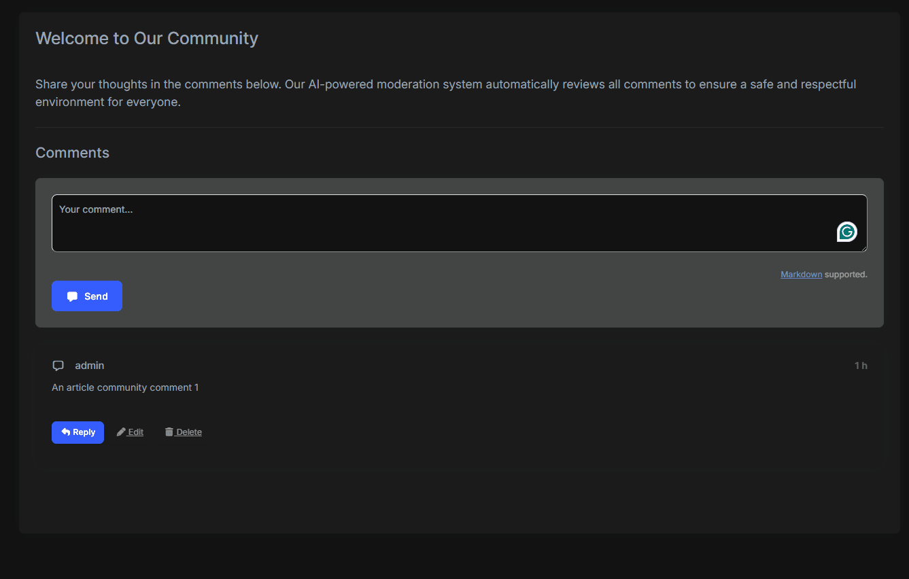

# Using OpenAI's Moderation API in an ABP Application with the AI Management Module

If your application accepts user-generated content (comments, reviews, forum posts) you likely need some form of content moderation. Building one from scratch typically means training ML models, maintaining datasets, and writing a lot of code. OpenAI's `omni-moderation-latest` model offers a practical shortcut: it's free, requires no training data, and covers 13+ harm categories across text and images in 40+ languages.

In this article, I'll show you how to integrate this model into an ABP application using the [**AI Management Module**](https://abp.io/docs/latest/modules/ai-management). We'll wire it into the [CMS Kit Module's Comment Feature](https://abp.io/docs/latest/modules/cms-kit/comments) so every comment is automatically screened before it's published. The **AI Management Module** handles the OpenAI configuration (API keys, model selection, etc.) through a runtime UI, so you won't need to hardcode any of that into your `appsettings.json` or redeploy when something changes.

By the end, you'll have a working content moderation pipeline you can adapt for any entity in your ABP project.

## Understanding OpenAI's Omni-Moderation Model

Before diving into the implementation, let's understand what makes OpenAI's `omni-moderation-latest` model a game-changer for content moderation.

### What is it?

OpenAI's `omni-moderation-latest` is a next-generation multimodal content moderation model built on the foundation of GPT-4o. Released in September 2024, this model represents a significant leap forward in automated content moderation capabilities. 

The most remarkable aspect? **It's completely free to use** through OpenAI's Moderation API, there are no token costs, no usage limits for reasonable use cases, and no hidden fees.

### Key Capabilities

The **omni-moderation** model offers several compelling features that make it ideal for production applications:

- **Multimodal Understanding**: Unlike text-only moderation systems, this model *can process both text and image inputs*, making it suitable for applications where users can upload images alongside their comments or posts.
- **High Accuracy**: Built on GPT-4o's advanced understanding capabilities, the model achieves significantly higher accuracy in detecting nuanced harmful content compared to rule-based systems or simpler ML models.
- **Multilingual Support**: The model demonstrates enhanced performance across more than 40 languages, making it suitable for global applications without requiring separate moderation systems for each language.
- **Comprehensive Category Coverage**: Rather than just detecting "spam" or "not spam," the model classifies content across 13+ distinct categories of potentially harmful content.

### Content Categories

The model evaluates content against the following categories, each designed to catch specific types of harmful content:

| Category | What It Detects |
|----------|-----------------|
| `harassment` | Content that expresses, incites, or promotes harassing language towards any individual or group |
| `harassment/threatening` | Harassment content that additionally includes threats of violence or serious harm |
| `hate` | Content that promotes hate based on race, gender, ethnicity, religion, nationality, sexual orientation, disability, or caste |
| `hate/threatening` | Hateful content that includes threats of violence or serious harm towards the targeted group |
| `self-harm` | Content that promotes, encourages, or depicts acts of self-harm such as suicide, cutting, or eating disorders |
| `self-harm/intent` | Content where the speaker expresses intent to engage in self-harm |
| `self-harm/instructions` | Content that provides instructions or advice on how to commit acts of self-harm |
| `sexual` | Content meant to arouse sexual excitement, including descriptions of sexual activity or promotion of sexual services |
| `sexual/minors` | Sexual content that involves individuals under 18 years of age |
| `violence` | Content that depicts death, violence, or physical injury in graphic detail |
| `violence/graphic` | Content depicting violence or physical injury in extremely graphic, disturbing detail |
| `illicit` | Content that provides advice or instructions for committing illegal activities |
| `illicit/violent` | Illicit content that specifically involves violence or weapons |

### API Response Structure

When you send content to the Moderation API (through model or directly to the API), you receive a structured response containing:

- **`flagged`**: A boolean indicating whether the content violates any of OpenAI's usage policies. This is your primary indicator for whether to block content.
- **`categories`**: A dictionary containing boolean flags for each category, telling you exactly which policies were violated.
- **`category_scores`**: Confidence scores ranging from 0 to 1 for each category, allowing you to implement custom thresholds if needed.
- **`category_applied_input_types`**: A dictionary containing information on which input types were flagged for each category. For example, if both the image and text inputs to the model are flagged for "violence/graphic", the `violence/graphic` property will be set to `["image", "text"]`. This is only available on omni models.

> For more detailed information about the model's capabilities and best practices, refer to the [OpenAI Moderation Guide](https://platform.openai.com/docs/guides/moderation).

## The AI Management Module: Your Dynamic AI Configuration Hub

The [AI Management Module](https://abp.io/docs/latest/modules/ai-management) is a powerful addition to the ABP Platform that transforms how you integrate and manage AI capabilities in your applications. Built on top of the [ABP Framework's AI infrastructure](https://abp.io/docs/latest/framework/infrastructure/artificial-intelligence), it provides a complete solution for managing AI workspaces dynamically—without requiring code changes or application redeployment.

### Why Use the AI Management Module?

Traditional AI integrations often suffer from several pain points:

1. **Hardcoded Configuration**: API keys, model names, and endpoints are typically stored in configuration files, requiring redeployment for any changes.
2. **No Runtime Flexibility**: Switching between AI providers or models requires code changes.
3. **Security Concerns**: Managing API keys across environments is cumbersome and error-prone.
4. **Limited Visibility**: There's no easy way to see which AI configurations are active or test them without writing code.

The AI Management Module addresses all these concerns by providing:

- **Dynamic Workspace Management**: Create, configure, and update AI workspaces directly from a user-friendly administrative interface—no code changes required.
- **Provider Flexibility**: Seamlessly switch between different AI providers (OpenAI, Gemini, Antrophic, Azure OpenAI, Ollama, and custom providers) without modifying your application code.
- **Built-in Testing**: Test your AI configurations immediately using the included chat interface playground before deploying to production.
- **Permission-Based Access Control**: Define granular permissions to control who can manage AI workspaces and who can use specific AI features.
- **Multi-Framework Support**: Full support for MVC/Razor Pages, Blazor (Server & WebAssembly), and Angular UI frameworks.

### Built-in Provider Support

The **AI Management Module** comes with built-in support for popular AI providers through dedicated NuGet packages:

- **`Volo.AIManagement.OpenAI`**: Provides seamless integration with OpenAI's APIs, including GPT models and the *Moderation API*.
- Custom providers can be added by implementing the `IChatClientFactory` interface. (If you configured the Ollama while creating your project, then you can see the example implementation for Ollama)

## Building the Demo Application

Now let's put theory into practice by building a complete content moderation system. We'll create an ABP application with the **AI Management Module**, configure OpenAI as our provider, set up the CMS Kit Comment Feature, and implement automatic content moderation for all user comments.

### Step 1: Creating an Application with AI Management Module

> In this tutorial, I'll create a **layered MVC application** named **ContentModeration**. If you already have an existing solution, you can follow along by replacing the namespaces accordingly. Otherwise, feel free to follow the solution creation steps below.

The most straightforward way to create an application with the AI Management Module is through **ABP Studio**. When you create a new project, you'll encounter an **AI Integration** step in the project creation wizard. This wizard allows you to:

- Enable the AI Management Module with a single checkbox
- Configure your preferred AI provider (OpenAI and Ollama)
- Set up initial workspace configurations
- Automatically install all required NuGet packages

> **Note:** The AI Integration tab in ABP Studio currently only supports the **MVC/Razor Pages** UI. Support for **Angular** and **Blazor** UIs will be added in upcoming versions.



During the wizard, select **OpenAI** as your AI provider, set the model name as `omni-moderation-latest` and provide your API key. The wizard will automatically:

1. Install the `Volo.AIManagement.*` packages across your solution
2. Install the `Volo.AIManagement.OpenAI` package for OpenAI provider support (you can use any OpenAI compatible model here, including Gemini, Claude and GPT models)
3. Configure the necessary module dependencies
4. Set up initial database migrations

**Alternative Installation Method:**

If you have an existing project or prefer manual installation, you can add the module using the ABP CLI:

```bash
abp add-module Volo.AIManagement
```

Or through ABP Studio by right-clicking on your solution, selecting **Import Module**, and choosing `Volo.AIManagement` from the NuGet tab.

### Step 2: Understanding the OpenAI Workspace Configuration

After creating your project and running the application for the first time, navigate to **AI Management > Workspaces** in the admin menu. Here you'll find the workspace management interface where you can view, create, and modify AI workspaces.



If you configured OpenAI during the project creation wizard, you'll already have a workspace set up. Otherwise, you can create a new workspace with the following configuration:

| Property | Value | Description |
|----------|-------|-------------|
| **Name** | `OpenAIAssistant` | A unique identifier for this workspace (no spaces allowed) |
| **Provider** | `OpenAI` | The AI provider to use |
| **Model** | `omni-moderation-latest` | The specific model for content moderation |
| **API Key** | `<Your-OpenAI-API-key>` | Authentication credential for the OpenAI API |
| **Description** | `Workspace for content moderation` | A helpful description for administrators |

The beauty of this approach is that you can modify any of these settings at runtime through the UI. Need to rotate your API key? Just update it in the workspace configuration. Want to test a different model? Change it without touching your code.

### Step 3: Setting Up the CMS Kit Comment Feature

Now let's add the CMS Kit Module to enable the Comment Feature. The CMS Kit provides a robust, production-ready commenting system that we'll enhance with our content moderation.

**Install the CMS Kit Module:**

Run the following command in your solution directory:

```bash
abp add-module Volo.CmsKit --skip-db-migrations
```

> Also, you can add the related module through ABP Studio UI.

**Enable the Comment Feature:**

By default, CMS Kit features are disabled to keep your application lean. Open the `GlobalFeatureConfigurator` class in your `*.Domain.Shared` project and enable the Comment Feature:

```csharp
using Volo.Abp.GlobalFeatures;
using Volo.Abp.Threading;

namespace ContentModeration;

public static class ContentModerationGlobalFeatureConfigurator
{
    private static readonly OneTimeRunner OneTimeRunner = new OneTimeRunner();

    public static void Configure()
    {
        OneTimeRunner.Run(() =>
        {
            GlobalFeatureManager.Instance.Modules.CmsKit(cmsKit =>
            {
                //only enable the Comment Feature
                cmsKit.Comments.Enable();
            });
        });
    }
}
```

**Configure the Comment Entity Types:**

Open your `*DomainModule` class and configure which entity types can have comments. For our demo, we'll enable comments on "Article" entities:

```csharp
using Volo.CmsKit.Comments;

// In your ConfigureServices method:
Configure<CmsKitCommentOptions>(options =>
{
    options.EntityTypes.Add(new CommentEntityTypeDefinition("Article"));
});
```

**Add the Comment Component to a Page:**

Finally, let's add the commenting interface to a page. Open the `Index.cshtml` file in your `*.Web` project and add the Comment component (replace with the following content):

```html
@page
@using Volo.CmsKit.Public.Web.Pages.CmsKit.Shared.Components.Commenting
@model ContentModeration.Web.Pages.IndexModel

<div class="container mt-4">
    <div class="card">
        <div class="card-header">
            <h3>Welcome to Our Community</h3>
        </div>
        <div class="card-body">
            <p class="lead">
                Share your thoughts in the comments below. Our AI-powered moderation system
                automatically reviews all comments to ensure a safe and respectful environment
                for everyone.
            </p>

            <hr/>

            <h4>Comments</h4>
            @await Component.InvokeAsync(typeof(CommentingViewComponent), new
            {
                entityType = "Article",
                entityId = "welcome-article",
                isReadOnly = false
            })
        </div>
    </div>
</div>
```

At this point, you have a fully functional commenting system. Users can post comments, reply to existing comments, and interact with the community. 



However, there's no content moderation yet and any content, including harmful content, would be accepted. Let's fix that!

## Implementing the Content Moderation Service

**Now comes the exciting part:** implementing the content moderation service that leverages OpenAI's `omni-moderation` model to automatically screen all comments before they're published.

### Understanding the Architecture

Our implementation follows a clean, modular architecture:

1. **`IContentModerator` Interface**: Defines the contract for content moderation, making our implementation testable and replaceable.
2. **`ContentModerator` Service**: The concrete implementation that calls OpenAI's Moderation API using the configuration from the AI Management Module.
3. **`MyCommentAppService`**: An override of the CMS Kit's comment service that integrates our moderation logic.

This separation of concerns ensures that:

- The moderation logic is isolated and can be unit tested independently
- You can easily swap the moderation implementation (e.g., switch to a different provider)
- The integration with CMS Kit is clean and maintainable

### Creating the Content Moderator Interface

First, let's define the interface in your `*.Application.Contracts` project. This interface is intentionally simple and it takes text input and throws an exception if the content is harmful:

```csharp
using System.Threading.Tasks;

namespace ContentModeration.Moderation;

public interface IContentModerator
{
    Task CheckAsync(string text);
}
```

### Implementing the Content Moderator Service

Now let's implement the service in your `*.Application` project. This implementation uses the `IWorkspaceConfigurationStore` from the AI Management Module to dynamically retrieve the OpenAI configuration:

```csharp
using System.Collections.Generic;
using System.Threading.Tasks;
using OpenAI.Moderations;
using Volo.Abp;
using Volo.Abp.DependencyInjection;
using Volo.AIManagement.Workspaces.Configuration;

namespace ContentModeration.Moderation;

public class ContentModerator : IContentModerator, ITransientDependency
{
    private readonly IWorkspaceConfigurationStore _workspaceConfigurationStore;

    public ContentModerator(IWorkspaceConfigurationStore workspaceConfigurationStore)
    {
        _workspaceConfigurationStore = workspaceConfigurationStore;
    }

    public async Task CheckAsync(string text)
    {
        // Skip moderation for empty content
        if (string.IsNullOrWhiteSpace(text))
        {
            return;
        }

        // Retrieve the workspace configuration from AI Management Module
        // This allows runtime configuration changes without redeployment
        var config = await _workspaceConfigurationStore.GetOrNullAsync<OpenAIAssistantWorkspace>();

        if(config == null)
        {
            throw new UserFriendlyException("Could not find the 'OpenAIAssistant' workspace!");
        }

        var client = new ModerationClient(
            model: "omni-moderation-latest",
            apiKey: config.ApiKey
        );

        // Send the text to OpenAI's Moderation API
        var result = await client.ClassifyTextAsync(text);
        var moderationResult = result.Value;

        // If the content is flagged, throw a user-friendly exception
        if (moderationResult.Flagged)
        {
            var flaggedCategories = GetFlaggedCategories(moderationResult);
            
            throw new UserFriendlyException(
                $"Your comment contains content that violates our community guidelines. " +
                $"Detected issues: {string.Join(", ", flaggedCategories)}. " +
                $"Please revise your comment and try again."
            );
        }
    }

    private static List<string> GetFlaggedCategories(ModerationResult result)
    {
        var flaggedCategories = new List<string>();

        if (result.Harassment.Flagged)
        {
            flaggedCategories.Add("harassment");
        }
        if (result.HarassmentThreatening.Flagged) 
        {
            flaggedCategories.Add("threatening harassment");
        }
        
        //other categories...

        return flaggedCategories;
    }
}
```

> **Note**: The `ModerationResult` class from the OpenAI .NET SDK provides properties for each moderation category (e.g., `Harassment`, `Violence`, `Sexual`), each with a `Flagged` boolean and a `Score` float (0-1). The exact property names may vary slightly between SDK versions, so check the [OpenAI .NET SDK documentation](https://github.com/openai/openai-dotnet) for the latest API.

### Integrating with CMS Kit Comments

The final piece of the puzzle is integrating our moderation service with the CMS Kit's comment system. We'll override the `CommentPublicAppService` to intercept all comment creation and update requests:

```csharp
using System;
using System.Threading.Tasks;
using ContentModeration.Moderation;
using Microsoft.Extensions.Options;
using Volo.Abp.DependencyInjection;
using Volo.Abp.EventBus.Distributed;
using Volo.CmsKit.Comments;
using Volo.CmsKit.Public.Comments;
using Volo.CmsKit.Users;
using Volo.Abp.SettingManagement;

namespace ContentModeration.Comments;

[Dependency(ReplaceServices = true)]
[ExposeServices(typeof(ICommentPublicAppService), typeof(CommentPublicAppService), typeof(MyCommentAppService))]
public class MyCommentAppService : CommentPublicAppService
{
    protected IContentModerator ContentModerator { get; }

    public MyCommentAppService(
        ICommentRepository commentRepository,
        ICmsUserLookupService cmsUserLookupService,
        IDistributedEventBus distributedEventBus,
        CommentManager commentManager,
        IOptionsSnapshot<CmsKitCommentOptions> cmsCommentOptions,
        ISettingManager settingManager,
        IContentModerator contentModerator)
        : base(commentRepository, cmsUserLookupService, distributedEventBus, commentManager, cmsCommentOptions, settingManager)
    {
        ContentModerator = contentModerator;
    }

    public override async Task<CommentDto> CreateAsync(string entityType, string entityId, CreateCommentInput input)
    {
        // Check for harmful content BEFORE creating the comment
        // If harmful content is detected, an exception is thrown and the comment is not saved
        await ContentModerator.CheckAsync(input.Text);

        return await base.CreateAsync(entityType, entityId, input);
    }

    public override async Task<CommentDto> UpdateAsync(Guid id, UpdateCommentInput input)
    {
        // Check for harmful content BEFORE updating the comment
        // This prevents users from editing approved comments to add harmful content
        await ContentModerator.CheckAsync(input.Text);

        return await base.UpdateAsync(id, input);
    }
}
```

**How This Works:**

1. When a user submits a new comment, the `CreateAsync` method is called.
2. Before the comment is saved to the database, we call `ContentModerator.CheckAsync()` with the comment text.
3. The moderation service sends the text to OpenAI's Moderation API.
4. If the content is flagged as harmful, a `UserFriendlyException` is thrown with a descriptive message.
5. The exception is caught by ABP's exception handling middleware and displayed to the user as a friendly error message.
6. If the content passes moderation, the comment is saved normally.

The same flow applies to comment updates, ensuring users can't circumvent moderation by editing previously approved comments.

Here's the full flow in action — submitting a comment with harmful content and seeing the moderation kick in:



## The Power of Dynamic Configuration - What AI Management Module Provides to You?

One of the most significant advantages of using the AI Management Module is the ability to manage your AI configurations dynamically. Let's explore what this means in practice.

### Runtime Configuration Changes

With the AI Management Module, you can:

- **Rotate API Keys**: Update your OpenAI API key through the admin UI without any downtime or redeployment. This is crucial for security compliance and key rotation policies.
- **Switch Models**: Want to test a newer moderation model? Simply update the model name in the workspace configuration. Your application will immediately start using the new model.
- **Adjust Settings**: Fine-tune settings like temperature or system prompts (for chat-based workspaces) without touching your codebase.
- **Enable/Disable Workspaces**: Temporarily disable a workspace for maintenance or testing without affecting other parts of your application.

### Multi-Environment Management

The dynamic configuration approach shines in multi-environment scenarios:

- **Development**: Use a test API key with lower rate limits
- **Staging**: Use a separate API key for integration testing
- **Production**: Use your production API key with appropriate security measures

All these configurations can be managed through the UI or via data seeding, without environment-specific code changes.

### Actively Maintained & What's Coming Next

The AI Management Module is **actively maintained** and continuously evolving. The team is working on exciting new capabilities that will further expand what you can do with AI in your ABP applications:

- **MCP (Model Context Protocol) Support** — Coming in **v10.2**, MCP support will allow your AI workspaces to interact with external tools and data sources, enabling more sophisticated AI-powered workflows.
- **RAG (Retrieval-Augmented Generation) System** — Also planned for **v10.2**, the built-in RAG system will let you ground AI responses in your own data, making AI features more accurate and context-aware.
- **And More** — Additional features and improvements are on the roadmap to make AI integration even more seamless.

Since the module is built on ABP's modular architecture, adopting these new capabilities will be straightforward — you can simply update the module and start using the new features without rewriting your existing AI integrations.

### Permission-Based Access Control

The AI Management Module integrates with ABP's permission system, allowing you to:

- Restrict who can view AI workspace configurations
- Control who can create or modify workspaces
- Limit access to specific workspaces based on user roles

This ensures that sensitive configurations like API keys are only accessible to authorized administrators.

## Conclusion

In this comprehensive guide, we've built a production-ready content moderation system that combines the power of OpenAI's `omni-moderation-latest` model with the flexibility of ABP's AI Management Module. Let's recap what makes this approach powerful:

### Key Takeaways

1. **Zero Training Required**: Unlike traditional ML approaches that require collecting datasets, training models, and ongoing maintenance, OpenAI's Moderation API works out of the box with state-of-the-art accuracy.
2. **Completely Free**: OpenAI's Moderation API has no token costs, making it economically viable for applications of any scale.
3. **Comprehensive Detection**: With 13+ categories of harmful content detection, you get protection against harassment, hate speech, violence, sexual content, self-harm, and more—all from a single API call.
4. **Dynamic Configuration**: The AI Management Module allows you to manage API keys, switch providers, and adjust settings at runtime without code changes or redeployment.
5. **Clean Integration**: By following ABP's service override pattern, we integrated moderation seamlessly into the existing CMS Kit comment system without modifying the original module.
6. **Production Ready**: The implementation includes proper error handling, graceful degradation, and user-friendly error messages suitable for production use.

### Resources

- [AI Management Module Documentation](https://abp.io/docs/latest/modules/ai-management)
- [OpenAI Moderation Guide](https://platform.openai.com/docs/guides/moderation)
- [CMS Kit Comments Feature](https://abp.io/docs/latest/modules/cms-kit/comments)
- [ABP Framework AI Infrastructure](https://abp.io/docs/latest/framework/infrastructure/artificial-intelligence)