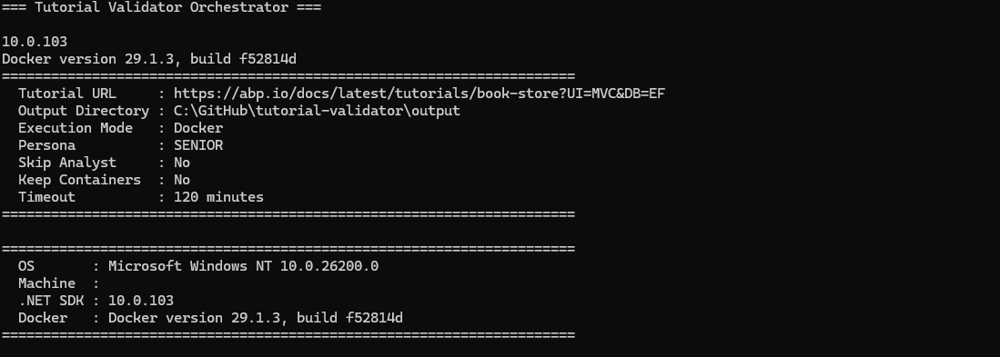

# How We Built TutorialValidator to Automatically Validate Documentation Tutorials

Writing a tutorial is hard. Keeping it correct over time is even harder.

If you maintain technical documentation, you probably know this pain: a tutorial that worked three months ago can quietly break after a framework update, a package change, or a small missing line in a code snippet. New developers follow the steps, hit an error, and lose trust in the docs.

That exact problem is why we built **TutorialValidator**.

TutorialValidator is an open-source, AI-powered tool that checks whether a software tutorial actually works from start to finish. You give it a tutorial URL, and it behaves like a real developer following the guide: it reads each step, executes commands, writes files, runs the app, and verifies expected results.

We first created it to validate ABP Framework tutorials internally, then shared it publicly so anyone can use it with their own tutorials.

## What Problem Does It Solve?

Most documentation issues are not obvious during review:

- A command assumes a file that has not been created yet
- A code sample misses a namespace or import
- A step relies on hidden context that is never explained
- An endpoint is expected to respond, but does not

Traditional proofreading catches wording problems. TutorialValidator targets **execution problems**.

It turns tutorials into something testable.

## How It Works (Simple View)

TutorialValidator runs in three phases:

1. **Analyst**: Scrapes tutorial pages and converts instructions into a structured test plan
2. **Executor**: Follows the plan step by step in a clean environment
3. **Reporter**: Produces a clear result summary and optional notifications

The key idea is simple: if a developer would need to do it, the validator does it too.

That includes running terminal commands, editing files, checking HTTP responses, and validating build outcomes.

## Why This Approach Is Useful

TutorialValidator is designed for practical documentation quality, not just technical experimentation.

- **Catches real-world breakages early** before readers report them
- **Creates repeatable validation** instead of one-off manual checks
- **Works well in teams** through report outputs, logs, and CI-friendly behavior
- **Supports different strictness levels** with developer personas (`junior`, `mid`, `senior`)

For example, `junior` and `mid` personas are great for spotting unclear documentation, while `senior` helps identify issues an experienced developer could work around.

## Built for ABP, Open for Everyone

Even though TutorialValidator was born from ABP documentation needs, it is not limited to ABP content.

It supports validating any publicly accessible software tutorial and can run in:

- **Docker mode** for clean, isolated execution (recommended)
- **Local mode** for faster feedback when your environment is already prepared

It also supports multiple AI providers, including OpenAI, Azure OpenAI, and OpenAI-compatible endpoints.

## Open Source and Extensible

TutorialValidator is structured as multiple focused projects:

- Core models and shared contracts
- Analyst for scraping and plan extraction
- Executor for step-by-step validation
- Orchestrator for end-to-end workflow
- Reporter for Email/Discord notifications

This architecture keeps the project easy to understand and extend. Teams can add new step types, plugins, or reporting channels based on their own workflow.

## Final Thoughts

Documentation is part of the product experience. When tutorials fail, trust fails.

TutorialValidator helps teams move from “we think this tutorial works” to “we verified it works.”

If your team maintains technical tutorials, this project can give you a practical safety net and a repeatable quality process.

---

Repository: https://github.com/AbpFramework/TutorialValidator

If you try it in your own docs pipeline, we would love to hear your feedback and ideas.
