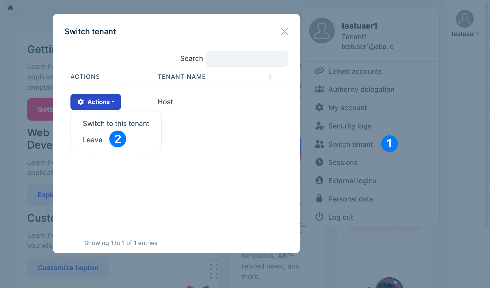
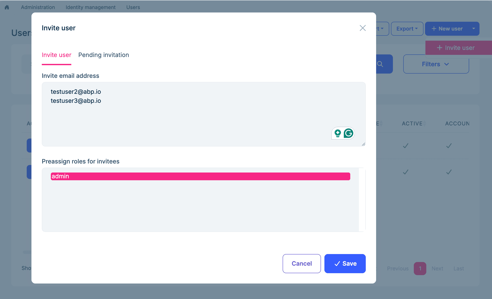
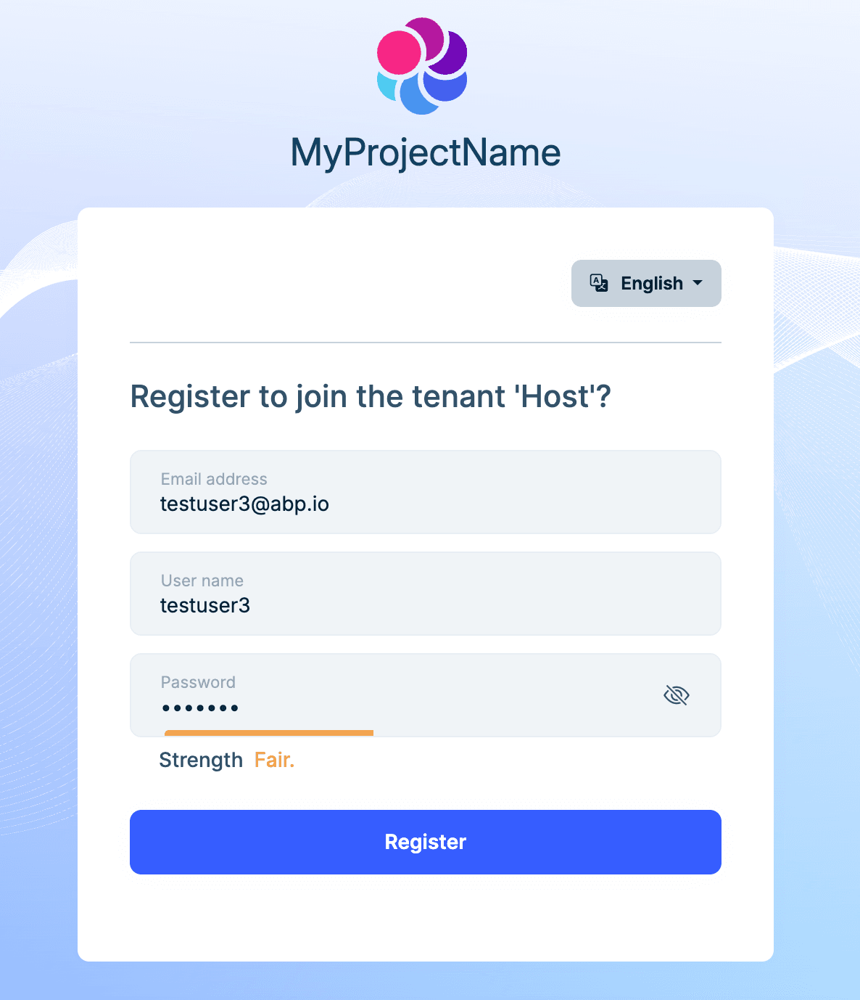
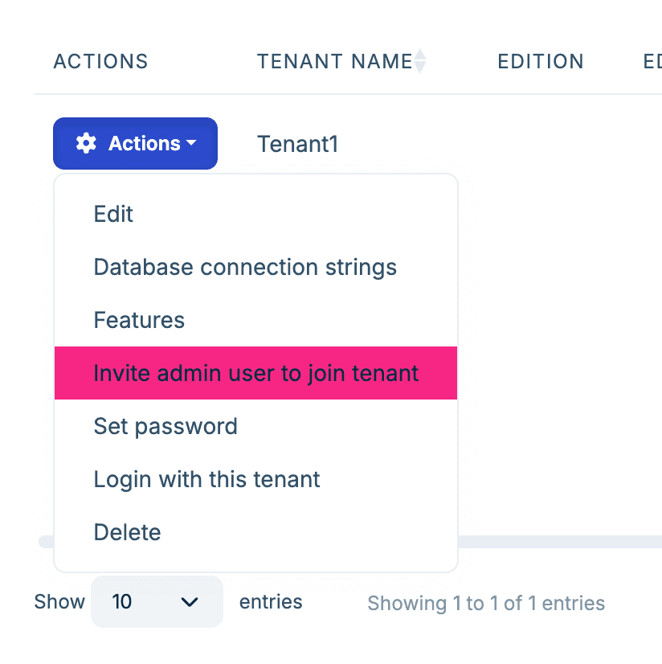
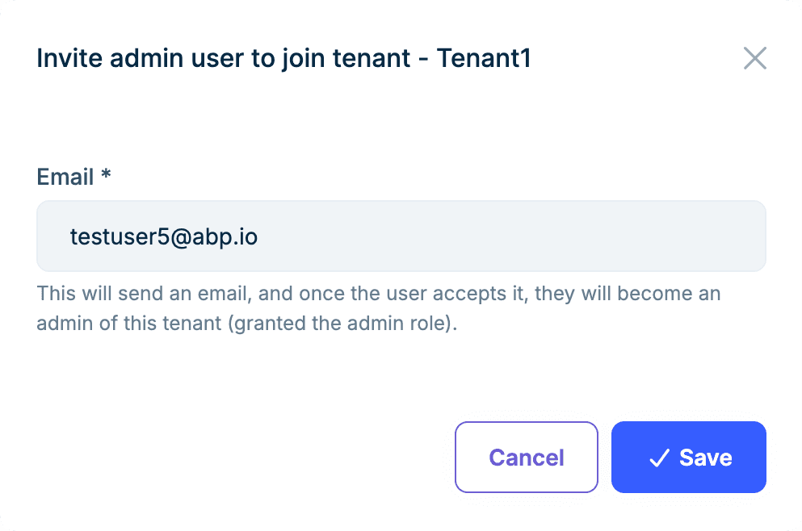
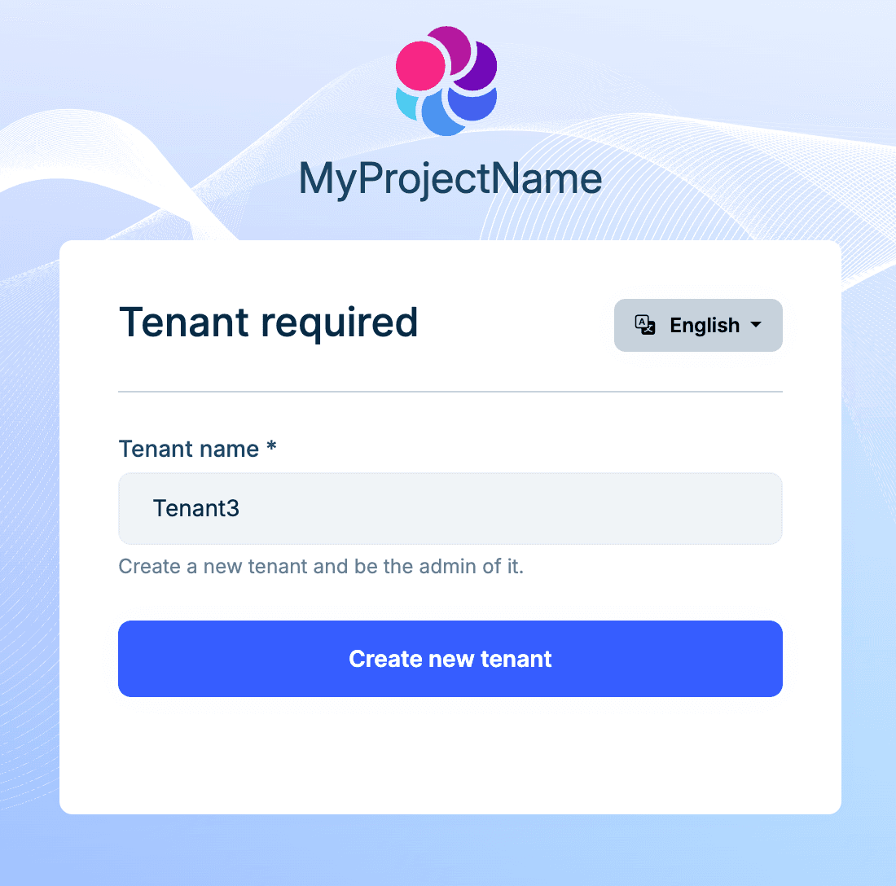
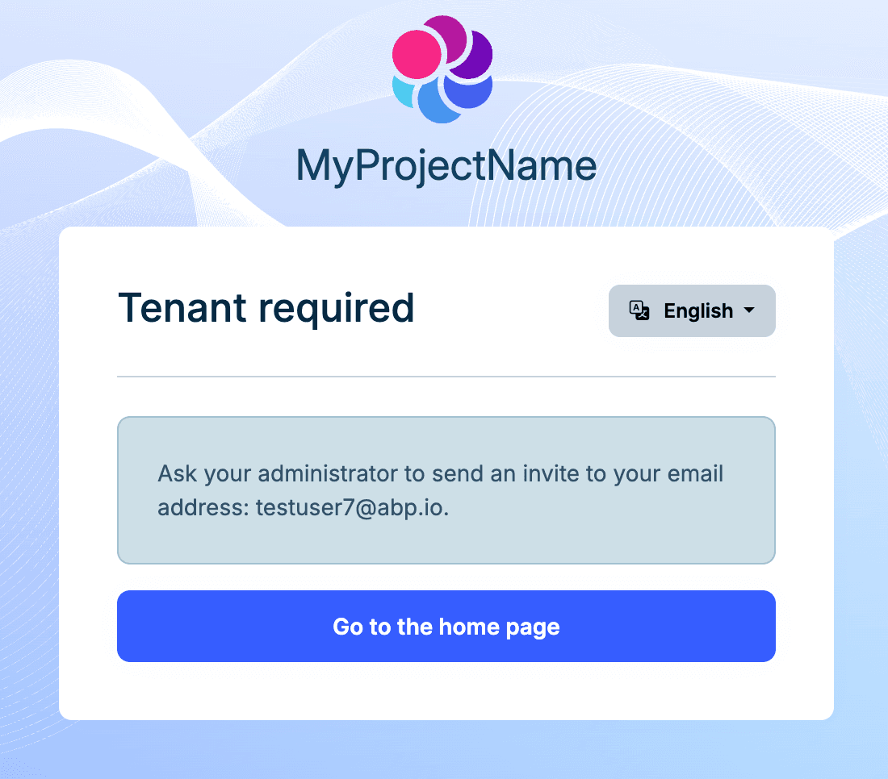

# Shared User Accounts in ABP Multi-Tenancy

Multi-tenancy is built on **isolation** — isolated data, isolated permissions, isolated users. ABP's default behavior has always followed this assumption: one user belongs to exactly one tenant. Clean, simple, no ambiguity. For most SaaS applications, that's exactly what you want. (The new `TenantUserSharingStrategy` enum formally names this default behavior `Isolated`.)

But isolation is **the system's** concern, not **the user's**. In practice, people's work doesn't always line up neatly with tenant boundaries.

Think about a financial consultant who works with three different companies — each one a tenant in your system. Under the Isolated model, she needs three separate accounts, three passwords. Forgot which password goes with which company? Good luck. Worse, the system sees three unrelated people — there's nothing linking those accounts to the same human being.

This comes up more often than you'd think:

- In a **corporate group**, an IT admin manages multiple subsidiaries, each running as its own tenant. Every day means logging out, logging back in with different credentials, over and over
- A **SaaS platform's ops team** needs to hop into different customer tenants to debug issues. Each time they create a throwaway account, then delete it — or just share one account and lose all audit trail
- Some users resort to email aliases (`alice+company1@example.com`) to work around uniqueness constraints — that's not a solution, that's a hack

The common thread here: the user's **identity** is global, but their **working context** is per-tenant. The problem isn't a technical limitation — it's that the Isolated assumption ("one user, one tenant") simply doesn't hold in these scenarios.

What's needed is not "one account per tenant" but "one account, multiple tenants."

ABP's **Shared User Accounts** (`TenantUserSharingStrategy.Shared`) does exactly this. It makes user identity global and turns tenants into workspaces that a user can join and switch between — similar to how one person can belong to multiple workspaces in Slack.

> This is a **commercial** feature, provided by the Account.Pro and Identity.Pro modules.

## Enabling the Shared Strategy

A single configuration is all it takes:

```csharp
Configure<AbpMultiTenancyOptions>(options =>
{
    options.IsEnabled = true;
    options.UserSharingStrategy = TenantUserSharingStrategy.Shared;
});
```

The most important behavior change after switching to Shared: **username and email uniqueness becomes global** instead of per-tenant. This follows naturally — if the same account needs to be recognized across tenants, its identifiers must be unique across the entire system.

Security-related settings (2FA, account lockout, password policies, captcha, etc.) are also managed at the **Host** level. This makes sense too: if user identity is global, the security rules around it should be global as well.

## One Account, Multiple Tenants

With the Shared strategy enabled, the day-to-day user experience changes fundamentally.

When a user is associated with only one tenant, the system recognizes it automatically and signs them in directly — the user doesn't even notice that tenants exist. When the user belongs to multiple tenants, the login flow presents a tenant selection screen after credentials are verified:


After signing into a tenant, a tenant switcher appears in the user menu — click it anytime to jump to another tenant without signing out. ABP re-issues the authentication ticket (with the new `TenantId` in the claims) on each switch, so the permission system is fully independent per tenant.



Users can also leave a tenant. Leaving doesn't delete the association record — it marks it as inactive. This preserves foreign key relationships with other entities. If the user is invited back later, the association is simply reactivated instead of recreated.

Back to our earlier scenario: the financial consultant now has one account, one password. She picks which company to work in at login, switches between them during the day. The system knows it's the same person, and the audit log can trace her actions across every tenant.

## Invitations

Users don't just appear in a tenant — someone has to invite them. This is the core operation from the administrator's perspective.

A tenant admin opens the invitation dialog, enters one or more email addresses (batch invitations are supported), and can pre-assign roles — so the user gets the right permissions the moment they join, no extra setup needed:



The invited person receives an email with a link. What happens next depends on whether they already have an account.

If they **already have an account**, they see a confirmation page and can join the tenant with a single click:


If they **don't have an account yet**, the link takes them to a registration form. Once they register, they're automatically added to the tenant:



Admins can also manage pending invitations at any time — resend emails or revoke invitations.

> The invitation feature is also available under the Isolated strategy, but invited users can only join a single tenant.

## Setting Up a New Tenant

There's a notable shift in how new tenants are bootstrapped.

Under the Isolated model, creating a tenant typically seeds an `admin` user automatically. With Shared, this no longer happens — because users are global, and it doesn't make sense to create one out of thin air for a specific tenant.

Instead, you create the tenant first, then invite someone in and grant them the admin role.





This is a natural fit — the admin is just a global user who happens to hold the admin role in this particular tenant.

## Where Do Newly Registered Users Go?

Under the Shared strategy, self-registration runs into an interesting problem: the system doesn't know which tenant the user wants to join. Without being signed in, tenant context is usually determined by subdomain or a tenant switcher on the login page — but for a brand-new user, those signals might not exist at all.

So ABP's approach is: **don't establish any tenant association at registration time**. A newly registered user doesn't belong to any tenant, and doesn't belong to the Host either — this is an entirely new state. ABP still lets these users sign in, change their password, and manage their account, but they can't access any permission-protected features within a tenant.

`AbpIdentityPendingTenantUserOptions.Strategy` controls what happens in this "pending" state.

**CreateTenant** — automatically creates a tenant for the new user. This fits the "sign up and get your own workspace" pattern, like how Slack or Notion handles registration: you register, the system spins up a workspace for you.

```csharp
Configure<AbpIdentityPendingTenantUserOptions>(options =>
{
    options.Strategy = AbpIdentityPendingTenantUserStrategy.CreateTenant;
});
```



**Inform** (the default) — shows a message telling the user to contact an administrator to join a tenant. This is the right choice for invite-only platforms where users must be brought in by an existing tenant admin.

```csharp
Configure<AbpIdentityPendingTenantUserOptions>(options =>
{
    options.Strategy = AbpIdentityPendingTenantUserStrategy.Inform;
});
```



There's also a **Redirect** strategy that sends the user to a custom URL for more complex flows.

> See the [official documentation](https://abp.io/docs/latest/modules/account/shared-user-accounts) for full configuration details.

## Database Considerations

The Shared strategy introduces some mechanisms and constraints at the database level that are worth understanding.

### Global Uniqueness: Enforced in Code, Not by Database Indexes

Username and email uniqueness checks must span all tenants. ABP disables the tenant filter (`TenantFilter.Disable()`) during validation and searches globally for conflicts.

A notable design choice here: **global uniqueness is enforced at the application level, not through database unique indexes**. The reason is practical — in a database-per-tenant setup, users live in separate physical databases, so a cross-database unique index simply isn't possible. Even in a shared database, soft-delete complicates unique indexes (you'd need a composite index on "username + deletion time"). So ABP handles this in application code instead.

To keep things safe under concurrency — say two tenant admins invite the same email address at the same time — ABP uses a **distributed lock** to serialize uniqueness validation. This means your production environment needs a distributed lock provider configured (such as Redis).

The uniqueness check goes beyond just "no duplicate usernames." ABP also checks for **cross-field conflicts**: a user's username can't match another user's email, and vice versa. This prevents identity confusion in edge cases.

### Tenants with Separate Databases

If some of your tenants use their own database (database-per-tenant), the Shared strategy requires extra attention.

The login flow and tenant selection happen on the **Host side**. This means the Host database's `AbpUsers` table must contain records for all users — even those originally created in a tenant's separate database. ABP's approach is replication: it saves the primary user record in the Host context and creates a copy in the tenant context. In a shared-database setup, both records live in the same table; in a database-per-tenant setup, they live in different physical databases. Updates and deletes are kept in sync automatically.

If your application uses social login or passkeys, the `AbpUserLogins` and `AbpUserPasskeys` tables also need to be synced in the Host database.

### Migrating from the Isolated Strategy

If you're moving an existing multi-tenant application from Isolated to Shared, ABP automatically runs a global uniqueness check when you switch the strategy and reports any conflicts.

The most common conflict: the same email address registered as separate users in different tenants. You'll need to resolve these first — merge the accounts or change one side's email — before the Shared strategy can be enabled.

## Summary

ABP's Shared User Accounts addresses a real-world need in multi-tenant systems: one person working across multiple tenants.

- One configuration switch to `TenantUserSharingStrategy.Shared`
- User experience: pick a tenant at login, switch between tenants anytime, one password for everything
- Admin experience: invite users by email, pre-assign roles on invitation
- Database notes: configure a distributed lock provider for production; tenants with separate databases need user records replicated in the Host database

ABP takes care of global uniqueness validation, tenant association management, and login flow adaptation under the hood.

## References

- [Shared User Accounts](https://abp.io/docs/latest/modules/account/shared-user-accounts)
- [ABP Multi-Tenancy](https://abp.io/docs/latest/framework/architecture/multi-tenancy)
