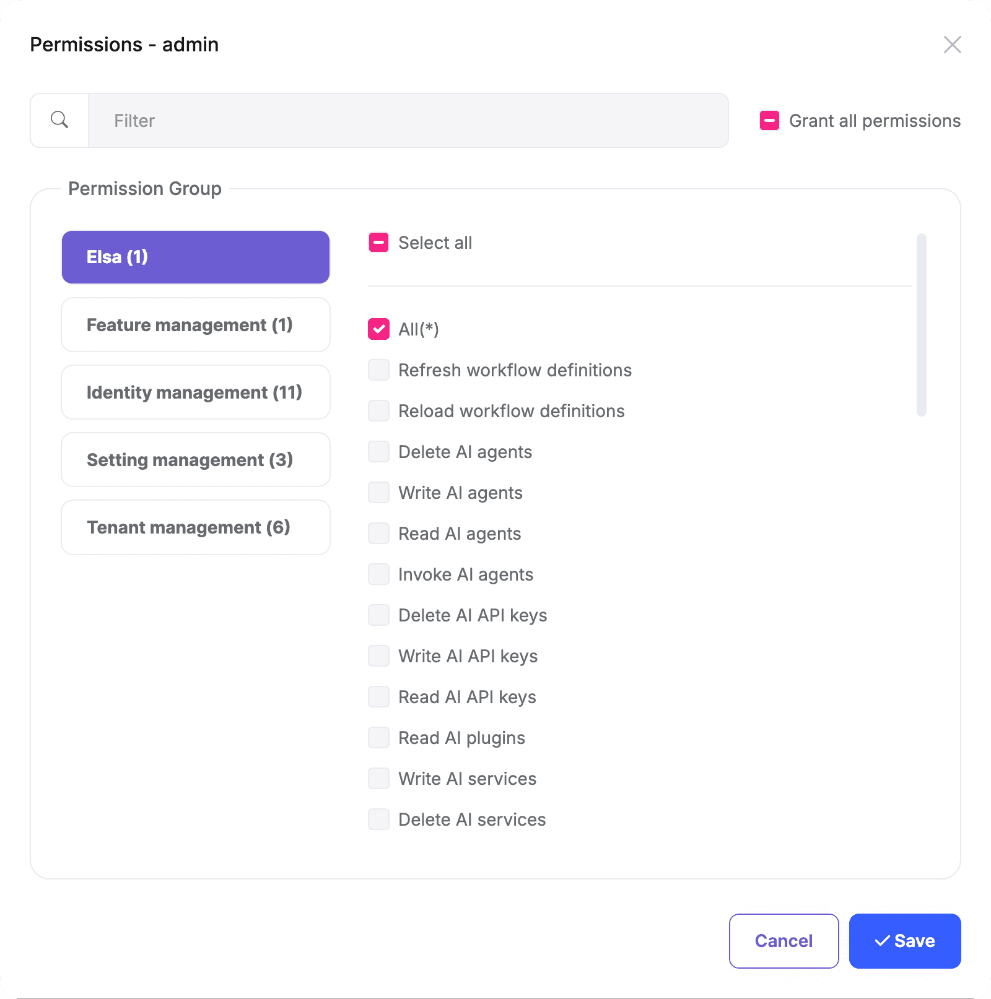
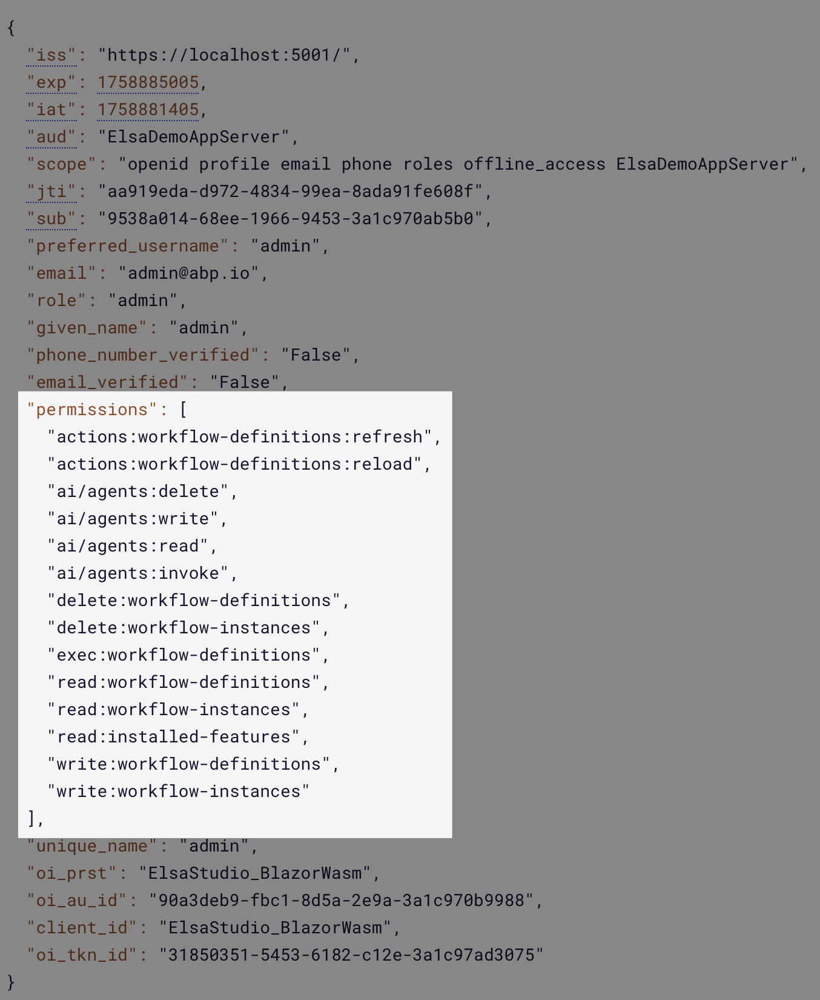
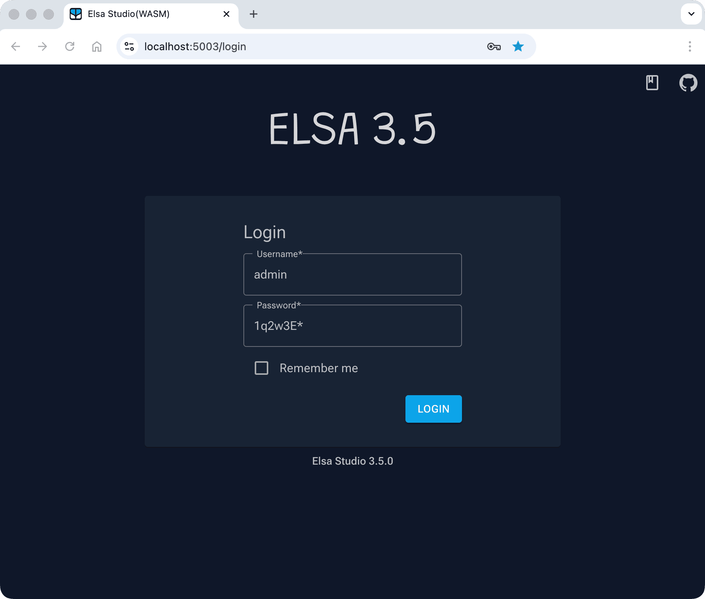
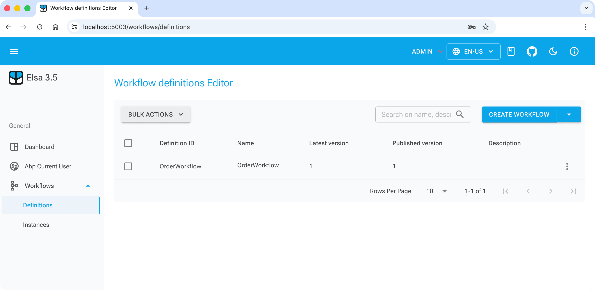

# Elsa Module (Pro)

> You must have an ABP Team or a higher license to use this module.

This module is used to integrate [Elsa Workflows](https://docs.elsaworkflows.io/) into ABP Framework applications. 

## How to install

Elsa module is not installed in [the startup templates](../solution-templates/layered-web-application). So, it needs to be installed manually. There are two ways of installing a module into your application.

### Using ABP CLI

ABP CLI allows adding a module to a solution using ```add-module``` command. You can check its [documentation](../cli#add-module) for more information. So, elsa module can be added using the command below;

```bash
abp add-module Volo.Elsa
```

### Manual Installation

If you modified your solution structure, adding module using ABP CLI might not work for you. In such cases,  elsa module can be added to a solution manually.

In order to do that, add packages listed below to matching project on your solution. For example, `Volo.Abp.Elsa.Application` package to your **{ProjectName}.Application.csproj** like below;

```xml
<PackageReference Include="Volo.Abp.Elsa.Application" Version="x.x.x" />
```

After adding the package reference, open the module class of the project (eg: `{ProjectName}ApplicationModule`) and add the below code to the `DependsOn` attribute.

```csharp
[DependsOn(
  //...
  typeof(AbpElsaApplicationModule)
)]
```

> If you are using Blazor Web App, you need to add the `Volo.Elsa.Admin.Blazor.WebAssembly` package to the **{ProjectName}.Blazor.Client.csproj** project and add the `Volo.Elsa.Admin.Blazor.Server` package to the **{ProjectName}.Blazor.csproj** project.

## The Elsa Module

The Elsa Workflows have their own database provider, and also have a Tenant/Role/User system. They are under active development, so the ABP Elsa module is not fully integrated yet. Below is the current status of each module in the ABP Elsa module.

- `AbpElsaAspNetCoreModule(Volo.Elsa.Abp.AspNetCore)` module is used to integrate Elsa authentication.
- `AbpElsaIdentityModule(Volo.Elsa.Abp.Identity)` module is used to integrate ABP Identity authentication.
- `AbpElsaApplicationModule(Volo.Elsa.Abp.Application)` and `AbpElsaApplicationContractsModule(Volo.Elsa.Abp.Application.Contracts)` modules are used to define the Elsa permissions.

The rest of the projects/modules are basically empty and will be implemented in the future based on the Elsa features.

- `AbpElsaDomainModule(Volo.Elsa.Abp.Domain)`
- `AbpElsaEntityFrameworkCoreModule(Volo.Elsa.Abp.EntityFrameworkCore)`
- `AbpElsaHttpApiModule(Volo.Elsa.Abp.HttpApi)`
- `AbpElsaHttpApiClientModule(Volo.Elsa.Abp.HttpApi.Client)`
- `AbpElsaBlazorModule(Volo.Elsa.Abp.Blazor)`
- `AbpElsaBlazorServerModule(Volo.Elsa.Abp.Blazor.Server)`
- `AbpElsaBlazorWebAssemblyModule(Volo.Elsa.Abp.Blazor.WebAssembly)`
- `AbpElsaWebModule(Volo.Elsa.Abp.Web)`

### Elsa Module Permissions

The Elsa workflow API points will check the permissions. It also has a `*` wildcard permission to allow all permissions.

ABP Elsa module defines all permissions that are used in the Elsa workflow, You can use ABP Permission Management module to manage the permissions.

`AbpElsaAspNetCoreModule(Volo.Elsa.Abp.AspNetCore)` module will check and add these permissions to current user claims.



You can also grant parts of the permissions to a role or user. It will add the `permissions` claims to the current user's `Cookies` or `Token`. Elsa Server will read the claims and allow or deny the access.



### Elsa Studio

Elsa Studio is a **independent** web application that allows you to design, manage, and execute workflows. It is built using **Blazor Server/WebAssembly**.

Elsa Studio requires authentication to access it. ABP Elsa module provides two ways to authenticate Elsa Studio.

### Elsa Studio Password Flow Authentication

The `AbpElsaIdentityModule(Volo.Elsa.Abp.Identity)` module is used to integrate [ABP Identity module](https://abp.io/docs/commercial/latest/modules/identity) to check Elsa Studio username and password against ABP Identity. 

You need to replace `UseIdentity` with `UseAbpIdentity` when configuring Elsa in your Elsa server project.

```csharp
context.Services
    .AddElsa(elsa => elsa
        .UseAbpIdentity(identity =>
        {
            identity.TokenOptions = options => options.SigningKey = "large-signing-key-for-signing-JWT-tokens";
        });
    );
```

After that, you can use add below code use `Identity` as login method in your Elsa Studio client project.

```csharp
builder.Services.AddLoginModule().UseElsaIdentity();
```





### Elsa Studio Code Flow Authentication

Abp applications uses OpenIddict for authentication. So, you can use the [Authorization Code Flow](https://oauth.net/2/grant-types/authorization-code/) to authenticate Elsa Studio.

Add code below to your Elsa Studio client project.

```csharp
builder.Services.AddLoginModule().UseOpenIdConnect(connectConfiguration =>
{
    var authority = configuration["AuthServer:Authority"]!.TrimEnd('/'); // Your Server URL
    connectConfiguration.AuthEndpoint = $"{authority}/connect/authorize";
    connectConfiguration.TokenEndpoint = $"{authority}/connect/token";
    connectConfiguration.EndSessionEndpoint = $"{authority}/connect/endsession";
    connectConfiguration.ClientId = configuration["AuthServer:ClientId"]!;
    connectConfiguration.Scopes = ["openid", "profile", "email", "phone", "roles", "offline_access", "ElsaDemoAppServer"];
});
```

After that, Elsa Studio will redirect to your ABP application login page, then redirect back to Elsa Studio after successful login.

### Elsa Module Demo Apps

We provide a complete demo application that shows how to use Elsa module in your ABP application. See the [Elsa Module Demo Apps](../samples/elsa-workflows.md) page for more information.
