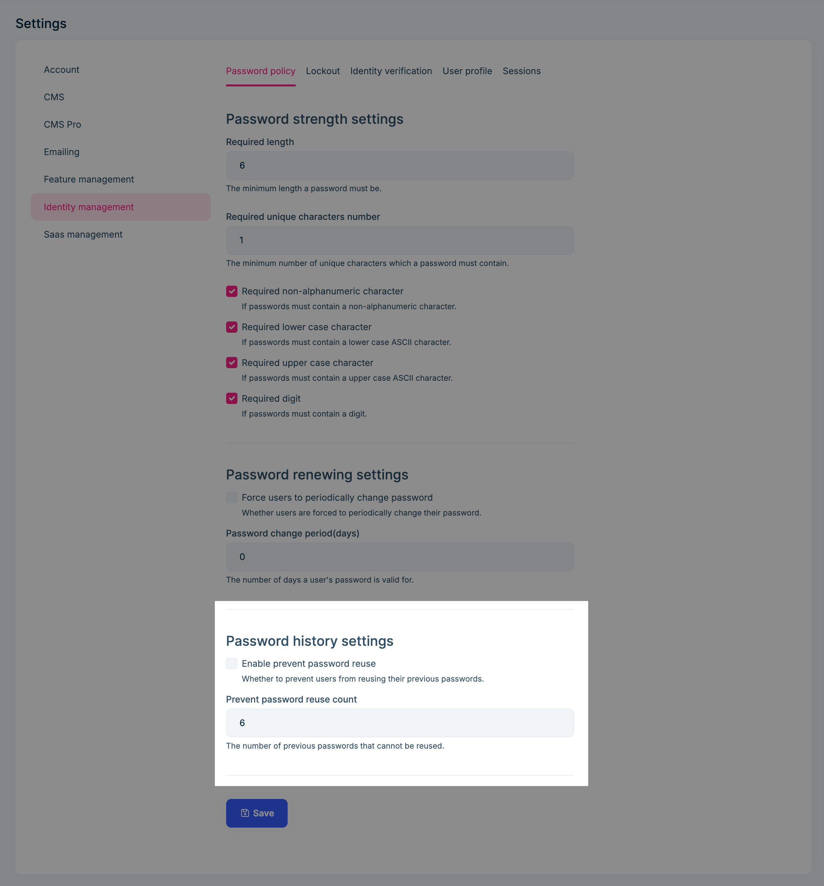
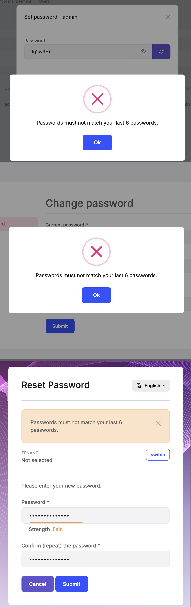

# Password History

## Introduction

> You must have an ABP Team or a higher license to use this module & its features.

The Identity PRO module has a built-in password history function.

## Password history settings

You need to enable the password history and configure related settings:

* **Enable prevent password reuse**: Whether to prevent users from reusing their previous passwords.
* **Password change period**: The number of previous passwords that cannot be reused.

When you enable the password history, users and administrators will not be able to reuse their previous passwords when changing/resetting their passwords.

