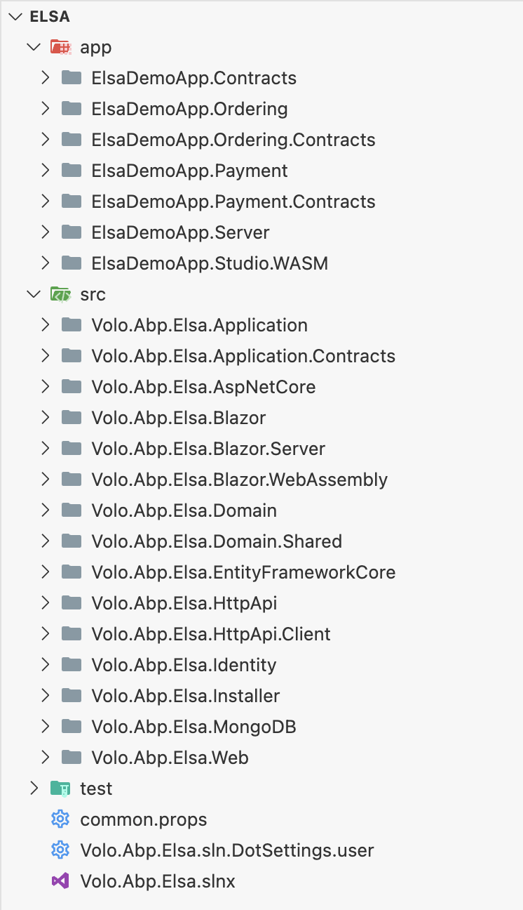
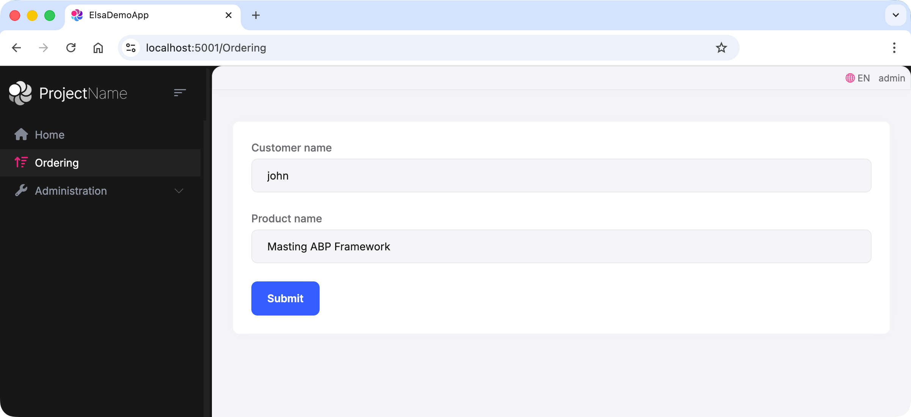

# Elsa Module Demo Apps

The Elsa module demo application is a sample application that demonstrates how to use the Elsa module in an ABP application. The demo application consists of four projects:

- `ElsaDemoApp.Server` is an ABP application with Identity and Elsa modules. It is used as the authentication server and Elsa workflow server.
- `ElsaDemoApp.Studio.WASM` is a Blazor WebAssembly application with Elsa Studio. It is used as the Elsa Studio client application.
- `ElsaDemoApp.Ordering` and `ElsaDemoApp.Payment` are two microservices that can be used to test the Elsa workflows in distributed systems.



## Download

> **Note:** Elsa Module Demo Apps sample application is only for the **ABP customers**. Therefore, you need to have a commercial license to be able to download the source code.

* You can download the complete source-code from [https://abp.io/api/download/samples/elsaworkflow](https://abp.io/Account/Login?returnUrl=/api/download/samples/elsaworkflow)

## Running the Demo Application

The `ElsaDemoApp.Server` has a pre-defined Elsa workflow that creates an order and processes the payment using Elsa workflows, and use ABP distributed event bus to coordinate the workflow.

```cs
public class OrderWorkflow : WorkflowBase
{
    public const string Name = "OrderWorkflow";

    protected override void Build(IWorkflowBuilder builder)
    {
        builder.WithDefinitionId(Name);
        builder.Root = new Sequence
        {
            Activities =
            {
                // Will publish NewOrderEto event to the Ordering microservice,  Ordering microservice will create the order and publish OrderPlaced event
                new CreateOrderActivity(),

                // Wait for the OrderPlaced event, This event is triggered by the Ordering microservice, and Elsa will make workflow continue to the next activity
                new OrderPlacedEvent(),

                // This activity will publish RequestPaymentEto event to the Payment microservice, Payment microservice will process the payment and publish PaymentCompleted event
                new RequestPaymentActivity(),

                //  Wait for the PaymentCompleted event, This event is triggered by the Payment microservice, and Elsa will make workflow continue to the next activity
                new PaymentCompletedEvent(),

                // This activity will send an email to the customer indicating that the payment is completed
                new PaymentCompletedActivity()
            }
        };
    }
}
```

Please follow the steps below to run the demo application.

> The demo application uses SQL Server LocalDB as the database provider and Redis and RabbitMQ, Please make sure you have them installed and running on your machine.

1. Run `ElsaDemoApp.Server` project to migrate the database(`dotnet run --migrate-database`) and start the server.
2. Run `ElsaDemoApp.Studio.WASM` project to start the Elsa Studio client application.
3. Run `ElsaDemoApp.Ordering` project to start the Ordering microservice.
4. Run `ElsaDemoApp.Payment` project to start the Payment microservice.

You can login into `ElsaDemoApp.Server` application and navigate to the `https://localhost:5001/Ordering` page to create an order. 



After that, you can navigate to the `ElsaDemoApp.Studio.WASM` application and see the workflow instance created, running and completed.

